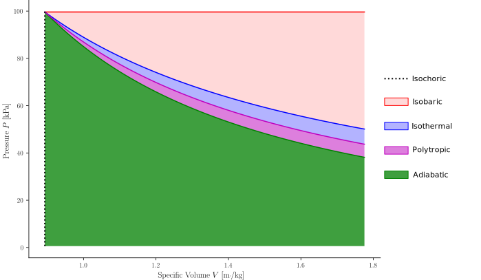

(sec_energy_work_heat)=
## Energy, work and heat

Thermodynamic systems do not remain motionless; they experience **processes** that transform or transfer energy. While equilibrium analysis provides a snapshot of a system’s state, **energy and its modes of transfer** describe how systems evolve between states. This section introduces the fundamental notions of **work**, **heat**, and **energy** — the building blocks of the **$1^{\text{st}}$ law of thermodynamics**, which states that energy can neither be created nor destroyed, only converted from one form to another.

---

(subsec_notion_of_energy)=
### Notion of energy

Thermodynamics is built around the concept of **energy conservation**. The familiar phrase — *“energy is neither created nor destroyed, but transformed”* — captures the essence of the $1^{\text{st}}$ law, as explained {ref}`further on<sec_first_law_closed_systems>`. Yet, energy is not a tangible object: it is an **abstract bookkeeping quantity** that links different forms of motion, interaction, and transformation.

In every process, energy may appear in diverse forms — mechanical, thermal, chemical, electrical — but the **total** always remains constant. What changes is its **distribution** among those forms.

Energy is a **state property**. A state property is a magnitude whose value is determined by the thermodynamic state of the system. Or, in other words: thermodynamic states are **described** by state properties. Among all the magnitudes that can be used in such a description, energy deserves a special consideration. Due to its conservative nature, energy variations between thermodynamic states can be related to the ways and processes in which such energy transfers occur. As we shall see, the way in which thermodynamics encodes the different modes of energy transfer adopts its most simplified form in the statement of the $1^{\text{st}}$ law.

:::{admonition} Note: the abstract notion of the $1^{\text{st}}$ law
:class: note, dropdown

Although the $1^{\text{st}}$ law will be stated in its mathematical, application-oriented form in this course, its original conception is more abstract. The conservation of energy is not the proper, formal statement of the $1^{\text{st}}$ law; rather, it is **one of its consequences**. In its abstract conception, the $1^{\text{st}}$ law establishes the following:
* Take any thermodynamic system $S$.
* Let it evolve between two generic end states, $S_{1}$ and $S_{2}$.
* It is always possible to define a magnitude, called energy ($E$), such that its difference $E_{2} - E_{1}$ does not depend on the way in which the evolution between the end states is carried out. In other words: the energy variation **is independent from the process path**.

A physical magnitude whose changes between states depend exclusively on the values that it adopts at such states is called a **physical property**. Thus, the formal statement of the $1^{\text{st}}$ law **establishes the energy magnitude as a state property**.
:::

---

(subsec_state_properties_process_magnitudes_and_reference_states)=
### State properties, process magnitudes and reference states

The fact that energy constitutes a **state property** means that its variations between states depend only on the values it takes at those states, not on how the process is carried out. In contrast, a magnitude whose value depends on the way in which the transformation occurs is called a **process magnitude**. Such magnitudes quantify how a system exchanges energy with its surroundings, rather than how much energy it possesses at a given state.

State properties and process magnitudes refer to physical quantities that are fundamentally different. It is therefore important to distinguish them not only conceptually but also symbolically:

* A **state property** $\phi$:

  * Describes a **thermodynamic state** and has a well-defined value at equilibrium.
  * Its change between two states depends only on those states and not on the path:

    * For **infinitesimal changes**, the **differential operator** is used:

      * In the general, multivariable case (if $\phi$ depends on a set of parameters $\left(x_1, x_2, \ldots\right)$):
        
        $$
        \mathrm{d}\phi =
        \left(\frac{\partial \phi}{\partial x_1}\right)\mathrm{d}x_1 +
        \left(\frac{\partial \phi}{\partial x_2}\right)\mathrm{d}x_2 + \cdots
        $$
        
      * If $\phi = \phi(x)$, that is, $\phi$ varies only with one parameter $x$, the differential reduces to:
     
        $$
        \mathrm{d}\phi = \frac{\mathrm{d}\phi}{\mathrm{d}x}\mathrm{d}x.
        $$
     
        Integrating between two states 1 and 2 gives the corresponding finite change:
     
        $$
        \Delta\phi_{1\to2} = \int_{x_1}^{x_2} \frac{\mathrm{d}\phi}{\mathrm{d}x}\mathrm{d}x = \phi_2 - \phi_1.
        $$
     
        Since $\phi$ is a **state property**, $\mathrm{d}\phi$ is an **exact differential**, and its integral depends only on the endpoints. For one-dimensional dependencies, the **differential operator** expresses the local rate of change of $\phi(x)$, while the **integral** gives the total variation between states.

* A **process magnitude** $\psi$:

  * Quantifies how a transformation occurs between two states (the mechanism by which the system changes).
  * Its infinitesimal form is represented by an **inexact differential**, $\delta\psi$, because its integral depends on the **path** taken by the process:

    $$
    \Psi_{1\to2} = \int_{1}^{2} \delta\psi,
    $$
  
    where the value of $\Psi_{1\to2}$ changes if the process path changes, even for the same start and end states.

The purpose of introducing the notations for the differences of state properties and process magnitudes is that thermodynamics cannot determine **absolute energy values**. Energy is defined only through **differences between states**, not by an absolute zero that can be measured experimentally.

To compare and balance energies (and other properties) consistently, a **reference state** is therefore chosen—typically by setting $E=0$ at a defined condition. This simplifies calculations without changing the physical meaning; it merely sets the numerical scale.

Reference states are **conventional**, chosen by **agreement** to simplify analyses. For example:

* Setting $h_f = 0$ for saturated liquid water at $0 \ ^\circ\text{C}$ is commonly adopted as the enthalpy reference for the water–steam system.
* Assigning standard enthalpies of formation at $298 \ \text{K}$ and $1 \ \text{bar}$ is standard practice in chemical thermodynamics.

These conventions vary across disciplines but share the same goal: simplifying energy balances and ensuring consistency. Nevertheless, one may define **custom reference states** if a particular problem requires it, as long as all quantities in the analysis remain consistent with the chosen baseline.

:::{admonition} Important: summarizing state properties and process magnitudes
:class: warning

The distinction between **state properties** and **process magnitudes** can be compactly summarized as follows:

| **Type of magnitude** | **Symbol(s)** | **Infinitesimal change** | **Finite change** | **Path dependence** | **Differential type** | **Physical meaning**                                                                |
| :-------------------- | :--------: | :----------------------: | :---------------------------------------------------------------------------: | :-----------------: | :-------------------: | :---------------------------------------------------------------------------------- |
| **State property**    |   $\phi$   |     $\mathrm{d}\phi$     | $\Delta\phi_{1\to2} = \displaystyle\int_1^2 \mathrm{d}\phi = \phi_2 - \phi_1$ |   **Independent**   |       **Exact**       | Quantifies the *state* of the system; depends only on its equilibrium condition.    |
| **Process magnitude** |   $\psi$, $\Psi$   |       $\delta\psi$       |               $\Psi_{1\to2} = \displaystyle\int_1^2 \delta\psi$               |    **Dependent**    |      **Inexact**      | Quantifies the *mode of change* between states; depends on the transformation path. |
:::

:::{admonition} Note: the dummy operators
:class: note, dropdown

So far, the variation operators have been written with explicit reference to their endpoints. For a state property change, the expression $\Delta\phi_{1\to2} = \phi_2 - \phi_1$ simply indicates that we are taking the difference in the property $\phi$ between state 1 and state 2. Likewise, the value of a process magnitude has been written as $\Psi_{1\to2}$, making explicit that the endpoints of the process.

In many thermodynamic problems, however, the initial and final states are already clear from the context, so it is unnecessary to specify them every time. In such cases, the finite changes can be written more simply as $\Delta\phi$ or $\Psi$, with the endpoints understood.
:::

---

(subsec_types_of_energy)=
### Types of energy

The **total energy** $E$ of a system is composed of several distinct contributions:

(eq_energy_split)=
$$
E = U + E_k + E_p + E_f + \cdots
$$

where:

* $U$ is the **internal energy**,
* $E_k$ is the **kinetic energy**,
* $E_p$ is the **potential energy**,
* and $E_f$ may represent **flow** or **pressure energy** in control-volume (open system) analysis.

Broadly, we distinguish between **macroscopic** (organized) and **microscopic** (disorganized) forms of energy.

(subsubsec_macroscopic_energy)=
#### Macroscopic energy (organized)

Macroscopic forms of energy depend on the system’s overall motion or position relative to an external frame of reference.

* **Kinetic energy** due to motion of the center of mass:

  (eq_Ek)=
  $$
  E_k = \frac{1}{2}mV^2.
  $$

* **Potential energy** associated with position in a gravitational field:

  (eq_Ep)=
  $$
  E_p = m g (z - z_0).
  $$

* **Flow (or flow-work) energy**, which quantifies the energy required to push a mass of fluid across a boundary:

  (eq_Ef)=
  $$
  E_f = p V,
  $$
  where $p$ is pressure and $V$ is the volume of the moving fluid element.

(subsubsec_microscopic_energy)=
#### Microscopic energy (disorganized)

The **microscopic** or **internal energy** $U$ reflects the chaotic motions and interactions of molecules — their translation, rotation, vibration, and bonding. Unlike macroscopic energy forms, the microscopic ones do not depend on (are not relative to) an external frame of reference.

As we shall see, changes in $U$ adopt relatively simple forms in systems without chemical reactions or phase change. In such systems, variations in $U$ are primarily **thermal** and correlate directly with temperature. The upshot is that the higher the temperature, the greater the internal energy content.

However, not all internal energy is thermal: chemical, nuclear, and elastic energies may also contribute to the microscopic energy sources.

:::{admonition} Note — organized vs. disorganized energy
:class: note, dropdown
“Organized” energy (like macroscopic motion or mechanical work) can be **fully converted** into disorganized energy (random molecular motion or thermal energy).
As we shall see, the reverse transformation is **limited** by the $2^{\text{nd}}$ law of thermodynamics.

This is why converting mechanical work into heat is easy (e.g., friction), but converting all heat into work (as in engines) is impossible.
:::

---

(subsec_physical_definition_of_work)=
### Physical definition of work

At its most fundamental level, **work** is defined as the **transfer of energy** that occurs when a force acts through a displacement. For an infinitesimal element of motion:

(eq_work_def)=
$$
\delta W = \vec{F} \cdot \mathrm{d}\vec{r}.
$$

The quantity $\delta W$ is a **scalar** obtained from the dot product of two vectors, force $\vec{F}$ and displacement $\mathrm{d}\vec{r}$. Its value depends not only on the endpoints but also on the **path** followed between them.

The unit of work is the joule ($\text{J}$), defined as:

(eq_joule_unit)=
$$
1 \ \mathrm{J} = 1 \ \mathrm{N\cdot m}.
$$

That is, one joule equals the work done by a force of one newton acting through a displacement of one meter.

To appreciate the scale of the basic energy-unit (the joule) let's calculate the following: the mass that would make us expense $1 \ \text{J}$ of energy when lifting it $1 \ \text{m}$ against the force of gravity. As $\delta{}W = 1 \ \text{J}$, $\mathrm{d}\vec{r} = 1 \vec{k}$ (assuming that $\vec{k}$ is the unit vector in the vertical direction) and $\vec{F} = -m{\cdot}\vec{a} = -m{\cdot}\vec{g} = m{\cdot}|g|\vec{k}$ (the negative sign comes from the fact that, when lifting the mass, we act **against** the force of gravity, which goes in the negative vertical direction):

$$
1 \ [\text{J}] = m \ [\text{kg}] \ {\cdot} \ |g| \ [\frac{\text{m}}{\text{s}^{2}}] \ {\cdot} \ 1 \ [\text{m}] \ \Longrightarrow |g| \approx 10 \ [\frac{\text{m}}{\text{s}^{2}}] \ \Longrightarrow m \approx \frac{1}{10} \ \text{kg} = 100 \ \text{gr},
$$

so the body in question would be a 100-gram mass — a small amount when compared to the daily standards we handle.

Because one joule is quite small for most engineering problems, it is common to use its multiples such as **kilojoules (kJ)** or **megajoules (MJ)**. For example, one liter of gasoline releases roughly $34 \ \text{MJ}$ of energy when burned, while a typical human body at rest dissipates about $100 \ \text{J}$ per second in metabolic work and heat.

---

(subsec_work_simple_compressible_systems)=
### Notion of work in simple compressible systems

In a **quasi-static (reversible) process**, the system evolves through an uninterrupted series of **equilibrium states**. This means that all intensive properties (such as pressure and temperature) remain well defined at every instant. Because $p$ can be assigned a definite value at each infinitesimal step, the product $p\mathrm{d}V$ is a meaningful quantity, allowing us to express work in **differential form** as:

(eq_flow_work_diff)=
$$
\delta W = p\mathrm{d}V,
$$

or, in specific form,

(eq_flow_work_diff_spec)=
$$
\delta w = p\mathrm{d}v.
$$

A simple way to interpret the {ref}`above expression <eq_flow_work_diff>` is to picture the system boundary as a movable wall of area $A$ on which a force $\vec{F}$ acts. If the wall moves by an infinitesimal displacement $\mathrm{d}\vec{x}$, the **elementary work** is the dot product $\vec{F}{\cdot}\mathrm{d}\vec{x}$.
Since the **pressure** is {ref}`the force per unit area <eq_pressure_def>`, $p = F/A$, the infinitesimal work can be written as

$$
\delta W = \pm pA\mathrm{d}x,
$$

and, as $\pm{}A\mathrm{d}x = \pm\mathrm{d}V$, {ref}`the generic work equation follows <eq_flow_work_diff>`. The interpretation of the positive and negative signs, in accordance to the sign convention adopted for the present course, is given {ref}`in a further section <subsec_the_sign_convention_work_heat>`. Integrating the above expression between two equilibrium states 1 and 2 gives the **total, finite work adscribed to the process**:

(eq_flow_work_int)=
$$
W_{1\to2} = \int_{1}^{2} p\mathrm{d}V.
$$

Graphically, this represents the **area under the process curve** in a $p–V$ diagram. The form of $p(V)$ determines how this integral is evaluated.

---

(subsec_typical_process_cases)=
### Typical process cases

* **Isochoric process** ($V = \text{constant}$):

  Since $\mathrm{d}V = 0$,

  $$
  W_{1\to2} = \int_{1}^{2} p\mathrm{d}V = 0.
  $$

  No boundary work is done — the process occurs at constant volume.

* **Isobaric process** ($p = \text{constant}$):

  The pressure can be taken outside the integral:

  $$
  W_{1\to2} = p \int_{V_1}^{V_2} \mathrm{d}V = p(V_2 - V_1).
  $$

* **Isothermal ideal-gas process** ($T = \text{constant}$, $p V = n R T$):

  Substituting $p = nRT/V$,

  $$
  W_{1\to2} = nRT \int_{V_1}^{V_2} \frac{\mathrm{d}V}{V}
  = nRT \ln\left(\frac{V_2}{V_1}\right).
  $$

* **Adiabatic ideal-gas process**:

  In an adiabatic process, no heat crosses the system boundary — all the energy transfer occurs as work.
  The pressure and volume are related by the expression $p V^{\gamma} = \text{constant}$, where $\gamma = c_p / c_v$ is the ratio of specific heats.
  Substituting $p = C/V^{\gamma}$,

  $$
  W_{1\to2} = \int_{V_1}^{V_2} C V^{-\gamma}\mathrm{d}V
  = \frac{C}{1 - \gamma}\left(V_2^{1 - \gamma} - V_1^{1 - \gamma}\right)
  = \frac{p_2 V_2 - p_1 V_1}{1 - \gamma}.
  $$

* **Polytropic process**:

    A way of generalizing the particular cases above is by means of the **polytropic relation**, $p V^n = \text{constant}$. Such a relation describes a broad class of processes where the pressure–volume relationship follows a power law. The exponent $n$ indicates how the gas exchanges energy during the transformation:
    
    * For **small $n$**, pressure decreases slowly with volume, meaning more work is produced (similar to isobaric or isothermal expansion).
    * For **large $n$**, pressure drops rapidly, and less work is done (approaching isochoric behavior).
      Hence, $n$ controls the “path” on the $p$–$V$ plane, bridging different kinds of processes (isothermal, adiabatic, etc.) into a single general model.

  Substituting $p = C/V^n$,

  $$
  W_{1\to2} = \int_{V_1}^{V_2} CV^{-n}\mathrm{d}V
  = \frac{C}{1-n}\left(V_2^{1-n} - V_1^{1-n}\right)
  = \frac{p_2 V_2 - p_1 V_1}{1 - n}.
  $$

  {ref}`As mentioned above <subsec_work_simple_compressible_systems>`, the work performed by a simple compressible system can be represented by the area under the $p-V$ curve that the $p(V)$ process encloses. The general relation $pV^n = \text{constant}$ describes a particular family of possible curves that can be drawn in the $p-V$ diagram for substances that follow the ideal gas model. Indeed, such a family is the set of **hyperbolic curves**, where the curvature and slope of the curve is determined by the **polytropic index $n$**:
    
  * When $n = 1$, the curve is an **equilateral hyperbola**, corresponding to an **isothermal** process for an ideal gas $(pV = \text{constant})$.
  * When $n = \gamma$, the curve represents an **adiabatic** process, steeper than the isothermal one because no heat exchange occurs.
  * Other values of $n$ describe intermediate or limiting cases (e.g., $n = 0$ for isobaric, $n \to \infty$ for isochoric).
  
  Thus, the **polytropic model** unifies all common thermodynamic paths under a single mathematical expression, with the isothermal and adiabatic transformations appearing as **particular hyperbolas** of this general family.

These cases show that the work done depends on **how** the system moves between states — that is, on the **path** — rather than on the states themselves.

:::{admonition} Important: work expressions for ideal-gas cases
:class: warning

| **Process** | **Constraint / Condition** | **Work expression** | **Interpretation** | **Polytropic index** | Curve shape on $p-V$ diagram |
| :- | :- | :- | :- | :-: | :-: |
| **Isochoric** | $V = \text{constant}$ | $W_{1\to2} = 0$ | No change in volume $\rightarrow$ no boundary work. | $n \to \infty$ | Vertical line |
| **Isobaric** | $p = \text{constant}$ | $W_{1\to2} = p(V_2 - V_1)$ | Pressure remains constant $\rightarrow$ work equals pressure × volume change. | $n = 0$ | Horizontal line |
| **Isothermal (ideal gas)** | $T = \text{constant}$ | $W_{1\to2} = nRT\ln(V_2/V_1)$ | Temperature fixed $\rightarrow$ work comes entirely from heat exchange. | $n = 1$ | Equilateral hyperbola |
| **Adiabatic (ideal gas)**  | $Q = 0$ | $W_{1\to2} = \dfrac{p_2V_2 - p_1V_1}{1 - \gamma}$, where $\gamma = c_p/c_v$ | No heat transfer $\rightarrow$ work equals the change in internal energy. | $n = \gamma$ | Hyperbola (steeper than equilateral) |
| **Polytropic** | $p V^n = \text{constant}$, $n \neq 1$ | $W_{1\to2} = \dfrac{p_2V_2 - p_1V_1}{1 - n}$ | Generalized process describing many possible paths between states. |   $n = n$ | $n-$modulated hyperbola |

:::

:::{admonition} Note: etymology of “polytropic”
:class: note, dropdown
The word **“polytropic”** comes from the Greek *poly* (πολύ, “many”) and *tropos* (τρόπος, “way” or “manner”). It literally means “many ways,” reflecting that a polytropic process can occur in **many possible manners** depending on the exponent $n$, each representing a distinct mode of energy exchange between pressure and volume.
:::

---

(subsec_heat)=
### Notion of heat

While work results from **organized motion** or **forces acting through displacements**, **heat** results from **random microscopic interactions** driven by temperature differences.

Energy transfer by heat always proceeds **from higher to lower temperature**. For a differential transfer:

(eq_heat_direction)=
$$
T_\text{hot} > T_\text{cold} \quad \Longrightarrow \quad Q_{\text{hot}\to\text{cold}} > 0.
$$

Heat, like work, is **path-dependent** and measured in joules. It is symbolized by $\delta Q$ for an infinitesimal transfer and by $Q$ for a finite process. It is a form of energy transfer or energy *in transit* across the boundary (just like work), not the energy stored within the system. Once absorbed, it contributes to the **internal energy** $U$ of a closed system or, as we shall see, to the **enthalpy** $H$ of the fluid in an open system.

---

(subsec_rates_specifics)=
### Rates and specific forms

For practical use, the energy transfer terms are often expressed on a **specific** (per unit mass) basis, or as **rates** (per unit time). As done so far, the specific quantities will be symbolized by the lowercase versions of their extensive counterparts:

$$
\delta w = \frac{\delta W}{m}, \quad
\delta q = \frac{\delta Q}{m}, \qquad \text{measured in } [\text{J}/\text{kg}]
$$

whereas the rates are symbolized by dotted variables.

$$
\dot{W} = \frac{\mathrm{d}W}{\mathrm{d}t}, \quad
\dot{Q} = \frac{\mathrm{d}Q}{\mathrm{d}t}, \qquad \text{measured in } [\text{J}/\text{s}]\equiv[\text{W}].
$$

These forms are essential for steady-flow systems, cyclic processes and open systems, where energy transfer per unit mass or per unit time is often more informative than total quantities.

:::{admonition} Note: the Watt, the basic power unit
:class: note, dropdown
Notice that the Watt unit $[\text{W}]$ corresponds to the **rate of energy**, i.e. to the energy flow per unit time (per second).

:::

---

(subsec_the_sign_convention_work_heat)=
### The sign convention for work and heat

{ref}`As mentioned before <subsec_work_simple_compressible_systems>`, the {ref}`infinitesimal expression for work <eq_flow_work_diff>` is a **general relation** that can take either **positive** or **negative** values depending on the **sign of the volume change** (i.e. $\pm\mathrm{d}V$):

* If $\mathrm{d}V > 0$, the system **expands** and performs **positive work** on its surroundings — energy leaves the system as mechanical output.
* If $\mathrm{d}V < 0$, the system **is compressed**, and **negative work** is done *by* the system — equivalently, work is done *on* the system, meaning mechanical energy enters it.

On a $p$–$V$ diagram, this corresponds to the **area under the process curve**:

* **Expansion** (work done *by* the system): area *below* the curve $\rightarrow W > 0$.
* **Compression** (work done *on* the system): area *above* the curve $\rightarrow W < 0$.

Likewise, heat is also a **process magnitude** whose sign depends on the **direction of energy flow**. By convention, we define:

* **Positive heat** $(Q > 0 )$: energy enters the system as heat $\rightarrow$ the system **gains** energy.
* **Negative heat** $( Q < 0 )$: energy leaves the system as heat $\rightarrow$ the system **loses** energy.

In this convention, **positive $Q$** denotes *heating* (energy received by the system), whereas **negative $Q$** denotes *cooling* (energy released to the surroundings).

:::{admonition} Important: sign convention summary
:class: warning
| **Interaction type**   | **Physical meaning**            | **Energy flow direction**  | **Sign convention** |
| :--------------------- | :------------------------------ | :------------------------- | :-----------------: |
| **Work (by system)**   | Expansion or mechanical output  | From system → surroundings |      $W > 0$      |
| **Work (on system)**   | Compression or mechanical input | From surroundings → system |      $W < 0$      |
| **Heat (to system)**   | Heating                         | From surroundings → system |      $Q > 0$      |
| **Heat (from system)** | Cooling                         | From system → surroundings |      $Q < 0$      |
:::

:::{admonition} Note: consistency of sign conventions
:class: note, dropdown
The convention $W > 0$ for work done **by** the system and $Q > 0$ for heat **added to** the system is standard in **engineering thermodynamics**.
In **physics** texts, however, the opposite sign for work is sometimes used ($W > 0$) for work done **on** the system).
Always confirm the sign convention in use before comparing equations or results from different sources.
:::

(card_worked_example_boundary_work)=
::::{card}
**WORKED EXAMPLE — boundary work of $\text{N}_2$ under different processes**
^^^

**Problem statement**

A closed system contains **1 kg of nitrogen gas ($\text{N}_2$)** initially at a pressure of $p_1 = 100 \ \text{kPa}$ and a temperature of $T_1 = 300 \ \text{K}$.
Whenever the considered process allows it, the gas expands **quasi-statically** until its **final volume doubles** ($V_2 = 2V_1$).

The process is analyzed under different conditions — **isochoric**, **isobaric**, **isothermal**, **adiabatic**, and **polytropic** — to determine the **boundary work** done by the gas in each case. For the most generic case, assume a polytropic index of $n = 1.2$.

Assume ideal-gas behavior throughout and compare the resulting work magnitudes.

---

**Synthesis**

The boundary work is defined as:

$$
W_{1\to2} = \int_{V_1}^{V_2} p \mathrm{d}V.
$$

For an ideal gas, $pV = mRT$, and the functional form of $p(V)$ depends on the **type of process**.
We apply the appropriate relations for each process and evaluate the corresponding $W_{1\to2}$ values.

---

**Problem data**{cite}`2015Cengel`

| Quantity                           |       Symbol       |                     Value |
| :--------------------------------- | :----------------: | ------------------------: |
| Gas                                |          —         |   Nitrogen ($\text{N}_2$) |
| Gas constant                       |         $R$        | $0.2968 \ \text{kJ}/\text{kg}{\cdot}\text{K}$ |
| Ratio of specific heats            | $\gamma = c_p/c_v$ |                     $1.4$ |
| Mass                               |         $m$        |           $1 \ \text{kg}$ |
| Initial pressure                   |        $p_1$       |        $100 \ \text{kPa}$ |
| Initial temperature                |        $T_1$       |          $300 \ \text{K}$ |
| Volume ratio                       |      $V_2/V_1$     |                       $2$ |
| Polytropic exponent                |         $n$        |                     $1.2$ |

---

**Calculations**

For the initial state:

$$
p_1 V_1 = mRT_1 = (1)(0.2968)(300) = 89.04 \ \text{kJ} = 89.04 \ \text{kPa}{\cdot}\text{m}^3.
$$

Hence:

$$
\boxed{V_1 = \dfrac{mRT_1}{p_1} = \dfrac{89.04}{100} = 0.8904 \ \text{m}^3} \ .
$$

---

1. **Isochoric process** ($V = \text{constant}$)

No change in volume $\Rightarrow \mathrm{d}V = 0$:

$$
W_{1\to2} = W_{\text{isochoric}} = \int_{V_1}^{V_2} p\mathrm{d}V = 0.
$$

$$
\boxed{W_{\text{isochoric}} = 0 \ \text{kJ}}
$$

---

2. **Isobaric process** ($p = \text{constant}$)

$$
W_{1\to2} = W_{\text{isobaric}} = p(V_2 - V_1) = 100(0.8904) = 89.0 \ \text{kJ}.
$$

$$
\boxed{W_{\text{isobaric}} = 89.0 \ \text{kJ}}
$$

---

3. **Isothermal process** ($T = \text{constant}$)

$$
W_{1\to2} = W_{\text{isothermal}} = mRT \ln\left(\frac{V_2}{V_1}\right) = (1)(0.2968)(300)\ln(2) = 61.7 \ \text{kJ}.
$$

$$
\boxed{W_{\text{isothermal}} = 61.7 \ \text{kJ}}
$$

---

4. **Adiabatic process** ($Q = 0$, reversible)

$$
W_{1\to2} = W_{\text{adiabatic}} \frac{p_2V_2 - p_1V_1}{1 - \gamma}.
$$

From $pV^\gamma = \text{constant}$:

$$
\frac{T_2}{T_1} = \left(\frac{V_1}{V_2}\right)^{\gamma-1} = (0.5)^{0.4} = 0.758,
\quad T_2 = 0.758(300) = 227.4 \ \text{K}.
$$

Then:

$$
W_{\text{adiabatic}} = \frac{mR(T_2 - T_1)}{1 - \gamma}
= \frac{(1)(0.2968)(227.4 - 300)}{1 - 1.4} = 53.9 \ \text{kJ}.
$$

$$
\boxed{W_{\text{adiabatic}} = 53.9 \ \text{kJ}}
$$

---

5. **Polytropic process** ($pV^n = \text{constant}$, $n = 1.2$)

$$
W_{1\to2} = W_{\text{polytropic}} = \frac{p_2V_2 - p_1V_1}{1 - n}.
$$

From the polytropic relation:

$$
\frac{p_2}{p_1} = \left(\frac{V_1}{V_2}\right)^n = (0.5)^{1.2} = 0.435.
$$

Thus, $p_2 = 43.5 \ \text{kPa}$, and

$$
W_{\text{polytropic}} = \frac{(43.5)(2V_1) - (100)(V_1)}{1 - 1.2} = \frac{(87.0 - 100)V_1}{-0.2} = 65.0 \ \text{kJ}.
$$

$$
\boxed{W_{\text{polytropic}} = 65.0 \ \text{kJ}}
$$

---

**Summary of results**

| Process                | Relation                   | $W$ [kJ] | Relative work                    | Comments                                           |
| :--------------------- | :------------------------- | -------: | :------------------------------- | :------------------------------------------------- |
| Isochoric              | $V = \text{const.}$        |      0.0 | —                                | No boundary motion → no work.                      |
| Isobaric               | $p = \text{const.}$        |     89.0 | Highest                          | Largest $p$–$V$ area; constant external pressure.  |
| Isothermal             | $T = \text{const.}$        |     61.7 | Moderate                         | Heat fully compensates work to keep $T$ constant.  |
| Adiabatic              | $Q = 0$                    |     53.9 | Lowest (nonzero)                 | Work done at expense of internal energy (cooling). |
| Polytropic ($n = 1.2$) | $pV^{1.2} = \text{const.}$ |     65.0 | Between isothermal and adiabatic | Partial heat exchange softens the pressure drop.   |

---

**Visualization**

For the current system, the above processes look as follows when plotted in a $p-V$ diagram. As observed, the comments made before can be correlated with the shapes of the curves. In particular, it becomes evident that the different processes are represented by a curve that adopts a specific shape in the diagram:

* The **isochoric** process renders a **vertical line**.
* The **isobaric** process renders a **horizontal line**.
* The **isothermal** process becomes an **equilateral hyperbola**.
* The **adiabatic** process is also a hyperbola, but with a **steeper slope and curvature** than the isothermal one, due to $\gamma = 1.4 > 1$.
* The **polytropic** process renders a hyperbola whose slope and curvature are between those of the isothermal and adiabatic one ($\gamma > n > 1$). These three cases show that the steepness and curvature of the hyperbolas are modulated by the polytropic index $n$.



---

:::{admonition} Tip: interpretation
:class: tip, dropdown

A detailed interpretation in terms of energy, work and heat interactions may ensue when introducing the $1^{\text{st}}$ law formally. However, some preliminary hints can be provided so far. For the same expansion ratio ($V_2/V_1 = 2$), the **work output** depends on how the system exchanges heat:

* In **isobaric** expansion, constant pressure yields the largest area under the $p$–$V$ curve.
* In **isothermal** expansion, pressure falls as $1/V$, giving moderate work.
* In **polytropic** expansion, a limited heat exchange produces an intermediate path between isothermal and adiabatic.
* In **adiabatic** expansion, no heat enters — the gas cools, and the pressure drop is steepest, yielding the smallest nonzero work.
* In **isochoric** processes, there is no boundary motion and no work.

This example shows how the **process path** — not just the endpoints — dictates the mechanical work in thermodynamic transformations.
:::

+++
END OF WORKED EXAMPLE
::::

---

(subsec_conceptual_closure_energy_work_heat)=
### Conceptual closure

**Energy** is a *state property*: it characterizes the condition of a system and its variations depend only on the initial and final states. **Work** and **heat**, in contrast, are *process magnitudes*: they describe **how** energy crosses the system boundary — either as organized mechanical action (work) or as disorganized molecular transfer due to temperature difference (heat).

Work and heat are therefore **complementary**: no system can exchange energy without one or both of them. Their direction and magnitude depend on the process path, not solely on the states.

To relate these transfers consistently, thermodynamics adopts clear **sign conventions**:

* $W > 0$ when work is done **by** the system (expansion), and $W < 0$ when done **on** it (compression).
* $Q > 0$ when heat is **added** to the system (heating), and $Q < 0$ when **released** (cooling).

On the **$p$–$V$ diagram**, areas represent **work**, while on the **$T$–$s$ diagram**, they represent **heat** for reversible processes. Both views complement each other: one expresses **mechanical** energy exchange, the other **thermal**, offering a complete picture of energy transfer between a system and its surroundings.

---

(subsec_references_ideal_and_real_gases)=
### References
```{bibliography}
:filter: docname in docnames
