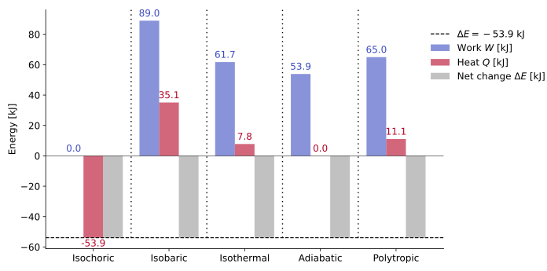

(sec_first_law_closed_systems)=
## $1^{\text{st}}$ Law in closed systems

So far, we have established that thermodynamics describes how energy moves and changes form within and across systems. When dealing with a **closed system**, the **mass remains constant** — no substance crosses the system boundary. However, energy can still be transferred in the form of **work** or **heat**. This section formulates the **$1^{\text{st}}$ law of thermodynamics** for such systems, expressing the balance between energy storage and energy transfer.

---

(subsec_energy_balance_closed_system)=
### Energy balance for a closed system

A **closed system** exchanges **energy**, but not **mass**, with its surroundings. Or, better expressed: as no mass can cross the boundary of a closed system by definition, the only energetic exchanges that can take place are those associated with non-massive transfers. If, {ref}`as stated previously <sec_energy_work_heat>`, energy is neither created nor destroyed — only transformed — and the **only non-massive transfer modes** are heat and work, the total energy balance is written as:

(eq_first_law_basic)=
$$
\Delta{}E{}={}Q{}-{}W,
$$

where:

* $Q$ is the **net heat** transferred *to* the system,
* $W$ is the **net work** done *by* the system,
* $\Delta{}E$ is the **total change in energy** of the system.

:::{admonition} Note: implicit assumptions in the $1^{\text{st}}$ law formulation
:class: note, dropdown

{ref}`The expression above <eq_first_law_basic>` also assumes, implicitly, that:
* The finite energy change, $\Delta{}E$, takes place between two end states $(1)$ and $(2)$. Formally, this means that the equation should read $\Delta{}E_{1\to2} = Q_{1\to2} - W_{1\to2}$, as mentioned when {ref}`introducing the <subsec_state_properties_process_magnitudes_and_reference_states>` $\Delta$ {ref}`operator <subsec_state_properties_process_magnitudes_and_reference_states>`. However, considering all the formulation that follows as referring to differences between two end states, those subscripts will be dropped for the sake of clarity.
* The sign convention {ref}`adopted in this course <subsec_the_sign_convention_work_heat>` is coherent with the way in which the heat and work contributions show up in the equation.

| **Type of energetic exchange** | **Description** | **Sign of $Q$ or $W$** | **Effect on system energy ($\Delta E$)** |
| :-------------------------- | :----------------------------------- | :--------------------: | :--------------------------------------: |
| **Heat added to system**    | System receives heat (energy inflow) |         $Q > 0$        |              $\Delta E > 0$              |
| **Heat released by system** | System loses heat (energy outflow)   |         $Q < 0$        |              $\Delta E < 0$              |
| **Work done by system**     | System performs work on surroundings |         $W > 0$        |              $\Delta E < 0$              |
| **Work done on system**     | Surroundings perform work on system  |         $W < 0$        |              $\Delta E > 0$              |

:::

The total energy variation of the system may be decomposed into its **macroscopic** and **microscopic** components:

(eq_first_law_components)=
$$
\Delta{}E{}={} \Delta{}E_k{}+{}\Delta{}E_p{}+{}\Delta{}U{}={}Q{}-{}W,
$$

where:

* $\Delta E_k$ corresponds to the **kinetic energy change**,
* $\Delta E_p$ to the **potential energy change**,
* $\Delta U$ to the **change in internal energy**.

In the absence of **chemical** or **nuclear** reactions, $\Delta U$ represents solely **thermal effects** — that is, variations in the system’s temperature.

:::{admonition} Note: flow energy and work
:class: note, dropdown
{ref}`When presenting the forms of macroscopic energy <subsubsec_macroscopic_energy>`, one of the types specified was the so-called **flow energy** $(pV)$. In closed systems, flow energy is not stored as part of the system; it represents **boundary work** and therefore appears in $W$. The energy forms that remain *contained* within the system are kinetic, potential, and internal.
:::

---

(subsec_first_law_simplified)=
### Simplified form: negligible kinetic and potential changes

For most stationary systems (no significant motion or elevation change), kinetic and potential energy variations are negligible:

(eq_first_law_reduced)=
$$
\boxed{\Delta{}U{}={}Q{}-{}W} \ .
$$

This reduced form — widely used in thermodynamics — expresses that **all energy transfers as heat or work** manifest as **changes in internal energy**.
Thus, if a closed system receives heat or performs work, its **temperature** (and hence its internal energy) will change accordingly. Its differential form is equally relevant:

(eq_first_law_reduced_diff)=
$$
\mathrm{d}U = \delta Q - \delta W \ \Rightarrow \ \boxed{\mathrm{d}U = \delta Q - p\mathrm{d}V} \ .
$$

:::{admonition} Tip: interpreting $\Delta U = Q - W$
:class: tip, dropdown

* When $Q>W$, the system’s **internal energy increases** (it warms up). Heating overcomes the work done by the system.
* When $-Q>-W$, the system's **internal energy decreases** (it cools down). Cooling overcomes the work done upon the system.
* When $W>Q$, the system’s **internal energy decreases** (it cools down). The work done by the system overcomes heating.
* When $-W>-Q$, the system's **internal energy increases** (it warms up). The work done upon the system overcomes cooling.
  This intuitive balance helps identify the direction of energy flow in simple processes.
  :::

---

(subsec_first_law_enthalpy)=
### $1^{\text{st}}$ law: particularization with enthalpy

The combination of internal energy and the flow term, $pV$, appears so often that it is defined as a separate thermodynamic property — the **enthalpy**:

(eq_enthalpy_def)=
$$
\boxed{H{}={}U{}+{}pV} \ .
$$

The **enthalpy**, $H$, represents the **total useful energy** of a fluid, combining the *thermal capacity to perform work* (through $U$) and the *flow capacity* ($pV$).
While internal energy $U$ tracks temperature-related effects, enthalpy incorporates both **temperature** and **pressure** effects, making it a more practical measure in processes involving fluids and flow.

Differentiating the definition of $H$:

(eq_differential_enthalpy)=
$$
\mathrm{d}H{}={} \mathrm{d}U{}+{}p\mathrm{d}V{}+{}V\mathrm{d}p.
$$

Substituting the **$1^{\text{st}}$ law in its differential form**, $\mathrm{d}U{}={} \delta Q{}-{}p\mathrm{d}V$, into this expression gives:

(eq_heat_enthalpy_relation1)=
$$
\mathrm{d}H = \delta{}Q - p\mathrm{d}V + p\mathrm{d}V + V\mathrm{d}p \ \Rightarrow \ \boxed{\delta Q{}={} \mathrm{d}H{}-{}V\mathrm{d}p} \ .
$$

This relation provides a direct link between **heat transfer** and **enthalpy change**, highlighting how $p$ and $V$ variations affect the overall heat exchange.

:::{admonition} Note: why defining enthalpy in closed systems makes sense
:class: note, dropdown

In a **closed system**, no mass crosses the boundary, so the term $pV$ does **not** represent energy stored within the system — it belongs to the **boundary work** term in the $1^{\text{st}}$ law's differential expression,

$$
\mathrm{d}U = \delta Q - \delta W = \delta Q - p\mathrm{d}V.
$$

However, the {ref}`definition of enthalpy <eq_enthalpy_def>` remains useful even for closed systems.
This is because, when differentiating $H$, the derivative of the product $pV$ {ref}`introduces two contributions <eq_differential_enthalpy>` showing that, although $p\mathrm{d}V$ already appears in the energy balance, the additional term $V\mathrm{d}p$ allows the pressure dependence of the system’s energy to be expressed more compactly.

Defining $H$ as $U + pV$ is thus a **formal convenience**: it reorganizes the energy terms into a single property that simplifies later formulations — especially when pressure becomes an independent variable — without implying the existence of new energy storage in the system.
:::

:::{admonition} Note: on enthalpy as a thermodynamic property
:class: note, dropdown

Since **enthalpy** is defined as a specific combination of {ref}`two state properties <eq_enthalpy_def>`, it is itself a **state property**.
Both internal energy $U$ and the product $pV$ depend only on the **thermodynamic state** — that is, on measurable variables such as pressure, volume, and temperature — not on the path taken between states.

Consequently, the {ref}`differential of enthalpy <eq_differential_enthalpy>` is an **exact differential**, meaning that changes in $H$ between two states depend solely on the endpoints and not on the intermediate process.

This property-based nature of $H$ is what allows enthalpy, like internal energy, to appear directly in state equations and thermodynamic tables.
:::

(card_worked_example_energy_balance)=
::::{card}
**WORKED EXAMPLE — energy balance under different processes (applied)**
^^^

**Problem statement**

Assume the same system and processes analyzed in {ref}`the previous worked example <card_worked_example_boundary_work>`.
Consider that, although each process path differs, the **net change in stored energy** of the system is the same as the **work done in the adiabatic process**, that is:

$$
\Delta E = -W_{\text{adiabatic}} = -53.9\ \text{kJ}.
$$

The negative sign indicates that the system **loses energy** through expansion work.
Using the **$1^{\text{st}}$ law of thermodynamics** for a closed system,

$$
\Delta E = Q - W,
$$

determine the corresponding **heat transfer** $Q$ for each process from the known work term $W$.

---

**Synthesis**

If $\Delta E$ is fixed at $-53.9\ \text{kJ}$, then:

$$
Q = \Delta E + W = -53.9 + W.
$$

Because the system expands in all cases ($W > 0$), part of its stored energy is used as mechanical work.
To reach the same energy loss in all processes, the required **heat transfer** must adjust accordingly.

---

**Problem data**

| Process              |          Relation          | $W$ [kJ] |
| :------------------- | :------------------------: | -------: |
| Isochoric            |     $V = \text{const.}$    |     +0.0 |
| Isobaric             |     $p = \text{const.}$    |    +89.0 |
| Isothermal           |     $T = \text{const.}$    |    +61.7 |
| Adiabatic            |           $Q = 0$          |    +53.9 |
| Polytropic ($n=1.2$) | $pV^{1.2} = \text{const.}$ |    +65.0 |

---

**Calculations**

For each process,

$$
Q = \Delta E + W = -53.9 + W.
$$

| Process              |         Relation         | $W$ [kJ] | $\Delta E$ [kJ] | $Q$ [kJ] | Interpretation                                            |
| :------------------- | :----------------------: | ----- | --------------: | -------: | :-------------------------------------------------------- |
| Isochoric            |     $V=\text{const.}$    |     +0.0 |           –53.9 |    –53.9 | No work done; all energy loss as heat rejection.          |
| Isobaric             |     $p=\text{const.}$    |    +89.0 |           –53.9 |    +35.1 | Work output larger than energy loss; requires heat input. |
| Isothermal           |     $T=\text{const.}$    |    +61.7 |           –53.9 |     +7.8 | Slight heat input compensates the mechanical work.        |
| Adiabatic            |           $Q=0$          |    +53.9 |           –53.9 |      0.0 | Reference case: all energy loss as expansion work.        |
| Polytropic ($n=1.2$) | $pV^{1.2}=\text{const.}$ |    +65.0 |           –53.9 |    +11.1 | Intermediate case between adiabatic and isothermal.       |

---

**Interpretation**

In this example, the **adiabatic case** serves as a reference: all the system’s energy loss manifests as **work output**, with **no heat transfer** ($Q=0$).
For the other processes, achieving the same net energy decrease ($\Delta E = -53.9\ \text{kJ}$) requires different heat exchanges:

* In processes with **greater work output** (e.g. isobaric), heat must enter the system to maintain the same overall energy change.
* In processes with **no work** (isochoric), all energy loss occurs as **heat rejection**.

This illustrates how the $1^{\text{st}}$ law ensures consistency between energy transfers regardless of the process path.

---

**Visualization**

The bar chart below compares, for each process, the **work** $W$ and **heat** $Q$ contributions that together yield the same total energy loss $\Delta E = -53.9\ \mathrm{kJ}$.
A horizontal dashed line marks $\Delta E$.
Bars above the line indicate **heat input**, whereas bars below indicate **heat rejection**.

---

:::{admonition} Tip: connecting to specific heats
:class: tip, dropdown

Later, when **specific heats** are introduced, we will see that $\Delta U$ and $\Delta H$ relate directly to temperature changes under constant-volume and constant-pressure conditions. This will make the different heat requirements in each process predictable from measurable thermal properties.

However, two limiting cases in this example anticipate the rationale behind specific heats:

* In **isochoric processes**, the system volume is fixed ($\mathrm{d}V=0$), so no work is done ($\delta W=0$).
  The **entire energy exchange** occurs as heat, $\delta Q = \mathrm{d}U$.
  This is the physical basis for defining the **specific heat at constant volume**, $c_v$.

* In **adiabatic processes**, the system is perfectly insulated ($\delta Q=0$), so no heat is exchanged.
  Any energy variation manifests exclusively as **work**, $\mathrm{d}U = -\delta W$.
  Although adiabaticity does **not define** a heat capacity, it shows the other extreme: a process in which one transfer mode is completely suppressed.

Together, these two constraints — one eliminating work, the other eliminating heat — clarify why specific heats are defined under *controlled, idealized* conditions.
They isolate the effect of temperature change on a single energy-exchange mechanism, making thermal behavior measurable and comparable across systems.

:::

+++
END OF WORKED EXAMPLE
::::

---

(subsec_conceptual_closure_firstlaw_closed)=
### Conceptual closure
* A **closed system** exchanges energy but **not mass** with its surroundings.
* The **$1^{\text{st}}$ law** expresses the **energy balance** between internal storage and transfer:
  $\Delta E{}={}Q{}-{}W$.
* When kinetic and potential effects are negligible, the simplified form $\Delta U{}={}Q{}-{}W$ suffices.
* The **enthalpy**, $H{}={}U{}+{}pV$, naturally emerges when dealing with processes at constant pressure or in open-system extensions.
