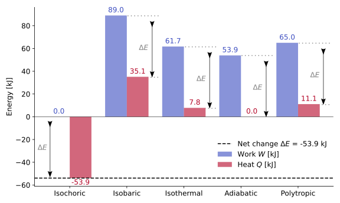

(sec_first_law_closed_systems)=
## $1^{\text{st}}$ Law in closed systems

So far, we have established that thermodynamics describes how energy moves and changes form within and across systems. When dealing with a **closed system**, the **mass remains constant** — no substance crosses the system boundary. However, energy can still be transferred in the form of **work** or **heat**. This section formulates the **$1^{\text{st}}$ law of thermodynamics** for such systems, expressing the balance between energy storage and energy transfer.

---

(subsec_energy_balance_closed_system)=
### Energy balance for a closed system

A **closed system** exchanges **energy**, but not **mass**, with its surroundings. Or, better expressed: as no mass can cross the boundary of a closed system by definition, the only energetic exchanges that can take place are those associated with non-massive transfers. If, {ref}`as stated previously <sec_energy_work_heat>`, energy is neither created nor destroyed — only transformed — and the **only non-massive transfer modes** are heat and work, the total energy balance is written as:

(eq_first_law_basic)=
$$
\Delta{}E{}={}Q{}-{}W,
$$

where:

* $Q$ is the **net heat** transferred *to* the system,
* $W$ is the **net work** done *by* the system,
* $\Delta{}E$ is the **total change in energy** of the system.

:::{admonition} Note: implicit assumptions in the $1^{\text{st}}$ law formulation
:class: note, dropdown

{ref}`The expression above <eq_first_law_basic>` also assumes, implicitly, that:
* The finite energy change, $\Delta{}E$, takes place between two end states $(1)$ and $(2)$. Formally, this means that the equation should read $\Delta{}E_{1\to2} = Q_{1\to2} - W_{1\to2}$, as mentioned when {ref}`introducing the $\Delta$ operator <subsec_state_properties_process_magnitudes_and_reference_states>`. However, considering all the formulation that follows as referring to differences between two end states, those subscripts will be dropped for the sake of clarity.
* The sign convention {ref}`adopted in this course <subsec_the_sign_convention_work_heat>` is coherent with the way in which the heat and work contributions show up in the equation.

| **Type of energetic exchange** | **Description** | **Sign of $Q$ or $W$** | **Effect on system energy ($\Delta E$)** |
| :-------------------------- | :----------------------------------- | :--------------------: | :--------------------------------------: |
| **Heat added to system**    | System receives heat (energy inflow) |         $Q > 0$        |              $\Delta E > 0$              |
| **Heat released by system** | System loses heat (energy outflow)   |         $Q < 0$        |              $\Delta E < 0$              |
| **Work done by system**     | System performs work on surroundings |         $W > 0$        |              $\Delta E < 0$              |
| **Work done on system**     | Surroundings perform work on system  |         $W < 0$        |              $\Delta E > 0$              |

:::

The total energy variation of the system may be decomposed into its **macroscopic** and **microscopic** components:

(eq_first_law_components)=
$$
\Delta{}E{}={} \Delta{}E_k{}+{}\Delta{}E_p{}+{}\cancel{E_{f}}+{}\Delta{}U{}={}Q{}-{}W,
$$

where:

* $\Delta E_k$ corresponds to the **kinetic energy change**,
* $\Delta E_p$ to the **potential energy change**,
* $\Delta U$ to the **change in internal energy**.

In the absence of **chemical** or **nuclear** reactions, $\Delta U$ represents solely **thermal effects** — that is, variations in the system’s temperature.

:::{admonition} Note: flow energy and work
:class: note, dropdown
{ref}`When presenting the forms of macroscopic energy <subsubsec_macroscopic_energy>`, one of the types specified was the so-called **flow energy** $(PV)$. In closed systems, flow energy is not stored as part of the system; it represents **boundary work** and therefore appears in $W$. The energy forms that remain *contained* within the system are kinetic, potential, and internal.
:::

---

(subsec_first_law_simplified)=
### Simplified form: negligible kinetic and potential changes

For most stationary systems (no significant motion or elevation change), kinetic and potential energy variations are negligible:

(eq_first_law_reduced)=
$$
\boxed{\Delta{}U{}={}Q{}-{}W} \ .
$$

This reduced form — widely used in thermodynamics — expresses that **all energy transfers as heat or work** manifest as **changes in internal energy**.
Thus, if a closed system receives heat or performs work, its **temperature** (and hence its internal energy) will change accordingly. Its differential form is equally relevant:

(eq_first_law_reduced_diff)=
$$
\mathrm{d}U = \delta Q - \delta W \ \Rightarrow \ \boxed{\mathrm{d}U = \delta Q - P\mathrm{d}V} \ .
$$

:::{admonition} Tip: interpreting $\Delta U = Q - W$
:class: tip, dropdown

* When $Q>W$, the system’s **internal energy increases** (it warms up). Heating overcomes the work done by the system.
* When $-Q>-W$, the system's **internal energy decreases** (it cools down). Cooling overcomes the work done upon the system.
* When $W>Q$, the system’s **internal energy decreases** (it cools down). The work done by the system overcomes heating.
* When $-W>-Q$, the system's **internal energy increases** (it warms down). The work done upon the system overcomes cooling.
  This intuitive balance helps identify the direction of energy flow in simple processes.
  :::

---

(subsec_first_law_enthalpy)=
### $1^{\text{st}}$ law: particularization with enthalpy

The combination of internal energy and the flow term, $PV$, appears so often that it is defined as a separate thermodynamic property — the **enthalpy**:

(eq_enthalpy_def)=
$$
\boxed{H{}={}U{}+{}PV} \ .
$$

The **enthalpy**, $H$, represents the **total useful energy** of a fluid, combining the *thermal capacity to perform work* (through $U$) and the *flow capacity* ($PV$).
While internal energy $U$ tracks temperature-related effects, enthalpy incorporates both **temperature** and **pressure** effects, making it a more practical measure in processes involving fluids and flow.

Differentiating the definition of $H$:

(eq_differential_enthalpy)=
$$
\mathrm{d}H{}={} \mathrm{d}U{}+{}P\mathrm{d}V{}+{}V\mathrm{d}P.
$$

Substituting the **$1^{\text{st}}$ law in its differential form**, $\mathrm{d}U{}={} \delta Q{}-{}P\mathrm{d}V$, into this expression gives:

(eq_heat_enthalpy_relation1)=
$$
\mathrm{d}H = \delta{}Q - P\mathrm{d}V + P\mathrm{d}V + V\mathrm{d}P \ \Rightarrow \ \boxed{\delta Q{}={} \mathrm{d}H{}-{}V\mathrm{d}P} \ .
$$

This relation provides a direct link between **heat transfer** and **enthalpy change**, highlighting how $P$ and $V$ variations affect the overall heat exchange.

:::{admonition} Note: why defining enthalpy in closed systems makes sense
:class: note, dropdown

In a **closed system**, no mass crosses the boundary, so the term $PV$ does **not** represent energy stored within the system — it belongs to the **boundary work** term in the $1^{\text{st}}$ law's differential expression,

$$
\mathrm{d}U = \delta Q - \delta W = \delta Q - P\mathrm{d}V.
$$

However, the {ref}`definition of enthalpy <eq_enthalpy_def>` remains useful even for closed systems.
This is because, when differentiating $H$, the derivative of the product $PV$ {ref}`introduces two contributions <eq_differential_enthalpy>` showing that, although $P\mathrm{d}V$ already appears in the energy balance, the additional term $V\mathrm{d}P$ allows the pressure dependence of the system’s energy to be expressed more compactly.

Defining $H$ as $U + PV$ is thus a **formal convenience**: it reorganizes the energy terms into a single property that simplifies later formulations — especially when pressure becomes an independent variable — without implying the existence of new energy storage in the system.
:::

:::{admonition} Note: on enthalpy as a thermodynamic property
:class: note, dropdown

Since **enthalpy** is defined as a specific combination of {ref}`two state properties <eq_enthalpy_def>`, it is itself a **state property**.
Both internal energy $U$ and the product $PV$ depend only on the **thermodynamic state** — that is, on measurable variables such as pressure, volume, and temperature — not on the path taken between states.

Consequently, the {ref}`differential of enthalpy <eq_differential_enthalpy>` is an **exact differential**, meaning that changes in $H$ between two states depend solely on the endpoints and not on the intermediate process.

This property-based nature of $H$ is what allows enthalpy, like internal energy, to appear directly in state equations and thermodynamic tables.
:::

::::{card}
**WORKED EXAMPLE — Energy balance under different processes (applied)**
^^^

**Problem statement**

Assume the same system and processes analyzed in {ref}`the previous worked example <card_worked_example_boundary_work>`. Consider that, although each process path differs, the **net change in stored energy** of the system is fixed at

$$
\Delta E = +50\ \text{kJ}.
$$

Using the **$1^{\text{st}}$ law of thermodynamics** for a closed system,

$$
\Delta E = Q - W,
$$

determine the corresponding **heat transfer** $Q$ for each process from the known work term $W$.

---

**Synthesis**

If $\Delta E$ is constant, the **energy balance** rearranges as

$$
Q = \Delta E + W.
$$

Any difference in the work output implies a compensating difference in the heat input.
Thus, processes that perform **more work** require **more heat** to achieve the same $\Delta E$.

---

**Problem data**

| Process              |          Relation          | $W$ [kJ] |
| :------------------- | :------------------------: | -------: |
| Isochoric            |     $V = \text{const.}$    |      0.0 |
| Isobaric             |     $P = \text{const.}$    |     89.0 |
| Isothermal           |     $T = \text{const.}$    |     61.7 |
| Adiabatic            |           $Q = 0$          |     53.9 |
| Polytropic ($n=1.2$) | $PV^{1.2} = \text{const.}$ |     65.0 |

---

**Calculations**

For each process,

$$
Q = \Delta E + W = 50 + W.
$$

| Process              |         Relation         | $W$ [kJ] | $\Delta E$ [kJ] | $Q$ [kJ] | Interpretation                                       |
| :------------------- | :----------------------: | -------: | --------------: | -------: | :--------------------------------------------------- |
| Isochoric            |     $V=\text{const.}$    |      0.0 |             +50 |    +50.0 | No boundary work; all energy from heat input.        |
| Isobaric             |     $P=\text{const.}$    |     89.0 |             +50 |   +139.0 | Large expansion work; more heat required.            |
| Isothermal           |     $T=\text{const.}$    |     61.7 |             +50 |   +111.7 | Moderate work and moderate heat input.               |
| Adiabatic            |           $Q=0$          |     53.9 |             +50 |   +103.9 | Energy increase mostly from work done on the system. |
| Polytropic ($n=1.2$) | $PV^{1.2}=\text{const.}$ |     65.0 |             +50 |   +115.0 | Intermediate case between isothermal and isobaric.   |

---

**Interpretation**

For the same energy increase $\Delta E = +50\ \text{kJ}$, the **heat requirement** depends on how much **mechanical work** is performed.
Greater work implies greater heat input to maintain the same net energy gain. Notice that the system **expands** at each of the processes, which means that it **looses energy** due to its transfer via mechanical work ($W>0 \implies \Delta E < 0$). Keeping the $\Delta E$ constant requires transferring some energy in the form of heat into the system, i.e. **heating it up** $(Q>0)$. In the particular case in which no work occurs (isochoric case), the entire energy rise comes from heat alone.

This illustrates that the **$1^{\text{st}}$ law** provides a bookkeeping framework for energy transfer: it does not specify *how* energy flows, but ensures that all exchanges — whether heat or work — are consistently accounted for.

---

**Visualization**

The bar chart below compares, for each process, the **work** $W$ and **heat** $Q$ contributions that together yield the same total energy increase $\Delta E = +50\ \mathrm{kJ}$. A horizontal dashed line marks $\Delta E$. Processes lying higher above that line require greater total energy input (heat + work).

---

:::{admonition} Tip: connecting to specific heats
:class: tip, dropdown

Later, when **specific heats** are introduced, we will express $\Delta U$ and $\Delta H$ in terms of temperature changes under constant-volume and constant-pressure conditions.
This will make the current results quantitatively predictable from measurable thermal properties.
:::

+++
END OF WORKED EXAMPLE
::::

---

(subsec_conceptual_closure_firstlaw_closed)=
### Conceptual closure
* A **closed system** exchanges energy but **not mass** with its surroundings.
* The **$1^{\text{st}}$ law** expresses the **energy balance** between internal storage and transfer:
  $\Delta E{}={}Q{}-{}W$.
* When kinetic and potential effects are negligible, the simplified form $\Delta U{}={}Q{}-{}W$ suffices.
* The **enthalpy**, $H{}={}U{}+{}PV$, naturally emerges when dealing with processes at constant pressure or in open-system extensions.
