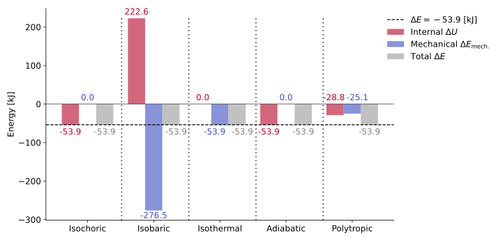

(sec_specific_heats_as_properties)=
## Specific heats

When a system is supplied with energy as heat, its temperature usually rises. The way that rise happens depends on **how the process is constrained** — for instance, whether the system can expand or not. Some of these constrained processes can be easily reproduced experimentally, allowing us to **relate measurable quantities** such as the energy added and the resulting temperature increase. From these controlled experiments arise the definitions of the **specific heats**, which connect changes in internal energy and enthalpy to temperature variations.

---

(subsec_heat_under_constraints)=
### Heat transfer derived from the $1^{\text{st}}$ law

Starting from the {ref}`differential form <eq_first_law_reduced_diff>` of the $1^{\text{st}}$ law for closed systems, two particularly simple experimental constraints can be considered.
These cases are not only conceptually simple but also **easy to reproduce in laboratory conditions**, as they rely on straightforward physical setups that isolate one energy-transfer mechanism at a time:

* **Constant volume (isochoric process):**

  This condition can be achieved by enclosing the substance in a **rigid, sealed container**, so that no change in volume can occur ($\mathrm{d}v = 0$).
  The system cannot perform boundary work, and the expression reduces to

  $$
  \mathrm{d}U = \delta Q.
  $$

  Thus, the **heat transferred** (per unit mass, or in specific form) equals the **change in internal energy**:

  $$
  \boxed{\delta q|_{v=\text{const.}} = \delta q_v = \mathrm{d}u}.
  $$

* **Constant pressure (isobaric process):**

  This setup is obtained by allowing the system to expand or contract against a **constant external pressure** — for instance, by using a **piston–cylinder assembly** open to the atmosphere.
  In this configuration ($\mathrm{d}p = 0$), we can rewrite the $1^{\text{st}}$ law in {ref}`terms of enthalpy <eq_heat_enthalpy_relation1>` and obtain:

  $$
  \mathrm{d}H = \delta Q.
  $$

  Therefore, at constant pressure, the **heat transfer** (again, in specific terms) equals the **enthalpy change** (the subscript ${p}$ states that the volume is kept constant):

  $$
  \boxed{\delta q|_{p=\text{const.}} = \delta q_p = \mathrm{d}h}.
  $$

These two situations — constant volume and constant pressure — are the most fundamental experimental settings for studying the relation between **heat input** and **temperature variation**, since they can be realized with simple, well-controlled apparatuses.

:::{note}

**WHY EXPERIMENTAL FEASIBILITY MATTERS**

The relevance of these two constraints lies in the fact that they can be practically achieved and precisely controlled. A rigid container naturally enforces constant volume, while a piston–cylinder exposed to the atmosphere maintains constant pressure. This experimental feasibility allows direct measurement of how much heat is required to change a substance’s temperature under each condition — making $c_v$ and $c_p$ measurable, reproducible, and physically meaningful properties.
:::

---

(subsec_experimental_basis_specific_heats)=
### Experimental origin of the specific heats

In both the **constant-volume** and **constant-pressure** experiments, the energy added as heat produces a **temperature increase** that can be measured.
The proportionality between the temperature rise and the energy supplied leads naturally to the introduction of **specific heats**.

Because **internal energy** $u$ and **enthalpy** $h$ are **state properties** — each depending on measurable variables like temperature and pressure or volume — their changes can be expressed through **partial derivatives**, where one parameter is held fixed while the other varies.

{ref}`By the state postulate <subsec_state_postulate>`, we know that two independent intensive variables suffice for determining the thermodynamic state of a simple compressible system. Holding one of them (either pressure or specific volume) constant while varying temperature isolates how the energy changes with $T$ under that specific condition.

* At **constant volume**:

  $$
  \left(\frac{\partial u}{\partial T}\right)_v = c_v \ [\text{kJ}/(\text{kg}{\cdot}\text{K})].
  $$

* At **constant pressure**:

  $$
  \left(\frac{\partial h}{\partial T}\right)_p = c_p \ [\text{kJ}/(\text{kg}{\cdot}\text{K})].
  $$

These relations show how **internal energy** and **enthalpy** respond to temperature changes for a given substance, defining the **specific heats** $c_v$ and $c_p$ as **property-based coefficients** — characteristic of the substance and its thermodynamic state, just like $u$ or $h$ themselves.

In practice, when these experiments are repeated over wider temperature intervals, the proportionality between the supplied heat and the resulting temperature change is found **not to remain strictly linear**. This deviation indicates that the amount of energy required to raise the temperature of a substance by one degree depends on how much of its internal structure (translational, rotational, vibrational modes) is energetically active at that temperature. Hence, the specific heats must be regarded as **temperature-dependent quantities**:

$$
c_v = c_v(T), \qquad c_p = c_p(T),
$$

since the microscopic mechanisms governing energy storage evolve with temperature.

:::{important}

**HEAT IS NOT A STATE PROPERTY**

Although the expressions
$\delta q_v = c_v\mathrm{d}T$ and $\delta q_p = c_p\mathrm{d}T$
might seem to imply that heat ($Q$) is a state property, this is **not the case**.

Heat is a **process magnitude**, not a property of the state.
It depends on the **path** taken between two states — even if, under certain constraints, its infinitesimal change appears to have a simple differential form.
Only the energy-related quantities ($u$, $h$) are **state functions**; the heat $q$ is simply the **mode of transfer** through which those properties change.

| **Quantity**              | **Expression (infinitesimal form)** | **Always valid?** | **Requires constraint?** | **Constraint type**              |
| :------------------------ | :---------------------------------- | :---------------: | :----------------------: | :------------------------------- |
| Internal energy variation | $\mathrm{d}u = c_v\mathrm{d}T$     |         Yes         |             No            | Always valid definition of $c_v$ |
| Enthalpy variation        | $\mathrm{d}h = c_p\mathrm{d}T$     |         Yes         |             No            | Always valid definition of $c_p$ |
| Heat transfer (isochoric) | $\delta q_v = c_v\mathrm{d}T$      |         No         |             Yes            | $v = \text{constant}$            |
| Heat transfer (isobaric)  | $\delta q_p = c_p\mathrm{d}T$      |         No         |             Yes            | $p = \text{constant}$            |
:::

:::{note}

**ON THE UNITS OF SPECIFIC HEATS**

Notice that both $c_p$ and $c_v$ are measured in $[\text{kJ}/(\text{kg}{\cdot}\text{K})]$, which means that the specific heats express the **amount of energy required to raise the temperature of one kilogram of a substance by one kelvin**, under the specified constraint (constant volume or constant pressure).
:::

---

(subsec_three_models_real_ideal_perfect_gases)=
### Three models: real, ideal and perfect gases

So far, we have recognized two main approaches to describe gas behavior: {ref}`real and ideal gases <subsec_equation_of_state_gases>`.
In **real gases**, intermolecular forces play an important role, and their influence must be accounted for in the equation of state, which can become quite complex.
In contrast, **ideal gases** are those in which such forces are neglected and the molecules behave as independent particles. Their behavior is then governed by the simple law $pv = RT$.

When considering the dependence of specific heats, this distinction becomes even clearer. For **real gases**, the specific heats vary with both **temperature** and **pressure (or volume)**, reflecting the effects of molecular interactions:

$$
c_v = c_v(T, p), \qquad c_p = c_p(T, p).
$$

For **ideal gases**, where intermolecular effects are absent, the **internal energy** ($u$) and **enthalpy** ($h$) depend **only on temperature**, and so do their derivatives:

$$
c_v = c_v(T), \qquad c_p = c_p(T).
$$

This simplification makes ideal gases particularly convenient for analytical modeling, as it decouples thermal effects from pressure or volume variations.

Yet a further simplification defines the **perfect gas**, a special case of the ideal gas in which $c_v$ and $c_p$ are **assumed constant** over the temperature range considered.

:::{important}

**SUMMARY OF THE THREE GAS MODELS**

| **Gas type**    | **Dependence of $c_v$, $c_p$**               | **Interactions**                         |            **Equation of state**            |
| :-------------- | :------------------------------------------- | :--------------------------------------- | :-----------------------------------------: |
| **Real gas**    | $c_v = c_v(T,p)$, $c_p = c_p(T,p)$           | Intermolecular forces significant        | Non-ideal (e.g. van der Waals, virial form) |
| **Ideal gas**   | $c_v = c_v(T)$, $c_p = c_p(T)$               | No interactions; only elastic collisions |                  $pv = RT$                  |
| **Perfect gas** | $c_v = \text{const.}$, $c_p = \text{const.}$ | Same assumptions as ideal gas            |                  $pv = RT$                  |
:::

Thus, every perfect gas is an ideal gas, but not every ideal gas is perfect — and neither are real gases ideal.
For energy calculations, these distinctions lead to the following general expressions:

$$
\Delta u = \int_{T_1}^{T_2} c_v(T)\mathrm{d}T,
\qquad
\Delta h = \int_{T_1}^{T_2} c_p(T)\mathrm{d}T,
$$

which, in the **perfect-gas approximation**, simplify to

$$
\boxed{\Delta u = c_v\Delta T, \qquad \Delta h = c_p\Delta T.}
$$

::::{important}

**THE JOULE FREE-EXPANSION EXPERIMENT**

The **Joule free-expansion experiment** provides direct experimental evidence that, for an **ideal gas**, both the **internal energy** and **enthalpy** depend only on temperature.

In Joule’s classic setup, a gas was allowed to **expand freely** into a vacuum from one rigid container into another, both thermally insulated (an **adiabatic free expansion**).
The key observations were:

1. **No heat exchange** occurred with the surroundings ($Q = 0$).
2. **No work** was performed by the gas ($W = 0$), since the expansion happened against a vacuum.

From the $1^{\text{st}}$ law for a closed system,

$$
\Delta U = Q - W,
$$

it follows that

$$
\Delta U = 0.
$$

However, after the expansion, the gas was observed to have the **same temperature** as before.
Thus, since $\Delta U = 0$ and $\Delta T = 0$, Joule concluded that, for such gases,

$$
U = U(T),
$$

i.e. **the internal energy of an ideal gas depends only on temperature**, not on volume or pressure.

Extending this result to the enthalpy,

$$
h = u + pv,
$$

and using the ideal gas law $pv = RT \implies pv=f(T)$, it follows that

$$
h = h(T),
$$

because both $u$ and $RT$ are functions of temperature only.

This experiment therefore established a fundamental property of ideal gases:

:::{epigraph}
**For an ideal gas, both $u$ and $h$ are functions of temperature only — independent of pressure and volume.**
:::

:::{note}

**THE SIGNIFICANCE OF JOULE'S RESULT**

Joule’s finding not only confirmed the validity of the ideal gas model but also provided the physical foundation for using temperature-dependent specific heats $c_v(T)$ and $c_p(T)$, since:

$$
\mathrm{d}u = c_v(T)\mathrm{d}T, \qquad \mathrm{d}h = c_p(T)\mathrm{d}T.
$$

These relations remain valid for all ideal gases and form the basis for most thermodynamic analyses involving temperature changes.
:::

::::

---

(subsec_relation_between_specific_heats)=
### Relation between $c_p$ and $c_v$

Recognizing that both $c_v$ and $c_p$ describe how internal energy and enthalpy vary with temperature allows us to explore how they are **interrelated**. For an ideal (or perfect) gas, the relation between $c_p$ and $c_v$ follows directly from the {ref}`enthalpy definition <eq_enthalpy_def>`:

$$
h = u + RT \ \Rightarrow \ \mathrm{d}h = \mathrm{d}u + R\mathrm{d}T.
$$

Substituting the differential forms $\mathrm{d}u = c_v\mathrm{d}T$ and $\mathrm{d}h = c_p\mathrm{d}T$ yields the **Mayer relation**:

(eq_mayer_relation)=
$$
\boxed{c_p - c_v = R} \ .
$$

This simple expression links both specific heats through the gas constant and reveals how much additional energy must be supplied at constant pressure to account for the work of expansion.

:::{note}

**THE ROLE OF $R$ IN ISOTHERMAL PROCESSES**

In analogy to how $c_v$ and $c_p$ appear under their respective constraints (isochoric and isobaric), the **gas constant** $R$ plays a similar role for **isothermal** processes of **ideal gases** — where temperature remains constant but **pressure** and **volume** vary.

In such cases, from the **Mayer relation**,

$$
R = c_p - c_v,
$$

the gas constant represents the **energy required for unit mass (or mole) of gas to expand by unit temperature change at constant pressure**, relative to constant volume — that is, the *energy per unit temperature that goes into $pv$ (expansion) work* rather than internal energy.

During **isothermal processes**, $\Delta T = 0 \Rightarrow \Delta u = \Delta h = 0$, so the heat transfer $Q$ is entirely converted into **boundary work** $W$. Using the ideal gas law $pv = RT$, we have:

$$
w = q = \int_{v_1}^{v_2} p\mathrm{d}v = RT \ln\frac{v_2}{v_1}.
$$

Hence, while $c_v$ and $c_p$ connect temperature changes to internal energy and enthalpy changes under fixed constraints, **$R$ governs the energy exchange during isothermal transformations** — quantifying how much energy (per unit mass or mole) is transferred as work when an ideal gas expands or compresses *without changing its temperature*.

In short:

| Process type | Constraint          | Governing relation         | Physical meaning                                        |
| :----------- | :------------------ | :------------------------- | :------------------------------------------------------ |
| Isochoric    | $v = \text{const.}$ | $\Delta u = c_v \Delta T$  | Heat changes internal energy only                       |
| Isobaric     | $p = \text{const.}$ | $\Delta h = c_p \Delta T$  | Heat changes both internal energy and $pv$ work         |
| Isothermal   | $T = \text{const.}$ | $q = w = R T \ln(v_2/v_1)$ | Heat fully converts to work (no $\Delta u$, $\Delta h$) |
:::

The ratio of the two specific heats,

(eq_gamma_def)=
$$
\boxed{\gamma = \frac{c_p}{c_v}} \ ,
$$

is dimensionless and depends on the **molecular structure** of the gas — specifically on the number of active degrees of freedom (translation, rotation, vibration).
For most real gases, $\gamma$ decreases slightly with temperature as vibrational modes become excited.

| **Gas type**               | **Molecular examples** |                    **Degrees of freedom (approx.)**                   | $\gamma = c_p/c_v$ (typical) {cite}`2015Cengel`|
| :------------------------- | :--------------------- | :-------------------------------------------------------------------: | :--------------------------: |
| **Monoatomic**             | $\text{He}$, $\text{Ne}$, $\text{Ar}$             |                            3 translational                            |           1.66–1.67          |
| **Diatomic**               | $\text{N}_{2}$, $\text{O}_{2}$, $\text{H}_{2}$, Air        |                     3 translational + 2 rotational                    |           1.38–1.41          |
| **Triatomic (linear)**     | $\text{CO}_{2}$, $\text{N}_{2}\text{O}$               | 3 translational + 2 rotational + (1 vibrational active at higher $T$) |           1.30–1.33          |
| **Triatomic (non-linear)** | $\text{H}_{2}\text{O}$, $\text{SO}_{2}$               |             3 translational + 3 rotational + (vibrational)            |           1.25–1.29          |
| **Polyatomic (≥ 4 atoms)** | $\text{CH}_{4}$, $\text{C}_{2}\text{H}_{6}$, $\text{NH}_{3}$         |          3 translational + 3 rotational + several vibrational         |           1.10–1.20          |

Because $c_p$, $c_v$, and $\gamma$ are **thermodynamic properties**, their values depend on the gas type and temperature and are therefore **tabulated** in engineering handbooks and reference sources for practical use {cite}`2015Cengel`

:::{note}

**ON THE RELATION BETWEEN $\gamma$ AND THE MOLECULAR STRUCTURE**

The decreasing values of $\gamma$ with the increasing complexity of the molecular structre illustrates how such a complexity broadens the number of energy-storage modes and making the gas more “thermally compliant.” Such a thermal compliance means that the gas can **absorb more energy for a given temperature increase** — in other words, it has more ways to store energy internally (through rotational and vibrational modes). As molecular complexity increases, energy is distributed among more degrees of freedom, so temperature rises less for the same energy input, resulting in a **lower** value of $\gamma$.
:::

Beyond the ratio $\gamma = c_p / c_v$, it is often convenient to introduce a **generalized specific heat** $c$ to describe **polytropic processes**, where pressure and volume follow $p v^n = \text{constant}$.
In such processes, the effective heat capacity $c$ links directly to the polytropic exponent $n$ through the relation:

(eq_polytropic_exponent_relation)=
$$
\boxed{n = \frac{c_p - c}{c_v - c}}.
$$

This expression shows that the value of $n$ — and therefore the thermodynamic character of the process — depends on the relative position of the process-specific heat $c$ between $c_v$ and $c_p$.
When $c$ approaches $c_v$, the process tends toward isochoric behavior ($n \to \infty$); when $c$ approaches $c_p$, the process becomes isobaric ($n \to 0$).
Intermediate values of $c$ correspond to **polytropic processes** with partial heat exchange between the system and its surroundings.

| **Process type** | **Condition**       | **Polytropic index** $n$ |  **Effective specific heat** $c$  |
| :--------------- | :------------------ | :----------------------: | :-------------------------------: |
| **Isochoric**    | $v = \text{const.}$ |      $n \to \infty$      |             $c = c_v$             |
| **Isobaric**     | $p = \text{const.}$ |          $n = 0$         |             $c = c_p$             |
| **Isothermal**   | $T = \text{const.}$ |          $n = 1$         | $c \to \infty$ (undefined) |
| **Adiabatic**    | $Q = 0$             |       $n = \gamma$       |              $c = 0$              |

:::{note}

**ON THE DERIVATION OF $n=(c_{p} - c)/(c_{v} - c)$**

For a **simple compressible system**, the infinitesimal form of the first law is:

$$
\delta q = \mathrm{d}u + p\mathrm{d}v.
$$

For an **ideal gas**, $\mathrm{d}u = c_v\mathrm{d}T$, and since $p v = R T$, the differential of volume can be expressed as:

$$
\mathrm{d}v = \frac{R}{p}\mathrm{d}T - \frac{R T}{p^2}\mathrm{d}p.
$$

Substituting back gives:

$$
\delta q = c_v\mathrm{d}T + p\left(\frac{R}{p}\mathrm{d}T - \frac{R T}{p^2}\mathrm{d}p\right)
= (c_v + R)\mathrm{d}T - \frac{R T}{p}\mathrm{d}p.
$$

Using Mayer’s relation $c_p = c_v + R$, this becomes:

$$
\delta q = c_p\mathrm{d}T - \frac{R T}{p}\mathrm{d}p.
$$

In a **polytropic process**, pressure and volume are related by:

$$
p v^n = \text{constant}.
$$

Differentiating logarithmically:

$$
\frac{\mathrm{d}p}{p} = -n\frac{\mathrm{d}v}{v}.
$$

Since $v = R T / p$, we can also relate $\mathrm{d}p/p$ to $\mathrm{d}T/T$:

$$
\frac{\mathrm{d}p}{p} = \frac{n}{1 - n}\frac{\mathrm{d}T}{T}.
$$

Replacing $\mathrm{d}p$ in the previous expression for $\delta q$:

$$
\delta q = c_p\mathrm{d}T - \frac{R T}{p}\left(\frac{p n}{(1 - n)T}\mathrm{d}T\right)
= \left[c_p - \frac{n R}{1 - n}\right]\mathrm{d}T.
$$

Hence, for a polytropic process, the heat exchanged per unit temperature change is:

$$
\delta q = c\mathrm{d}T, \quad \text{with} \quad c = \frac{c_p - n R}{1 - n}.
$$

Substituting $R = c_p - c_v$ finally gives:

$$
c = \frac{c_p - n c_v}{1 - n},
$$

and rearranging:

$$
n = \frac{c_p - c}{c_v - c}.
$$

This expression tells us **how “polytropic” the process is**, i.e., how much of the internal energy change comes from heat exchange vs. work:

* $c$ represents the **effective specific heat** — the amount of heat per unit temperature change for the actual process.
* $c_p$ and $c_v$ are the two **limiting values**:

  * $c_p$ corresponds to the case where pressure is constant and all $p,\mathrm{d}v$ work is supplied by heat input.
  * $c_v$ corresponds to no expansion work (constant volume), where all heat goes into raising internal energy.

Between those extremes, the process behaves *partly like both*, depending on how much of the energy supplied (or extracted) goes into expansion/compression work.

The exponent $n$ thus acts as a **thermodynamic dial** between these limits:

* When $c = c_p$ → $n = 0$: constant pressure.
* When $c = c_v$ → $n \to \infty$: constant volume.
* When $c = 0$ → $n = \gamma$: adiabatic (no heat exchange).
* When $c$ tends to infinity → $n = 1$: isothermal (heat input fully compensates the work done).

:::

::::{important}

**WORKED EXAMPLE — FINAL TEMPERATURES WITH A PERFECT GAS MODEL**

**Problem statement**

In the two previous worked examples, we have {ref}`calculated the work associated with different processes <worked_example_boundary_work>` and {ref}`obtained the required heat input for a fixed net energy change <worked_example_energy_balance>`.
The purpose of this worked example is to determine the **final temperature** of nitrogen ($\mathrm{N_2}$) at the end of those processes, using the **perfect gas model**. For the polytropic process, calculate the effective heat capacity $c$ as well.

We consider the **same system and initial state** (closed system, $m=1~\mathrm{kg}$ of $\mathrm{N_2}$, $p_1=100~\mathrm{kPa}$, $T_1=300~\mathrm{K}$) and keep the **same net stored‐energy change** as before:

$$
\Delta E = -53.9~\mathrm{kJ}.
$$

Caveat: {ref}`mind that, in general <eq_first_law_components>`, $\Delta E \neq \Delta U$. For a closed system,

$$
\Delta E = \Delta U + \Delta E_{\text{k.}} + \Delta E_{\text{p.}} = \Delta U + \Delta E_{\mathrm{mech.}} = Q - W,
$$

so the **mechanical‐energy** change $\Delta E_{\mathrm{mech.}} = \Delta E_{\text{k.}} + \Delta E_{\text{p.}}$ must be accounted for.

---

**Synthesis**

Perfect‐gas, constant specific heats:

$$
c_v = \frac{R}{\gamma-1}, \qquad \Delta U = m c_v (T_2 - T_1).
$$

With $\Delta E$ fixed and the known $W$ from the boundary‐work example:

$$
Q = \Delta E + W, \qquad \Delta E_{\mathrm{mech.}} = \Delta E - \Delta U.
$$

Path relations used to obtain $T_2$:
* isochoric $v=\mathrm{const.}$ (assume $\Delta E_{\mathrm{mech.}}=0$);
* isobaric $p=\mathrm{const.}$ with volume doubling ($T_2/T_1=v_2/v_1=2$);
* isothermal $T=\mathrm{const.}$;
* adiabatic, reversible $Q=0,\ pv^\gamma=\mathrm{const.}$;
* polytropic $pv^n=\mathrm{const.}$ with $n=1.2$.

---

**Problem data**

**Constants and initial state**

| Quantity                  |        Symbol        |                            Value |
| :------------------------ | :------------------: | -------------------------------: |
| Gas                       |           —          |         Nitrogen, $\mathrm{N_2}$ |
| Mass                      |          $m$         |                  $1~\mathrm{kg}$ |
| Initial temperature       |         $T_1$        |                 $300~\mathrm{K}$ |
| Initial pressure          |         $p_1$        |               $100~\mathrm{kPa}$ |
| Gas constant              |          $R$         | $0.2968~\mathrm{kJ/(kg\cdot K)}$ |
| Heat‐capacity ratio       |       $\gamma$       |                            $1.4$ |
| Specific heat at constant $v$      | $c_v = R/(\gamma-1)$ |  $0.742~\mathrm{kJ/(kg\cdot K)}$ |
| Fixed total energy change |      $\Delta E$      |              $-53.9~\mathrm{kJ}$ |

**Work from the boundary‐work example**

| Process                |          Relation          | $W$ [kJ] |
| :--------------------- | :------------------------: | -------: |
| Isochoric              |     $v=\mathrm{const.}$    |     +0.0 |
| Isobaric               |     $p=\mathrm{const.}$    |    +89.0 |
| Isothermal             |     $T=\mathrm{const.}$    |    +61.7 |
| Adiabatic (reversible) | $pv^{1.4}=\mathrm{const.}$ |    +53.9 |
| Polytropic $n=1.2$     | $pv^{1.2}=\mathrm{const.}$ |    +65.0 |

---

**Calculations**

1. **Isochoric**

   $W = 0$.
   Assume rigid, stationary vessel $\Rightarrow \Delta E_{\mathrm{mech.}} = 0$.
   Then $\Delta U = \Delta E = -53.9~\mathrm{kJ}$ and:

   $$
   T_2 = T_1 + \frac{\Delta U}{m c_v}
   = 300 + \frac{-53.9}{0.742}
   = 227.4~\mathrm{K}.
   $$

   $$
   \boxed{T_2 = 227.4~\mathrm{K}}, \quad
   \boxed{Q = -53.9~\mathrm{kJ}},
   $$

   $$
   \boxed{\Delta U = -53.9~\mathrm{kJ}}, \quad
   \boxed{\Delta E_{\mathrm{mech.}} = 0.0~\mathrm{kJ}} \ .
   $$

---

2. **Isobaric**

   $$
   W = +89.0~\mathrm{kJ}.
   $$

   Volume doubling:

   $$
   pv=RT \Rightarrow \frac{v_2}{v_1} = \frac{T_2}{T_1}; \ v_{2}=2v_{1} \implies \frac{T_2}{T_1}=2
   $$

   $$
   \Delta U = m c_v (T_2 - T_1)
   = (1)(0.742)(300)
   = +222.6~\mathrm{kJ}.
   $$

   $$
   \Delta E_{\mathrm{mech.}} = \Delta E - \Delta U
   = -53.9 - 222.6
   = -276.5~\mathrm{kJ}.
   $$

   $$
   Q = \Delta E + W
   = -53.9 + 89.0
   = +35.1~\mathrm{kJ}.
   $$

   Cross‐check via enthalpy:
    
   $$
   c_p = c_v + R = 0.743 + 0.2968 = 1.039~\mathrm{\tfrac{kJ}{kg\cdot K}},
   $$
   
   $$
   \Delta T = T_2 - T_1 = 600 - 300 = 300~\mathrm{K}.
   $$
   
   $$
   \Delta H = m c_p \Delta T = (1)(1.039)(300) = 311.6~\mathrm{kJ} \ \text{or}
   $$
   
   $$
   \Delta H = \Delta U + W = 222.6 + 89.0 = 311.6~\mathrm{kJ}.
   $$
   
   $$
   Q = \Delta H + \Delta E_{\mathrm{mech.}}
   = 311.6 - 276.5
   = 35.1~\mathrm{kJ} \quad (\text{same result}).
   $$
   
   $$
   \boxed{T_2 = 600.0~\mathrm{K}}, \quad
   \boxed{Q = +35.1~\mathrm{kJ}},   
   $$

   $$
   \boxed{\Delta U = +222.6~\mathrm{kJ}}, \quad
   \boxed{\Delta E_{\mathrm{mech.}} = -276.5~\mathrm{kJ}} \ .
   $$

---

3. **Isothermal**

   $$
   W = +61.7~\mathrm{kJ}.
   $$

   Since $T_2 = T_1 = 300.0~\mathrm{K}$,
   $\Delta U = 0$ and

   $$
   \Delta E_{\mathrm{mech.}} = \Delta E - \Delta U
   = -53.9 - 0
   = -53.9~\mathrm{kJ}.
   $$

   $$
   Q = \Delta E + W
   = -53.9 + 61.7
   = +7.8~\mathrm{kJ}.
   $$

   $$
   \boxed{T_2 = 300.0~\mathrm{K}}, \quad
   \boxed{Q = +7.8~\mathrm{kJ}},
   $$

   $$
   \boxed{\Delta U = 0.0~\mathrm{kJ}}, \quad
   \boxed{\Delta E_{\mathrm{mech.}} = -53.9~\mathrm{kJ}} \ .
   $$

---

4. **Adiabatic**

   $Q = 0$, and $pv^\gamma = \mathrm{const.}$ with volume doubling:

   $$
   T_2 = T_1 \left(\frac{v_1}{v_2}\right)^{\gamma-1}
   = 300(0.5)^{0.4}
   = 227.4~\mathrm{K}.
   $$

   $$
   \Delta U = m c_v (T_2 - T_1)
   = (1)(0.743)(227.4 - 300)
   = -53.9~\mathrm{kJ}.
   $$

   $$
   \Delta E_{\mathrm{mech.}} = \Delta E - \Delta U
   = -53.9 - (-53.9)
   = 0.0~\mathrm{kJ}.
   $$

   $$
   W = Q - \Delta E = 0 - (-53.9) = +53.9~\mathrm{kJ}.
   $$

   $$
   \boxed{T_2 = 227.4~\mathrm{K}}, \quad
   \boxed{Q = 0.0~\mathrm{kJ}},
   $$

   $$
   \boxed{\Delta U = -53.9~\mathrm{kJ}}, \quad
   \boxed{\Delta E_{\mathrm{mech.}} = 0.0~\mathrm{kJ}} \ .
   $$

---

5. **Polytropic ($n=1.2$)**

   $$
   W = +65.0~\mathrm{kJ}.
   $$

   $$
   T_2 = T_1 (v_2/v_1)^{1-n}
   = 300 \cdot 2^{-0.2}
   = 261.2~\mathrm{K}.
   $$

   $$
   \Delta U = m c_v (T_2 - T_1)
   = (1)(0.743)(261.2 - 300)
   = -28.8~\mathrm{kJ}.
   $$

   $$
   \Delta E_{\mathrm{mech.}} = \Delta E - \Delta U
   = -53.9 - (-28.8)
   = -25.1~\mathrm{kJ}.
   $$

   $$
   Q = \Delta E + W
   = -53.9 + 65.0
   = +11.1~\mathrm{kJ}.
   $$

   $$
   c = \frac{c_{p} - nc_{v}}{1 - n} = \frac{1.039 - 1.2{\cdot}0.742}{1 - 1.2} = -0.737 \ \text{kJ}/\left(\text{kg}\cdot\text{K}\right)
   $$

   $$
   \boxed{T_2 = 261.2~\mathrm{K}}, \quad
   \boxed{Q = +11.1~\mathrm{kJ}}, \quad
   \boxed{\Delta U = -28.8~\mathrm{kJ}},
   $$

   $$
   \boxed{\Delta E_{\mathrm{mech.}} = -25.1~\mathrm{kJ}}, \quad
   \boxed{c = -0.737 \ \text{kJ}/\left(\text{kg}\cdot\text{K}\right)} \ .
   $$

---

**Summary of results**

| Process              |          Relation          | $W$ [kJ] | $Q$ [kJ] | $T_2$ [K] | $\Delta U$ [kJ] | $\Delta E_{\mathrm{mech.}}$ [kJ] | $c$ [kJ/(kg$\cdot$K)] |
| :------------------- | :------------------------: | -------: | -------: | --------: | --------------: | ------------------------------: | -----: |
| Isochoric            |     $v=\mathrm{const.}$    |     +0.0 |    −53.9 |     227.4 |           −53.9 |                             0.0 | 0.743
| Isobaric             |     $p=\mathrm{const.}$    |    +89.0 |    +35.1 |     600.0 |          +222.6 |                          −276.5 | 1.039
| Isothermal           |     $T=\mathrm{const.}$    |    +61.7 |     +7.8 |     300.0 |             0.0 |                           −53.9 | $\to \infty$
| Adiabatic (rev.)     | $pv^{1.4}=\mathrm{const.}$ |    +53.9 |      0.0 |     227.4 |           −53.9 |                             0.0 | 0
| Polytropic ($n=1.2$) | $pv^{1.2}=\mathrm{const.}$ |    +65.0 |    +11.1 |     261.2 |           −28.8 |                           −25.1 | -0.737

---

**Visualization**

The bar chart below compares, for each process, the **internal** $U$ and **mechanical** $E_{\text{mech.}}$ variations that together yield the same total energy loss $\Delta E = -53.9\ \mathrm{kJ}$.
A horizontal dashed line marks $\Delta E$.

---

:::{tip}

**INTERPRETATION**

This example extends the same–$\Delta E$ comparison to **final temperatures** under a perfect‐gas model, while explicitly tracking **mechanical‐energy changes**.

* **Energy bookkeeping:** for every path, the first law is satisfied as $\Delta E = \Delta U + \Delta E_{\mathrm{mech.}} = Q - W$. With $\Delta E$ fixed, $Q$ shifts with $W$, and $T_2$ follows from $\Delta U = m c_v \Delta T$.
* **Isochoric:** by **assumption**, the vessel is rigid and stationary, so $\Delta E_{\mathrm{mech.}}=0$. With $W=0$, the entire energy loss is internal cooling, yielding $T_2=227.4~\mathrm{K}$.
* **Isobaric:** constant‐pressure expansion doubles the volume. Internal energy rises sharply; to keep the same total loss, the system must **lose mechanical energy**. Macroscopically, this corresponds to the gas doing work that propels a piston upward or raises a weight.
* **Isothermal:** temperature remains fixed ($\Delta U=0$). The total energy decrease appears as a **loss of mechanical energy**, representing the system’s macroscopic expansion against external resistance.
* **Adiabatic, reversible:** here $\Delta E_{\mathrm{mech.}}=0$ is a **result**, not an assumption. The constraints $Q=0$ and $pv^\gamma=\mathrm{const.}$ fix $T_2$, so that $\Delta U=-W$ and $\Delta E=\Delta U$.
* **Polytropic ($n=1.2$):** intermediate behavior between isothermal and adiabatic. Part of the fixed loss occurs as internal cooling, and the rest as a mechanical‐energy decrease, yielding $T_2$ between the isothermal and adiabatic values.

 

* **Macroscopic insight:**

  The sign and magnitude of $\Delta E_{\mathrm{mech.}}$ describe how the system’s **bulk kinetic or potential energy** changes. Large negative values (as in the isobaric case) indicate significant **mechanical energy release** to the surroundings—such as lifting a piston—whereas $\Delta E_{\mathrm{mech.}}=0$ corresponds to a **stationary system** whose energy changes are purely thermal.

 

* **Overall takeaway:**

    Even with the same total energy change ($\Delta E=-53.9~\mathrm{kJ}$), each process redistributes the energy differently among $Q$, $W$, $\Delta U$, and $\Delta E_{\mathrm{mech.}}$.
    The process path determines the **final temperature** and the way thermal and mechanical exchanges balance to satisfy the first law.

 

* **On the negative effective heat**: notice that the $c$ value obtained for the given polytropic index is **negative**.

  * Since $q = c\mathrm{d}T$, the *sign* of $c$ tells how **heat flow ($\delta q$)** and **temperature change ($\mathrm{d}T$)** are related:
    * If $c > 0$: heat enters the system ($\delta q > 0$) as temperature increases ($\mathrm{d}T > 0$) → the process **absorbs** heat to get hotter.
    * If $c < 0$: heat enters or leaves the system *while* temperature changes in the opposite direction — for instance, during expansion, **heat enters but the gas cools down**; during compression, **heat leaves but the gas heats up**.
    * In other words, **a negative effective specific heat means that heat and temperature change have opposite signs** — the heat transfer *partly compensates* the energy exchange produced by work.
  * When does $c$ become negative? From the relation $c = (c_p - n c_v)/(1 - n)$, $c < 0$ occurs when numerator and denominator have opposite signs — that is, for **polytropic indices $1 < n < \gamma$**.
    * For $n = 1$, the process is **isothermal** and $c \to \infty$.
    * For $1 < n < \gamma$, the process is **sub-adiabatic** (or *under-adiabatic*), meaning that **some heat transfer** occurs, but it acts *opposite* to the temperature change.
    * For $n = \gamma$, the process is **adiabatic**, and $c = 0$.
    * For $n > \gamma$, both numerator and denominator are negative, making $c > 0$ again.
  * Hence, **negative $c$ corresponds to sub-adiabatic processes**, where part of the energy transfer through work is offset by heat flow in the opposite direction.
    During expansion, the gas still cools even though it *absorbs* heat; during compression, it warms up even though it *rejects* heat. This doesn’t violate thermodynamics — it simply reflects that the **work interaction dominates over the heat exchange**. Such behavior is common in controlled expansions, throttling adjustments, or other partially insulated processes where heat and mechanical effects counteract each other.

:::

::::

---

(subsec_conceptual_closure_specific_heats)=
### Conceptual closure

* The **specific heats**, $c_v$ and $c_p$, link measurable temperature changes to the underlying variations in **internal energy** and **enthalpy**.
* Their definitions arise naturally from **experimentally realizable processes** — constant volume and constant pressure — which isolate one energy-transfer mechanism at a time.
* Because $u$ and $h$ are **state properties**, the quantities $c_v$ and $c_p$ are **well-defined thermodynamic properties**, even though the **heat** exchanged ($\delta q$) remains a **path-dependent** process variable.
* The dependence of $c_v$ and $c_p$ on **temperature** (and, for real gases, on **pressure or volume**) connects macroscopic thermodynamics with the microscopic structure of matter.
* For **ideal gases**, where $u$ and $h$ depend only on temperature, the **Mayer relation** ($c_p - c_v = R$) and the **specific heat ratio** ($\gamma = c_p / c_v$) provide compact links between these properties and molecular behavior.
* Increasing molecular complexity broadens the number of energy-storage modes, lowering $\gamma$ and making the gas more “thermally adaptable.”

Together, these ideas form the bridge between **measurable heat effects** and **intrinsic thermodynamic properties**, setting the foundation for later analyses of **energy transformations** and **flow processes**.
