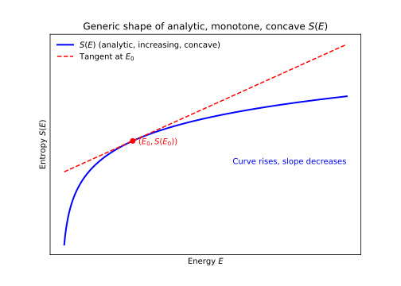
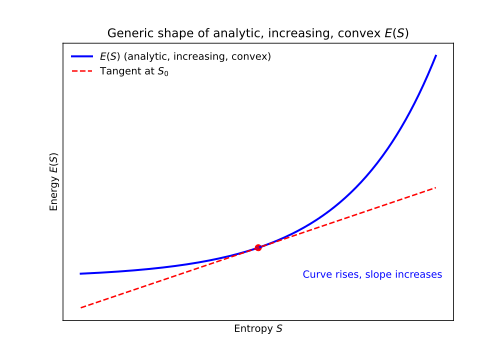
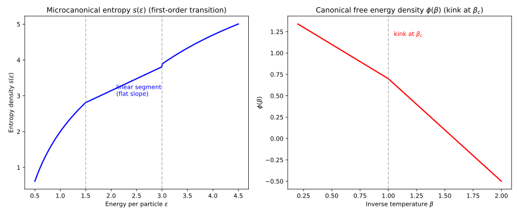

(sec_from_quantum_to_analyticity)=
## FROM QUANTUM TO ANALYTICITY

(subsec_classical_vs_quantum)=
### CLASSICAL VS QUANTUM

**FROM CLASSICAL TO QUANTUM MECHANICS: WHY A NEW FRAMEWORK?**

In **classical mechanics**, the microscopic state of a system is described in terms of **phase space**: a set of coordinates $(q,p)$, where $q$ represents positions and $p$ momenta.

* At any instant, a particle has a definite position and momentum.
* The dynamics are deterministic: if you know the initial condition $(q_0,p_0)$, Hamilton’s equations determine $(q(t),p(t))$ for all future times.
* Probabilities only enter as a practical tool: because we cannot track every molecule in a gas, we introduce distributions $f(q,p)$, but in principle, the system’s evolution is predictable.

This picture breaks down in the microscopic world because of key phenomena:

1. **Discrete spectra.**
   Atomic emission and absorption lines are quantized; energies do not vary continuously.

2. **Wave–particle duality.**
   Light and matter show interference patterns, which cannot be explained if particles are always in definite trajectories.

3. **Uncertainty principle.**
   No experiment can measure position and momentum simultaneously with arbitrary precision. This cannot be reconciled with classical determinism.

4. **Superposition and interference.**
   Systems can be in states that are *simultaneously* alternatives, leading to observable interference effects. This is beyond the reach of classical probability theory.

Thus, the “state space” of classical mechanics (phase space) is insufficient. We require a new mathematical structure that:

* Accommodates linear superposition.
* Encodes probabilities via amplitudes.
* Handles continuous observables like $x,p$, while allowing discrete spectra.
* Supports operators with real eigenvalues (for observables).

This new structure is the **Hilbert space**, which replaces classical phase space as the fundamental arena for microstates.

(subsec_hilbert_spaces_as_language_of_quantum_mechanics)=
### HILBERT SPACES AS THE LANGUAGE OF QUANTUM MECHANICS

**WHY ARE HILBERT SPACES NECESSARY?**

The need for Hilbert spaces arises from a set of **experimental facts** and **consistency requirements**:

1. **Superposition principle (linearity of states).**
   Experiments such as the double-slit show that a system can be in a state that is a combination of two possibilities.

   * If a particle can go through slit A ($|\psi_A\rangle$) or slit B ($|\psi_B\rangle$), then the most general state is

     $$|\psi\rangle = \alpha|\psi_A\rangle + \beta|\psi_B\rangle.$$
     
   * This requires the set of physical states to form a **vector space**.

2. **Complex phases matter.**
   Interference patterns depend on relative phases between amplitudes (e.g. $\alpha|\psi_A\rangle + \beta e^{i\phi}|\psi_B\rangle$ changes the observed pattern). This forces the vector space to be **over the complex numbers**, not just the reals.

3. **Probabilities come from amplitudes.**
   In classical mechanics, probability is attached directly to microstates. In quantum mechanics, the **Born rule** states:

   $$P_{\psi\to\phi} = |\langle \phi|\psi\rangle|^2.$$

   This requires a **positive-definite inner product**.

5. **Observables must yield real outcomes.**
   This requires **self-adjoint operators** on the space, whose eigenvalues are real.

6. **Infinite-dimensional necessity.**

   * The CCR $[X,P]=i\hbar I$ cannot be realized in finite dimension.
   * Many systems have infinite spectra (harmonic oscillator, hydrogen atom).
   * Continuous observables (position, momentum) require continuous bases.

7. **Completeness.**
   Approximations (e.g. Fourier expansions) must converge to valid states. This requires the space to be **complete** under the induced norm.

Together, these imply that the correct framework is a **complex, infinite-dimensional, complete inner-product space**: a Hilbert space.

---

**MATHEMATICAL DEFINITION**

A **Hilbert space** $\mathcal{H}$ is a complex vector space with an inner product $\langle \cdot|\cdot \rangle$ that satisfies:

* **Conjugate symmetry:** $\langle \phi|\psi\rangle=\overline{\langle \psi|\phi\rangle}$.
* **Linearity in the second argument:** $\langle \phi|a\psi_1+b\psi_2\rangle=a\langle \phi|\psi_1\rangle+b\langle \phi|\psi_2\rangle$.
* **Positive-definiteness:** $\langle \psi|\psi\rangle \ge 0$, equality iff $\psi=0$.

It is **complete** in the norm $|\psi|=\sqrt{\langle \psi|\psi\rangle}$.

**Examples:**

1. $\mathbb{C}^2$ for spin-$\tfrac12$ systems, with basis ${|\uparrow\rangle,|\downarrow\rangle}$.
2. $L^2(\mathbb{R})$: all square-integrable functions $\psi(x)$, with

   $$\langle \phi|\psi\rangle = \int_{-\infty}^{\infty} \overline{\phi(x)}\psi(x),dx.$$
   
3. Fock space: tensor products of one-particle Hilbert spaces, symmetrized (bosons) or antisymmetrized (fermions).

---

**OPERATIONAL / PHYSICAL VIEW**

Hilbert space is the **arena of possibilities**, just like phase space in classical mechanics:

* **States:** pure states $|\psi\rangle$, mixed states $\rho$.
* **Superposition:** linear combinations are also valid states.
* **Probabilities:** transition probabilities $|\langle \phi|\psi\rangle|^2$; averages $\langle O\rangle=\mathrm{Tr}(\rho O)$.
* **Observables:** self-adjoint operators $H,X,P,S_i$, with real spectra.
* **Spectral theorem:** $H = \sum_i E_i |E_i\rangle\langle E_i|$ (discrete) or $H=\int E|E\rangle\langle E|,dE$ (continuous).
* **Completeness and measurement:** any state decomposes into a basis

  $$|\psi\rangle=\sum_i c_i|E_i\rangle,\qquad \sum_i|c_i|^2=1.$$

  Coefficients give probabilities of measurement outcomes.

---

**SUMMARY**

In statistical mechanics:

* **Classical:** states = points in phase space, probabilities via $f(q,p)$.
* **Quantum:** states = vectors or density operators in Hilbert space. Probabilities arise from inner products and the Born rule.

The Hilbert space formalism provides:

* The mathematical framework for probabilities (via $\rho$).
* The way to compute averages ($\mathrm{Tr}(\rho O)$).
* The natural setting for partition functions ($Z=\mathrm{Tr}(e^{-\beta H})$).

Thus, Hilbert space is indispensable for **quantum statistical mechanics**.

::::{admonition} Mathematically speaking

**CLASSICAL MECHANICS: PHASE SPACE**

In **classical mechanics**, the state of an $N$-particle system at time $t$ is given by the collection of positions and momenta:

$$
(\mathbf{q},\mathbf{p}) = (q_1,\dots,q_N,p_1,\dots,p_N).
$$

The **phase space** $\Gamma$ is the $2N$-dimensional manifold spanned by these variables:

$$
\Gamma = \mathbb{R}^{2N}.
$$

* **Structure of phase space**

    * **Differentiable manifold:** $\Gamma$ is a smooth manifold (coordinates are $(q_i,p_i)$).
    
    * **Symplectic structure:** $\Gamma$ is equipped with a **non-degenerate, closed 2-form**
    
      $$
      \omega = \sum_{i=1}^N dq_i \wedge dp_i.
      $$
    
      This makes $(\Gamma,\omega)$ a **symplectic manifold**.
    
    * **Poisson brackets:** For functions $f,g$ on $\Gamma$, define
    
      $$
      {f,g} = \sum_{i=1}^N \left( \frac{\partial f}{\partial q_i}\frac{\partial g}{\partial p_i} - \frac{\partial f}{\partial p_i}\frac{\partial g}{\partial q_i} \right).
      $$
    
      This Poisson bracket encodes the algebra of observables.
    
    * **Dynamics:** The Hamiltonian $H(\mathbf q,\mathbf p)$ generates time evolution via Hamilton’s equations:
    
      $$
      \dot q_i = {q_i,H},\quad \dot p_i = {p_i,H}.
      $$

So the mathematical structure of classical mechanics is:

**A symplectic manifold $(\Gamma,\omega)$, with smooth functions $f:\Gamma\to\mathbb R$ as observables, endowed with the Poisson bracket.**

:::{admonition} On the symplectic nature of classical state space (phase space)
:class: tip

**THE IDEA**

A **symplectic structure** is a special kind of geometric structure that lives on the **phase space** of classical mechanics. It encodes the fact that positions and momenta come in **canonical pairs** and that dynamics preserves the “area” (or higher-dimensional volume) in phase space.

---

**FORMAL DEFINITION**

A **symplectic manifold** is a pair $(M,\omega)$ where:

* $M$ is a smooth even-dimensional manifold (e.g. $\mathbb R^{2N}$ for $N$ degrees of freedom).
* $\omega$ is a **2-form** on $M$ (an antisymmetric bilinear form at each point, extended smoothly).
* $\omega$ is:

  * **Closed:** $d\omega = 0$ (its exterior derivative vanishes).
  * **Non-degenerate:** for every nonzero tangent vector $v$, there exists some $w$ such that $\omega(v,w)\neq 0$.

For standard phase space $(q_i,p_i)$, the symplectic form is

$$
\omega = \sum_{i=1}^N dq_i \wedge dp_i.
$$

---

**WHAT THIS MEANS PHYSICALLY**

* **Canonical structure of coordinates.**
   The fact that $\omega = dq \wedge dp$ ties $q$ and $p$ together as conjugate variables. The form tells you how they combine to define the geometry of phase space.

* **Hamilton’s equations.**
   The symplectic form allows you to turn the Hamiltonian function $H(q,p)$ into a vector field $X_H$ that generates dynamics:

   $$
   \iota_{X_H}\omega = dH,
   $$

   where $\iota$ denotes contraction. This compactly encodes Hamilton’s equations.

* **Poisson brackets.**
   The symplectic structure gives you a way to define the Poisson bracket:

   $$
   \{f,g\} = \omega(X_f,X_g),
   $$

   where $X_f$ is the Hamiltonian vector field associated to $f$.

* **Liouville’s theorem.**
   Because $\omega$ is closed, Hamiltonian flows preserve the phase-space volume form $\omega^N = dq_1\wedge dp_1\wedge \cdots \wedge dq_N \wedge dp_N$. This is the mathematical heart of Liouville’s theorem: phase-space volume is conserved under Hamiltonian time evolution.

---

**ON THE BILINEAR PAIRING**

* **The bilinear form**
    * On a $2n$-dimensional phase space $M$, the **symplectic form** is

    $$
    \omega = \sum_{i=1}^n dq_i \wedge dp_i.
    $$

    * This is not just notation: $\omega$ *pairs* every “position coordinate” $q_i$ with a unique “momentum coordinate” $p_i$.
    * The structure says: the “area element” that matters is $dq_i \wedge dp_i$, not $dq_i \wedge dq_j$ or $dp_i \wedge dp_j$.

* **Why this enforces conjugation**
    * The fact that $\omega$ is **non-degenerate** means that each $dq_i$ must have a partner $dp_i$ such that $\omega(dq_i,dp_i)\neq 0$.
    * This **forces a pairing**: the only way to build a nondegenerate 2-form on $2n$ dimensions is to organize the coordinates into $n$ conjugate pairs.
    * Thus the very existence of $\omega$ enforces that for every generalized coordinate $q_i$ there is a conjugate momentum $p_i$.

* **Physics behind it**
    * Conjugation expresses how energy is exchanged: $q_i$ and $p_i$ are the natural dual variables in Hamilton’s equations,
    
      $$
      \dot{q}_i = \frac{\partial H}{\partial p_i}, \qquad
      \dot{p}_i = -\frac{\partial H}{\partial q_i}.
      $$
      
    * Without the symplectic structure, you would not have such neat first-order equations: you’d be stuck with second-order Newtonian equations.
    * The **conjugacy** is not just convenient — it is **encoded by the symplectic geometry** of phase space.

---

**WHY “SYMPLECTIC” AND NOT “METRIC”?**

* A **metric** (like in Riemannian geometry) measures lengths and angles.
* A **symplectic form** does *not* measure distances; instead, it measures oriented areas (or higher-dimensional “volume elements”) spanned by pairs of vectors.
* So classical mechanics is not built on a metric space, but on a symplectic space. The metric is irrelevant: what matters is the preservation of the symplectic structure.

---

**ETYMOLOGY**

* **On the word itself**
    * **“Metric”** comes from the Greek *metron* (measure), which naturally ties to lengths, distances, and angles.
    * **“Symplectic”** comes from the Greek *sym* (together) and *plektikos* (woven, plaited, intertwined).
    * So *symplectic* literally means “interwoven” or “knit together.”

* **Why “symplectic” was chosen**
    * The term was introduced by Hermann Weyl in the early 20th century. He wanted a real-geometry analogue of “complex” (from *complexus*, “woven together”) to describe the geometry underlying Hamiltonian mechanics.
        * In linear algebra, a symplectic form is an **antisymmetric bilinear form** $\omega(u,v)$, not a metric.
        * Instead of measuring lengths ($g(u,u)$), it measures **oriented areas** via $\omega(u,v)$.
        * In higher dimensions, repeated wedge products $\omega^n$ measure higher-dimensional volumes.
    * Thus the “woven together” aspect refers to how pairs $(q,p)$ are locked together by $\omega = \sum dq_i \wedge dp_i$.

* **How this ties to area/volume**
    * In a 2D plane with coordinates $(q,p)$, the symplectic form is $\omega = dq \wedge dp$.
    * Given two vectors $u=(u_q,u_p)$ and $v=(v_q,v_p)$,
      
      $$
      \omega(u,v) = u_q v_p - u_p v_q,
      $$
      
      which is exactly the signed **area** of the parallelogram spanned by $u$ and $v$.
    * In $2n$ dimensions, $\omega^n$ measures $2n$-dimensional volume (the Liouville measure).
    * So the “symplectic” structure generalizes the idea of **area elements** to higher-dimensional phase space.

---

**SUMMARY**

* “Symplectic” refers to the special 2-form $\omega$ that lives on phase space and encodes the canonical pairing of coordinates $(q,p)$.
* It makes phase space into a **symplectic manifold** $(\Gamma,\omega)$.
* It defines Poisson brackets, Hamilton’s equations, and underpins Liouville’s theorem.
* Unlike a metric, it doesn’t measure lengths/angles but encodes the **area-preserving geometry** of Hamiltonian flows.
* The symplectic structure enforces conjugation because its non-degenerate 2-form pairs coordinates into $(q,p)$ blocks, and this pairing uniquely induces the Poisson brackets ${q_i,p_j}=\delta_{ij}$, making “position” and “momentum” natural conjugates in Hamiltonian mechanics.
* The word *symplectic* itself means “woven together,” reflecting how positions and momenta are paired. The mathematics makes this literal: the symplectic form $\omega$ measures **oriented areas** (and, by wedge powers, volumes) in phase space. So while *metric* ties to lengths, *symplectic* ties to **area/volume preservation** under the dynamics of classical mechanics.

So: **phase space is not just $\mathbb R^{2N}$ — it is $\mathbb R^{2N}$ with a symplectic structure.** That’s what makes classical Hamiltonian mechanics work.

:::

---

**QUANTUM MECHANICS: HILBERT SPACE**

In **quantum mechanics**, the state is no longer a point in phase space, but a **ray in a Hilbert space** $\mathcal H$.

* **Hilbert space:** A complete complex vector space with inner product.

* **Observables:** Self-adjoint (Hermitian) operators $A:\mathcal H\to \mathcal H$.

* **Dynamics:** Given by Schrödinger’s equation

  $$
  i\hbar \frac{d}{dt}|\psi(t)\rangle = H|\psi(t)\rangle,
  $$

  or equivalently, Heisenberg’s equation

  $$
  \dot A = \frac{i}{\hbar}[H,A].
  $$

* **Probabilities:** The Born rule states that measurement outcomes are probabilistic, with probabilities given by $|\langle \phi|\psi\rangle|^2$.

So the quantum structure is:

**A Hilbert space $(\mathcal H, \langle\cdot,\cdot\rangle)$ with operators as observables and a commutator algebra.**

---

**KEY MATHEMATICAL DIFFERENCES**

* **State space**

    * **Classical:** a single point $(\mathbf q,\mathbf p)$ in $\Gamma$ is a complete description.
    * **Quantum:** a vector $|\psi\rangle$ in Hilbert space is a state, but only up to a global phase ($e^{i\theta}|\psi\rangle$ represents the same state).

* **Algebra of observables**

    * **Classical:** observables are smooth functions $f:\Gamma\to \mathbb R$, with Poisson brackets.
    * **Quantum:** observables are operators $A$ on $\mathcal H$, with commutators $[A,B]=AB-BA$.

    There is a **quantization map**: replace Poisson brackets by commutators:
    
    $$
    \{f,g\} \quad \longrightarrow \quad \frac{1}{i\hbar}[A,B].
    $$

* **Geometry**

    * **Classical:** symplectic geometry, deterministic flows generated by Hamiltonian vector fields.
    * **Quantum:** Hilbert space geometry, probabilistic amplitudes from inner products, unitary time evolution.

* **Nature of states**

    * **Classical:** pure states = points in phase space. Mixed states = probability distributions $\rho(\mathbf q,\mathbf p)$ on $\Gamma$.
    * **Quantum:** pure states = rays in Hilbert space. Mixed states = density operators $\rho$ on $\mathcal H$.

---

**AGAIN: WHY THE JUMP IS NECESSARY**

The passage from phase space to Hilbert space is not cosmetic; it was forced by:

* **Superposition principle:** no analogue in classical mechanics.
* **Uncertainty relations:** in classical mechanics, $q$ and $p$ can be specified simultaneously; in quantum mechanics, $[Q,P]=i\hbar$ forbids that.
* **Experimental evidence:** interference patterns, discrete spectra, stability of matter, low-temperature behavior.

Thus the mathematical framework of Hilbert space is needed to capture the essential new features of nature.

---

**SUMMARY**

* Classical mechanics is built on **symplectic manifolds** (phase space), with observables as real functions and Poisson brackets.
* Quantum mechanics is built on **Hilbert spaces**, with observables as operators and commutators.
* Thermodynamics arises in both by introducing statistical ensembles: probability measures on phase space in the classical case, density operators on Hilbert space in the quantum case.

| Feature | **Classical Mechanics** | **Quantum Mechanics** |
| - | - | - |
| **State space**  | Phase space $\Gamma = \mathbb R^{2N}$ (positions $q_i$, momenta $p_i$) | Hilbert space $\mathcal H$ (complex inner product space, complete) |
| **Pure state** | A single point $(\mathbf q,\mathbf p)\in \Gamma$ | A ray $ \psi\rangle\in \mathcal H$ (vector modulo global phase) |
| **Mixed state** | Probability density $\rho(\mathbf q,\mathbf p)$ on $\Gamma$, $\rho\ge0$, $\int \rho{}d\Gamma=1$ | Density operator $\rho$ on $\mathcal H$, $\rho\ge0$, $\mathrm{Tr}\rho=1$ |
| **Observables** | Smooth real functions $f:\Gamma\to\mathbb R$ | Self-adjoint (Hermitian) operators $A=A^\dagger$ on $\mathcal H$ |
| **Algebra** | Poisson bracket:  $\{f,g\}=\sum_i \Big(\frac{\partial f}{\partial q_i}\frac{\partial g}{\partial p_i}-\frac{\partial f}{\partial p_i}\frac{\partial g}{\partial q_i}\Big)$ | Commutator: $[A,B]=AB-BA$ with correspondence $\{f,g\}\leftrightarrow\tfrac{1}{i\hbar}[A,B]$ |
| **Dynamics** | Hamilton’s equations: $\dot q_i={q_i,H}\dot p_i={p_i,H}$ | Schrödinger equation: $i\hbar \frac{d}{dt} \psi(t)\rangle=H \psi(t)\rangle$ or Heisenberg eq.: $\dot A=\tfrac{i}{\hbar}[H,A]$ |
| **Geometry** | Symplectic manifold $(\Gamma,\omega)$ with $\omega=\sum_i dq_i\wedge dp_i$ | Complex Hilbert space with inner product $\langle\phi \psi\rangle$ (probability amplitudes) |
| **Expectation values** | Ensemble average: $\langle f\rangle = \int_\Gamma f(\mathbf q,\mathbf p)\rho(\mathbf q,\mathbf p),d\Gamma$ | Quantum average: $\langle A\rangle = \mathrm{Tr}(\rho A)$ |
| **Uncertainty** | Can know $q$ and $p$ simultaneously with arbitrary precision | Non-commutativity: $[Q,P]=i\hbar$ ⇒ uncertainty principle $\Delta Q \Delta P \ge \hbar/2$ |
| **Thermodynamic ensembles** | Probability measures on $\Gamma$, e.g. $\rho \propto e^{-\beta H(\mathbf q,\mathbf p)}$ | Density operators on $\mathcal H$, e.g. $\rho=\tfrac{e^{-\beta H}}{Z}Z=\mathrm{Tr}e^{-\beta H}$ |

::::

::::{admonition} On the trace
:class: note

**WHAT THE TRACE IS (MATHEMATICS)**

Formally, the trace is a **linear functional** on the space of trace-class operators on a Hilbert space:

$$
\mathrm{Tr}: {A \in \mathcal{B}(\mathcal{H}) \text{trace-class}} \to \mathbb{C}.
$$

It takes an operator $A$ and outputs a scalar (real if $A$ is Hermitian).

Definition in finite dimension: if $A$ is a $d\times d$ matrix,

$$
\mathrm{Tr}(A) = \sum_{i=1}^d A_{ii}.
$$

Key structural properties:

* **Linearity:** $\mathrm{Tr}(\alpha A+\beta B)=\alpha,\mathrm{Tr}(A)+\beta,\mathrm{Tr}(B)$.
* **Cyclic property:** $\mathrm{Tr}(AB)=\mathrm{Tr}(BA)$.
* **Unitary invariance:** $\mathrm{Tr}(U^\dagger A U)=\mathrm{Tr}(A)$.
* **Spectral property:** If $A$ has eigenvalues $a_i$ (with multiplicities), $\mathrm{Tr}(A)=\sum_i a_i$.

So yes: **the trace is a mapping** from the operator space to the real (or complex) numbers, uniquely characterized by these properties.

It is not “meant” to preserve metrics, but rather it preserves **invariants under change of basis (unitary transformations)**. That invariance is why it becomes so useful: it tells you that what you compute is intrinsic to the operator, not to your coordinate system.

---

**WHY THE TRACE MATTERS IN PHYSICS**

Here’s where the jump happens from “just math” to “physical necessity”:

* In **classical probability**, expectations are

  $$
  \langle f \rangle = \sum_i p_i f(i).
  $$
  
* In **quantum mechanics**, states are operators $\rho$, and observables are operators $O$. The only way to reproduce the classical expectation in all bases and remain consistent with unitary symmetries is to define

  $$
  \langle O \rangle = \mathrm{Tr}(\rho O).
  $$

  This is not an arbitrary choice: Gleason’s theorem shows that any non-contextual probability assignment in Hilbert space must have this form.

Thus the trace becomes the **mathematical mechanism** for implementing ensemble averages in a basis-independent way.

---

**BASIS DEPENDENCE VS VARIANCE**

* In the eigenbasis of $A$, the trace is a **sum over eigenvalues**.
* In any other basis, the matrix entries look different, with off-diagonal terms, but the trace’s invariance ensures the value is the same.
* Physically, this means you can compute the partition function, or a thermal average, in whichever basis is most convenient (energy, position, momentum, coherent states, path integrals) — and the result is guaranteed to be consistent.

---

**CONNECTION WITH “METRICS”**

The trace is also used to **define metrics** on operator spaces:

* **Hilbert–Schmidt inner product:** $\langle A,B\rangle = \mathrm{Tr}(A^\dagger B)$.
* This equips the space of operators with its own inner-product structure.
* The density operator formalism uses this: probabilities and expectations come from these trace-based pairings.

So although the trace is not *primarily* a metric, it is the building block for metrics on operator spaces.

---

**SUMMARY**

* The trace is a **mathematical linear functional** that outputs an invariant scalar associated with an operator.
* Its invariance under basis change is not about “preserving a metric,” but about **capturing an intrinsic property of the operator** (the sum of its eigenvalues).
* In physics, this invariance makes it the perfect tool to generalize “sum over microstates” into the operator formalism: the partition function, expectations, and normalization conditions all use the trace because they must be basis-independent.

Yes, the trace is “just” a mathematical function in the abstract sense, but its **invariance properties** make it the *unique* mechanism that allows quantum mechanics and statistical mechanics to define probabilities, expectations, and thermodynamic quantities consistently across representations.

::::

::::{admonition} On trace-class operators
:class: note

**TRACE-CLASS OPERATORS: DEFINITION**

Let $\mathcal H$ be a Hilbert space. For a bounded operator $A:\mathcal H\to \mathcal H$, consider its **singular values**: these are the eigenvalues $s_n(A)\ge 0$ of the positive operator $\sqrt{A^\dagger A}$.

* $A$ is called **trace-class** if

$$
|A|_{1} := \sum_{n=1}^\infty s_n(A) < \infty.
$$

Here $|\cdot|_1$ is called the **trace norm**.

* For such operators, the trace is defined as

$$
\mathrm{Tr}(A) = \sum_{n=1}^\infty \langle e_n|A|e_n\rangle,
$$

where ${ |e_n\rangle }$ is any orthonormal basis of $\mathcal H$.

* This sum converges absolutely, and the value does **not** depend on the choice of basis.

So: “trace-class” means the operator has singular values that decay fast enough for the sum to converge.

---

**PROPERTIES OF TRACE-CLASS OPERATORS**

If $A$ is trace-class, then:

* **Well-defined trace:** $\mathrm{Tr}(A)$ exists and is finite.
* **Basis-independence:** $\mathrm{Tr}(A)$ is invariant under changes of orthonormal basis.
* **Spectral additivity:** if $A$ has eigenvalues ${a_i}$ (counting multiplicities), then

  $$
  \mathrm{Tr}(A) = \sum_i a_i,
  $$

  provided the sum converges absolutely.
* **Stability under products:** if $A$ is trace-class and $B$ is bounded, then $AB$ and $BA$ are trace-class, with

  $$
  \mathrm{Tr}(AB) = \mathrm{Tr}(BA).
  $$

This is what makes the cyclic property work in quantum statistical mechanics.

---

**EXAMPLES**

* **Finite-dimensional case**

    Every operator on $\mathbb C^n$ is automatically trace-class, because the sum of singular values is finite (it is just the sum of finitely many numbers). So in finite dimensions, you don’t need to worry: the trace always exists.

* **Infinite-dimensional case**

    * The **identity operator** $I$ on $L^2(\mathbb R)$ is *not* trace-class, because all singular values are $1$ and the sum $\sum 1$ diverges. That’s why $\mathrm{Tr}(I)$ is “infinite.”
    * A rank-one projection $P=|\psi\rangle\langle\psi|$ is trace-class, with $\mathrm{Tr}(P)=1$.
    * More generally, all finite-rank operators are trace-class.

* **Thermal operator**

    For a Hamiltonian $H$ bounded below, the operator

    $$
    e^{-\beta H}
    $$
    
    is trace-class for every $\beta>0$. The exponential damps large eigenvalues fast enough to make the sum $\sum_i e^{-\beta E_i}$ converge (at finite volume). This is why the partition function
    
    $$
    Z(\beta)=\mathrm{Tr}e^{-\beta H}
    $$
    
    is finite and well-defined.

---

**WHY THIS MATTERS IN PHYSICS**

The requirement that $e^{-\beta H}$ be trace-class ensures that:

* The **partition function** $Z(\beta)$ is finite.
* The **density operator**

  $$
  \rho = \frac{e^{-\beta H}}{Z}
  $$

  has unit trace.
* Expectation values $\langle O\rangle=\mathrm{Tr}(\rho O)$ are well-defined.

In short: “trace-class” is the mathematical guarantee that the **“sum over microstates” really converges** in quantum statistical mechanics.

---

**SUMMARY**

* An operator is **trace-class** if the sum of its singular values is finite.
* This condition ensures that the trace $\mathrm{Tr}(A)$ is a finite, basis-independent number.
* In physics, trace-class operators are exactly those we can use to represent states (density operators) and thermal weights (like $e^{-\beta H}$).

::::

(subsec_link_to_thermodynamics)=
### LINK TO THERMODYNAMICS

**WHY THERMODYNAMICS IS NEEDED**

Macroscopic systems contain an astronomical number of constituents: a mole of gas has $N_A \sim 10^{23}$ atoms or molecules. Each of these particles has degrees of freedom (positions and momenta classically, wavefunctions quantum mechanically). In principle, one could write down the exact equations of motion for each particle, but in practice this is impossible: the number of equations scales astronomically, and solving them is hopeless.

Yet real macroscopic systems behave **simply and reproducibly**. Pressures, temperatures, energies, entropies, phase transitions — all of these are described by compact, universal laws that do not depend on microscopic detail.

The purpose of **thermodynamics** is precisely this:

* To replace the microscopic chaos with a description in terms of a handful of **macroscopic state variables** ($T$, $S$, $U$, $V$, $N$, etc.).
* To capture **universal relations** between them (laws of thermodynamics).
* To provide a framework for predicting macroscopic equilibrium behavior **without tracking every microscopic detail**.

So thermodynamics is the **macroscopic summary** of microscopic physics. The question becomes: how do we connect the microscopic level (classical or quantum mechanics) with the macroscopic laws of thermodynamics?

---

**CLASSICAL MECHANICS AS A FOUNDATION**

* **Phase space and symplectic structure**

    In classical mechanics, the microstate of an $N$-particle system is given by positions and momenta:
    
    $$
    (\mathbf q, \mathbf p) = (q_1,\dots,q_N;p_1,\dots,p_N).
    $$
    
    The set of all such possible states forms the **phase space** $\Gamma = \mathbb R^{2N}$.
    
    But $\Gamma$ is not just any space: it has a special **symplectic structure**. Mathematically, a symplectic manifold $(\Gamma,\omega)$ is a smooth even-dimensional manifold equipped with a 2-form
    
    $$
    \omega = \sum_{i=1}^N dq_i \wedge dp_i,
    $$
    
    that is closed ($d\omega=0$) and non-degenerate. This structure encodes:
    
    * The **pairing** of each coordinate $q_i$ with its conjugate momentum $p_i$.
    * The **equations of motion** via Hamilton’s equations.
    * **Liouville’s theorem**: the symplectic form guarantees conservation of phase-space volume under time evolution.
    
    Thus, a classical **microstate** is a single point $(q,p)$ in the symplectic manifold $\Gamma$.

* **From microstates to probability distributions**

    In practice, we do not know the exact microstate of a macroscopic system. Instead, we describe our knowledge with a **probability distribution** $\rho(q,p)$ over $\Gamma$, normalized so that
    
    $$
    \int_\Gamma \rho(q,p) d\Gamma = 1.
    $$
    
    An **observable** is a smooth function $f:\Gamma\to \mathbb R$. Its expected (macroscopic) value is obtained as
    
    $$
    \langle f \rangle = \int_\Gamma f(q,p) \rho(q,p) d\Gamma.
    $$
    
    So in classical mechanics, thermodynamics arises by replacing the deterministic description of a single microstate with a **statistical ensemble of microstates**, and computing averages of observables.

---

**QUANTUM MECHANICS AS A REFINEMENT**

* **Hilbert space**

    Quantum mechanics changes the microscopic picture fundamentally.
    
    * States are no longer points in phase space, but **rays in a Hilbert space** $\mathcal H$.
    * A Hilbert space is a complete complex vector space with an inner product $\langle \phi|\psi\rangle$.
    * Pure states are vectors $|\psi\rangle\in\mathcal H$, modulo a global phase.
    * Observables are represented by self-adjoint (Hermitian) operators $A$ on $\mathcal H$.
    
    The state of a system with $10^{23}$ particles cannot be represented by a single manageable vector — the Hilbert space is astronomically large.

* **From pure states to density operators**

    Just as in classical mechanics we generalized from points in $\Gamma$ to probability densities $\rho(q,p)$, in quantum mechanics we generalize from pure states $|\psi\rangle$ to **density operators** $\rho$:
    
    * $\rho$ is a positive semidefinite operator on $\mathcal H$,
    * $\mathrm{Tr}(\rho) = 1$,
    * Pure states are special cases: $\rho = |\psi\rangle\langle\psi|$.
    
    The expectation value of an observable $A$ is defined by
    
    $$
    \langle A \rangle = \mathrm{Tr}(\rho A).
    $$
    
    This is the **quantum analogue** of the classical ensemble average integral.

---

**ENSEMBLES: THE UNIFYING CONCEPT**

An **ensemble** is a statistical description of all possible microscopic states consistent with our macroscopic knowledge.

* We never know the exact microstate (point in phase space, or vector in Hilbert space).
* But we know constraints: energy, particle number, volume, etc.
* The ensemble is the **probability assignment** over all microstates that respects those constraints.

Thus:

* In **classical mechanics**, ensembles are probability distributions $\rho(q,p)$ on phase space.
* In **quantum mechanics**, ensembles are density operators $\rho$ on Hilbert space.

Both encode incomplete knowledge of the system’s microstate, and both allow us to compute macroscopic averages.

::::{admonition} In advance: on the entropy as the main macro/micro link
:class: note

To connect ensembles to thermodynamics, we need a measure of “uncertainty” or “information content.”

* In classical mechanics, this is the Gibbs entropy:

  $$
  S = -k \int_\Gamma \rho(q,p) \ln\rho(q,p) d\Gamma.
  $$

* In quantum mechanics, this is the von Neumann entropy:

  $$
  S = -k \mathrm{Tr}(\rho \ln \rho).
  $$

Both reduce to the Shannon entropy in discrete cases. Entropy thus measures how spread out the ensemble is over possible microstates. It is the key link between microscopic ensembles and macroscopic thermodynamic laws.

::::

---

**SUMMARY**

Despite the mathematical differences (symplectic manifolds vs Hilbert spaces), the **core idea of thermodynamics** is the same in both classical and quantum frameworks:

* **We cannot track microstates.**
* **We can describe ensembles of possible microstates.**
* **We compute averages of observables over those ensembles.**
* **Thermodynamic variables** (energy, temperature, entropy, pressure) are precisely those averages, which show universal, reproducible behavior.

Classical and quantum statistical mechanics are thus two realizations of the same deeper idea: thermodynamics as the science of macroscopic averages derived from microscopic ensembles.

Quantum mechanics enriches this picture by adding features absent in classical mechanics: discreteness of energy levels, indistinguishability of particles, superposition, and entanglement. These are necessary to explain phenomena like black-body radiation, Fermi degeneracy, and Bose–Einstein condensation.

| Feature | Classical mechanics | Quantum mechanics |
| - | - | - |
| **State space** | Phase space $\Gamma$ (symplectic manifold with coordinates $(q,p)$) | Hilbert space $\mathcal H$ (complete inner product space) |
| **Pure state**  | Point $(q,p)\in \Gamma$ | Ray $ \psi\rangle \in \mathcal H$ |
| **Mixed state** | Probability density $\rho(q,p)$ on $\Gamma$ | Density operator $\rho$ on $\mathcal H$ |
| **Observables** | Smooth functions $f(q,p)$ | Self-adjoint operators $A$ |
| **Averages** | $\langle f \rangle = \int f(q,p)\rho(q,p){}d\Gamma$ | $\langle A \rangle = \mathrm{Tr}(\rho A)$ |
| **Entropy** | $S=-k\int \rho\ln\rho{}d\Gamma$ | $S=-k{}\mathrm{Tr}(\rho\ln\rho)$ |
| **Geometry** | Symplectic geometry: $\omega = \sum dq_i \wedge dp_i$, Hamiltonian flows conserve volume | Hilbert space geometry: inner product gives probabilities, unitary flows conserve norm |

In short: thermodynamics exists because direct microscopic descriptions are intractable. Classical mechanics provides phase space and probability distributions as the basis for ensembles. Quantum mechanics provides Hilbert space and density operators. In both cases, the goal is the same: to capture the macroscopic laws of nature through statistical descriptions of many-particle systems.

(subsec_rationale_derivation_microcanonical_ensemble)=
### RATIONALE AND DERIVATION OF THE MICROCANONICAL ENSEMBLE

**WHY DE MICROCANONICAL ENSEMBLE?**

**Setting:** an *isolated* macroscopic system—no energy, volume, or particles exchanged with the outside. The only macroscopic facts we know are its conserved quantities (typically $E$, $V$, $N$). We ask: *how do we predict macroscopic observables without knowing the exact microstate?*

**Core idea:** when *all* we know is that the system’s total energy is $E$ (within a tiny tolerance), and that $V,N$ are fixed, the least biased description is: *assign equal probability to every microstate compatible with those facts*. This is the **principle of equal a priori probabilities**.

**Why this matters:**

* It is the *primitive ensemble* because it assumes the least—only conservation laws.
* It supplies a **microscopic definition of entropy**, $S(E,V,N)$, from which temperature, pressure, and chemical potential are defined.
* It underlies the derivation of all other equilibrium ensembles (by carving out a subsystem and treating the rest as a bath).

---

**PHYSICAL JUSTIFICATIONS OF “EQUAL WEIGHT ON THE ENERGY SHELL”**

There are three complementary (and mutually reinforcing) rationales:

1. **Liouville invariance (classical mechanics):**

    * **Statement:** Hamiltonian dynamics preserves phase-space volume.
    
    * In classical mechanics, the equations of motion are
  
      $$
      \dot q_i = \frac{\partial H}{\partial p_i}, \qquad
      \dot p_i = -\frac{\partial H}{\partial q_i}.
      $$
  
    * These define a flow in phase space: $(q(t),p(t))$ traces a trajectory.
    * Liouville’s theorem states that the divergence of this flow vanishes:
  
      $$
      \nabla_{q,p}\cdot(\dot q, \dot p) = 0.
      $$
  
    * Geometrically: the symplectic structure $\omega=\sum dq_i\wedge dp_i$ is preserved under Hamiltonian evolution, so the phase-space volume form $\omega^N = dq_1dp_1\cdots dq_Ndp_N$ is invariant.
    
    **Consequence:**
    
    * Suppose we start with a distribution uniform on the energy shell $H(q,p)=E$.
    * Time evolution moves points along the shell, but never off it (since $H$ is conserved).
    * Because phase-space volume is preserved, no region of the shell can become more or less densely populated.
    
    Thus, a uniform distribution on the constant-energy surface is **stationary under time evolution**. That is why it is dynamically consistent: the only time-invariant distribution under Hamiltonian flow with fixed $E$ is uniform on the energy shell.

::::{admonition} On the derivation of Liouville's theorem
:class: note

**THE SETUP: HAMILTONIAN FLOW IN PHASE SPACE**

* Consider a system with $N$ degrees of freedom.
* Phase space coordinates: $(q_1,\dots,q_N, p_1,\dots,p_N) \in \mathbb R^{2N}$.
* Dynamics: Hamilton’s equations

  $$
  \dot q_i = \frac{\partial H}{\partial p_i}, \qquad
  \dot p_i = -\frac{\partial H}{\partial q_i}.
  $$

This defines a vector field on phase space:

$$
\mathbf v(q,p) = \big(\dot q_1,\dots,\dot q_N;\dot p_1,\dots,\dot p_N\big).
$$

So trajectories are integral curves of this vector field.

---

**THE CONTINUITY EQUATION IN PHASE SPACE**

Imagine a **distribution of systems** (an ensemble) represented by a probability density $\rho(q,p,t)$ on phase space. Its time evolution obeys a continuity equation:

$$
\frac{\partial \rho}{\partial t} + \nabla\cdot(\rho,\mathbf v) = 0,
$$

where $\nabla\cdot$ is the divergence in $2N$-dimensional phase space.

Expanding:

$$
\frac{\partial \rho}{\partial t} + \sum_{i=1}^N \left(
\frac{\partial}{\partial q_i}(\rho \dot q_i) + \frac{\partial}{\partial p_i}(\rho \dot p_i)
\right) = 0.
$$

---

**LIOUVILLE'S THEOREM: DIVERGENCE-FREE FLOW**

The divergence of the Hamiltonian flow $\mathbf v$ is

$$
\nabla\cdot \mathbf v = \sum_{i=1}^N \left(
\frac{\partial \dot q_i}{\partial q_i} + \frac{\partial \dot p_i}{\partial p_i}
\right).
$$

Plug in Hamilton’s equations:

* $\dot q_i = \frac{\partial H}{\partial p_i} \Rightarrow \frac{\partial \dot q_i}{\partial q_i} = \frac{\partial^2 H}{\partial q_i \partial p_i}$.
* $\dot p_i = -\frac{\partial H}{\partial q_i} \Rightarrow \frac{\partial \dot p_i}{\partial p_i} = -\frac{\partial^2 H}{\partial p_i \partial q_i}$.

So each term cancels:

$$
\frac{\partial \dot q_i}{\partial q_i} + \frac{\partial \dot p_i}{\partial p_i} = 0.
$$

Therefore:

$$
\nabla\cdot \mathbf v = 0.
$$

---

**CONSEQUENCE FOR $\rho$**

With $\nabla\cdot \mathbf v=0$, the continuity equation reduces to

$$
\frac{\partial \rho}{\partial t} + \mathbf v \cdot \nabla \rho = 0.
$$

This is exactly the statement that $\rho$ is **constant along trajectories** in phase space:

$$
\frac{d\rho}{dt} = 0 \quad \text{along solutions of Hamilton’s equations}.
$$

So the density of representative points (systems in the ensemble) is conserved as the flow moves them around.

Equivalently: if you take any volume element in phase space and let it evolve under Hamiltonian dynamics, its **volume stays the same**. The shape may distort (stretch, shear), but its $2N$-dimensional volume is preserved.

---

**WHY THIS PROVES THE UNIFORM MICROCANONICAL DISTRIBUTION**

Now let’s apply this to the microcanonical idea:

* In an isolated system, $H(q,p)$ is conserved: trajectories never leave the surface $H=E$.
* The flow is divergence-free: the number of states in any region of the energy shell is conserved.
* Therefore, if we assign **equal probability to all microstates on the energy shell**, time evolution will never change that uniformity.

This is the dynamical justification of the microcanonical ensemble: **it is the stationary distribution for isolated Hamiltonian systems**.

---

**SUMMARY**

* Liouville’s theorem states that Hamiltonian flow preserves phase-space volume (divergence-free vector field, or equivalently preservation of the symplectic form).
* This means that probability densities are constant along trajectories.
* Uniform probability on the energy shell $H=E$ is dynamically consistent — once uniform, always uniform.
* This is one of the key rationales for the microcanonical ensemble.

---

Would you like me to also show the **quantum analogue** of Liouville’s theorem (the von Neumann equation $\dot \rho = \frac{1}{i\hbar}[H,\rho]$, which preserves $\mathrm{Tr}(\rho^n)$ and hence entropy)? That would make the parallel complete.

::::

::::{admonition} On the quantum equivalent of Liouville's theorem
:class: note

**QUANTUM DYNAMICS OF STATE**

In quantum mechanics, states evolve according to the Schrödinger equation:

$$
i\hbar \frac{d}{dt}|\psi(t)\rangle = H |\psi(t)\rangle,
$$

with $H$ the Hamiltonian.

For density operators $\rho$ (which describe both pure and mixed states), the corresponding equation of motion is the **von Neumann equation**:

$$
i\hbar \frac{d\rho}{dt} = [H,\rho].
$$

---

**PROPERTIES OF THE VON NEUMANN EQUATION**

Let’s analyze what this evolution preserves:

* **Trace invariance**

    Take the derivative of the trace:

    $$
    \frac{d}{dt}\mathrm{Tr}(\rho) = \frac{1}{i\hbar}\mathrm{Tr}([H,\rho]) = \frac{1}{i\hbar}(\mathrm{Tr}(H\rho)-\mathrm{Tr}(\rho H)) = 0.
    $$

    So $\mathrm{Tr}(\rho)$ is constant (probability normalization preserved).

* **Positivity**

    If $\rho$ is positive semidefinite at $t=0$, it remains so under unitary evolution $\rho(t)=U(t)\rho(0)U^\dagger(t)$, with $U(t)=e^{-iHt/\hbar}$.

* **Spectrum preservation**

    The eigenvalues of $\rho$ are conserved, because unitary conjugation does not change the spectrum. This implies that all quantities $\mathrm{Tr}(\rho^n)$ are constant for every $n$.

* **Entropy conservation**

    In particular, the von Neumann entropy

    $$
    S[\rho] = -k\mathrm{Tr}(\rho \ln \rho)
    $$

    is constant under time evolution, because it depends only on the eigenvalues of $\rho$.
    
    So **unitary dynamics conserves entropy**. This is the direct analogue of Liouville’s theorem: the “volume” of the quantum state distribution (in operator space) is preserved.

---

**THE ANALOGY WITH THE CLASSICAL CASE**

* **Classical Liouville theorem:** Hamiltonian flow preserves phase-space volume, making uniform distributions on energy shells invariant.
* **Quantum von Neumann equation:** Unitary evolution preserves the spectrum of $\rho$, making uniform mixtures over energy eigenspaces invariant.

Both mean: **the microcanonical ensemble is dynamically consistent** — once you adopt it, time evolution doesn’t distort it.

---

**BROADER INTERPRETATION**

* In **classical mechanics**, Liouville invariance says “uniform probability on the energy shell is preserved.”
* In **quantum mechanics**, von Neumann evolution says “uniform density operator on the energy eigensubspace is preserved.”

In both cases: the microcanonical ensemble is the *natural* description of an isolated system with fixed energy, because it’s both the **least biased assignment of probabilities** (max entropy) *and* the **stationary one under the dynamics** (Liouville/von Neumann invariance).

---

**SUMMARY**

The quantum analogue of Liouville’s theorem is the **von Neumann equation** $i\hbar \dot \rho = [H,\rho]$. It ensures that the trace, positivity, spectrum, and entropy of $\rho$ are preserved in time. Since the microcanonical density operator commutes with $H$, it is exactly stationary. This guarantees that the microcanonical ensemble is a consistent equilibrium distribution in quantum mechanics, just as Liouville’s theorem guarantees it in classical mechanics.

::::

2. **Maximum entropy (information-theoretic argument):**

    * **Statement:** When all we know is the conserved quantities (like energy, volume, number of particles), the least biased probability distribution is the one that maximizes entropy subject to those constraints.
    
    * In the **classical case**, entropy is
  
      $$
      S[\rho] = -k \int \rho(q,p)\ln \rho(q,p)d\Gamma,
      $$
  
      subject to $\rho\geq 0$, $\int\rho{}d\Gamma=1$, and the condition that $\rho$ vanishes outside $H(q,p)=E$ (or the thin shell $E\le H \le E+\Delta$).
    * In the **quantum case**, entropy is the von Neumann entropy
  
      $$
      S[\rho] = -k\mathrm{Tr}(\rho\ln \rho),
      $$
  
      with $\rho$ positive semidefinite, $\mathrm{Tr}\rho=1$, and $\rho$ supported only on the eigenspace of $H$ with eigenvalue in $[E,E+\Delta]$.
    
    **Result:** The maximum of $S$ under these constraints is achieved when $\rho$ is **uniform on the allowed set**:
    
    * Classically: $\rho$ constant on the shell, zero elsewhere.
    * Quantum: $\rho$ is the normalized projector onto the energy eigensubspace.
    
    Any other assignment of probabilities would encode more “structure” than we are justified to assume, since we have no information distinguishing different microstates with the same $E$.

::::{admonition} On the formal justification of the MaxEnt argument
:class: note

**THE PHILOSOPHY BEHIND MaxEnt**

The idea goes back to Gibbs and was later formalized by E.T. Jaynes:

> When we have incomplete information about a system, the probability distribution we should use is the one that **maximizes entropy** subject to the known constraints.

Why? Because maximizing entropy ensures we are not smuggling in any “hidden bias” — we are choosing the distribution that is most *noncommittal* about unknown information, while still respecting the facts we do know.

Entropy here plays the role of a **measure of missing information**.

---

**CLASSICAL CASE**

* **Set up the problem**

    We want a probability density $\rho(q,p)$ on phase space, normalized as

    $$
    \int_\Gamma \rho(q,p) d\Gamma = 1.
    $$
    
    Constraints:
    
    * The system is isolated, so its Hamiltonian $H(q,p)$ is strictly conserved.
    * Therefore, we know the system’s energy is $E$ (within some small width $\Delta$).
    
    That means:

    $$
    \rho(q,p) = 0 \quad \text{if } H(q,p)\notin [E,E+\Delta].
    $$
    
    This is the *only* information we impose.

* **Maximize entropy**

    Classical Gibbs entropy is:

    $$
    S[\rho] = -k \int_\Gamma \rho(q,p) \ln \rho(q,p) d\Gamma.
    $$
    
    We now maximize $S[\rho]$ subject to:
    
    1. Normalization $\int \rho d\Gamma=1$.
    2. Support constraint: $\rho=0$ outside the energy shell.

* **Result**

    The calculus of variations shows that, given only the support constraint, the entropy is maximized when $\rho$ is **constant on the allowed set**.
    
    Explicitly:

    $$
    \rho_{\text{mc}}(q,p) = \frac{1}{\Omega(E,\Delta)} \chi_{\mathcal{R}(E,\Delta)}(q,p),
    $$

    where $\chi_{\mathcal R}$ is the characteristic function of the shell and $\Omega(E,\Delta)$ its volume.
    
    Any non-uniform assignment inside the shell lowers the entropy, because it “prefers” some microstates over others without justification.

---

**QUANTUM CASE**

* **Set up the problem**

    In quantum mechanics, we describe states by density operators $\rho$, with:
    
    * $\rho\ge 0$,
    * $\mathrm{Tr}(\rho)=1$.
    
    Constraint: we know the energy is in $[E,E+\Delta]$, so $\rho$ must live entirely within the subspace $\mathcal H_{E,\Delta}$ spanned by those eigenstates.
    
    That means:

    $$
    \rho = \Pi_{E,\Delta} \rho \Pi_{E,\Delta},
    $$

    where $\Pi_{E,\Delta}$ is the projector onto that energy subspace.

* **Maximize entropy**
    
    Quantum entropy (von Neumann entropy):

    $$
    S[\rho] = -k \mathrm{Tr}(\rho \ln \rho).
    $$
    
    We maximize this subject to the constraints above.

* **Result**

    * The von Neumann entropy is maximized when $\rho$ is proportional to the identity on the constrained subspace.
    * Therefore,

      $$
      \rho_{\text{mc}} = \frac{1}{\Omega(E,\Delta)}\Pi_{E,\Delta}.
      $$
    
    This is the **maximally mixed state** on the allowed eigensubspace — all compatible energy eigenstates are equally probable.

---

**WHY THIS WORKS**

* Entropy measures how much information is missing about the system’s microstate.
* Given only the constraint $H=E$, the maximum entropy distribution is the least informative (most uniform) one consistent with that.
* If we tried to assign non-uniform weights, that would implicitly assume some *extra information* (favoring some microstates over others) that we do not have.

Thus the **maximum entropy principle uniquely singles out the microcanonical ensemble** as the correct one for isolated systems with fixed energy.

---

**SUMMARY**

The microcanonical distribution (uniform over the energy shell or eigensubspace) is the distribution that maximizes entropy under the constraint of fixed energy. This makes it the most unbiased, least informative choice consistent with what we know. In both classical and quantum mechanics, the MaxEnt principle delivers the uniform distribution, which matches the other two rationales and thus justifies the microcanonical ensemble.

::::

3. **Typicality / concentration of measure:**

    * **Statement:** In very large systems (large $N$), almost every microstate compatible with $E,V,N$ yields the same macroscopic averages. Therefore, a uniform choice over all such microstates is equivalent to what is observed in practice.
    
    * Imagine a system with $N\sim 10^{23}$ particles. The number of microstates $\Omega(E,V,N)$ is astronomically large.
    * The law of large numbers and central limit phenomena imply that fluctuations of macroscopic observables (like energy per particle, density, pressure) scale as $1/\sqrt{N}$ and are vanishingly small for $N\to\infty$.
    * This means that **almost all microstates in the energy shell give practically the same values for macroscopic observables.** The overwhelming majority of states are “typical” in that sense.
    
    **Consequence:**
    
    * Picking a microstate at random from the shell (uniformly) will almost certainly yield the macroscopic values we observe.
    * Non-typical states (with strange macroscopic averages) do exist, but their fraction is exponentially small in $N$ and irrelevant for thermodynamics.
    
    This argument is sometimes called the “typicality justification” or “concentration of measure”: macroscopic observables are sharply peaked around their ensemble averages because of the huge dimensionality of state space.

* **Why all three rationales matter**

    * **Liouville invariance** ensures the uniform assignment is dynamically stable under time evolution: once uniform, always uniform.
    * **Maximum entropy** ensures it is the least biased distribution given our macroscopic knowledge: we are not smuggling in extra assumptions.
    * **Typicality** ensures that, for macroscopic systems, even if the system were not *exactly* uniform, almost all states consistent with the energy constraint give the same macro-behavior, so the uniform assumption is physically safe.

::::{admonition} On the justification of typicality
:class: note

**THE PROBLEM IT ADDRESSES**

Even if we accept Liouville’s theorem (uniformity preserved dynamically) and the MaxEnt principle (uniformity as least biased), one might still ask:

* *What if the system is not exactly uniform over the energy shell?*
* *Could non-uniformities matter for macroscopic predictions?*

The answer is **no, for macroscopic systems**, because of *typicality*: in huge state spaces, almost every microstate compatible with the energy constraint looks macroscopically the same.

---

**LAW OF LARGE NUMBERS INTUITION**

Consider an observable that is an average over $N$ particles, e.g. energy per particle, density, magnetization.

* Each microscopic contribution fluctuates, but when we average over $N$ terms, the central limit theorem tells us the standard deviation scales as

  $$
  \sigma \sim \frac{1}{\sqrt{N}}.
  $$
  
* For $N\sim 10^{23}$, $\sigma$ is astronomically small: fluctuations in macroscopic observables vanish compared to their means.

So even if the probability distribution is not perfectly uniform, the vast majority of microstates yield the same macroscopic averages within imperceptible fluctuations.

---

**CONCENTRATION OF MEASURE IN HIGH DIMENSIONS**

There is a more geometric way to see this:

* In a very high-dimensional space, probability “concentrates” on a thin shell around the average values.
* Example: in $d$-dimensional Euclidean space, the volume of a sphere of radius $R$ is concentrated in a thin shell near the surface. For large $d$, almost all points lie close to radius $R$.
* Analogously, in the $6N$-dimensional phase space of a gas, almost all microstates consistent with total energy $E$ give observables very close to their average values.

This is sometimes phrased as: *“typical microstates are representative.”*

---

**TYPICALITY IN CLASSICAL MECHANICS**

In classical statistical mechanics:

* Fix $E,V,N$. The energy shell in phase space has volume $\Omega(E,\Delta)$.
* Within this shell, consider a macroscopic observable $M(q,p)$ (e.g. pressure).
* The fraction of states for which $M$ deviates appreciably from its mean decreases **exponentially with $N$**.

Formally, large deviation theorems show that

$$
\text{Prob}\big(|M-\langle M\rangle|>\epsilon\big) \sim e^{-cN},
$$

for some $c>0$ depending on the system.

So in the thermodynamic limit $N\to\infty$, the distribution of $M$ collapses to a delta peak at its expectation value.

---

**TYPICALITY IN QUANTUM MECHANICS**

In quantum mechanics, typicality takes a slightly different flavor:

* Consider a large Hilbert space $\mathcal H_{E,\Delta}$ spanned by energy eigenstates with $E\le E_n\le E+\Delta$.
* Pick a random pure state $|\psi\rangle$ from this subspace (uniformly with respect to the Haar measure).
* Then, for any macroscopic observable $A$, the expectation $\langle \psi|A|\psi\rangle$ is overwhelmingly close to the microcanonical average $\mathrm{Tr}(\rho_{\text{mc}} A)$.

This is sometimes called **canonical typicality**: almost all pure states in the energy shell look thermal at the macroscopic level.

---

**WHY TYPICALITY MATTERS**

* It shows that **non-uniformity doesn’t matter in practice**: the uniform distribution is not just mathematically neat, but physically safe, because atypical states form a vanishing fraction of the whole.
* It explains why real systems equilibrate: after any reasonable perturbation, the overwhelming majority of accessible states yield the same macroscopic predictions, so the system looks thermal without fine-tuning.
* It bridges statistical mechanics with thermodynamics: macroscopic determinism emerges from microscopic probabilistic descriptions, thanks to concentration of measure.

---

**SUMMARY**

* **Law of large numbers**: fluctuations scale as $1/\sqrt{N}$, negligible for macroscopic $N$.
* **Concentration of measure**: in huge spaces, almost all states look the same macroscopically.
* **Classical case**: large deviation estimates show atypical states have exponentially small weight.
* **Quantum case**: almost every pure state in the energy shell yields expectation values equal to microcanonical averages.

**Therefore:** Even if we were not exactly uniform in probability assignment, the *typicality* of high-dimensional systems ensures that the microcanonical ensemble’s predictions coincide with what we see in reality.

::::

In short: the microcanonical ensemble is uniform on the energy shell because (1) dynamics preserves that uniformity (Liouville), (2) logic of incomplete information dictates it (max entropy), and (3) in practice it doesn’t matter anyway (typicality). These three rationales converge to make the microcanonical ensemble the natural and fundamental starting point of statistical mechanics.

---

**CLASSICAL MICROCANONICAL ENSEMBLE**

* **Setting: isolated classical system (fixed $(E,V,N)$)**

    We consider a classical system of $N$ particles confined in volume $V$, described by positions and momenta $(\mathbf q,\mathbf p)\in\Gamma=\mathbb R^{6N}$ with Hamiltonian $H(\mathbf q,\mathbf p)$. The system is **isolated**, so the conserved macroscopic data are $(E,V,N)$: energy $E$ is fixed (no exchange with the outside), as are $V$ and $N$.

 

* **Energy shell in phase space**

    The **constant-energy surface** is
  
    $$
    \Sigma_E = {(\mathbf q,\mathbf p)\in\Gamma: H(\mathbf q,\mathbf p)=E}.
    $$
  
    Because $\Sigma_E$ has zero Lebesgue measure in $\Gamma$, we use a **thin shell** of width $\Delta>0$:
  
    $$
    \mathcal R(E,\Delta) = {(\mathbf q,\mathbf p): E\le H(\mathbf q,\mathbf p)\le E+\Delta}.
    $$
  
    $\Delta$ is chosen **microscopically small** (no macroscopic change when $E \to E+\Delta$) but **mesoscopically large** (contains astronomically many microstates).

 

* **State counting: $\Gamma(E)$, $\omega(E)$, and $\Omega(E,\Delta)$**

    We normalize counts with $1/(N! h^{3N})$ (indistinguishability and cell size):
    
    1. **Cumulative count (“phase-space volume below $E$”):**
 
        $$
        \Gamma(E,V,N) = \frac{1}{N! h^{3N}}\int_{H(\mathbf q,\mathbf p)\le E} d^{3N}q d^{3N}p.
        $$
    
    2. **Surface density of states (DoS):** by the fundamental theorem of calculus in $E$,
 
        $$
        \omega(E,V,N) = \frac{\partial\Gamma}{\partial E}
         = \frac{1}{N! h^{3N}}\int \delta \big(E-H(\mathbf q,\mathbf p)\big) d^{3N}q d^{3N}p.
        $$
 
        ::::{admonition} Why the delta?
        :class: note
 
        We started with the **cumulative phase–space volume** below energy $E$:
        
        $$
        \Gamma(E) = \frac{1}{N! h^{3N}} \int \Theta\big(E - H(\mathbf q,\mathbf p)\big) d^{3N}q d^{3N}p,
        $$
        
        where $\Theta(x)$ is the **Heaviside step function** ($\Theta(x)=1$ if $x\ge0$, else $0$).
        
        Now: take the derivative with respect to $E$. The only place $E$ appears is inside $\Theta(E-H)$. And
        
        $$
        \frac{d}{dE} \Theta(E-H) = \delta(E-H).
        $$
        
        This is the **distributional derivative**: the step function’s derivative is a delta “spike” exactly at the surface $H=E$.
        
        So:
        
        $$
        \omega(E) \equiv \frac{d\Gamma}{dE}
        = \frac{1}{N!h^{3N}} \int \delta(E-H(\mathbf q,\mathbf p)) d^{3N}q d^{3N}p.
        $$
        
        **Interpretation:** $\Gamma(E)$ counts all states with $H\le E$ (the “volume” below the surface). Differentiating extracts the **surface density** of states *exactly at* energy $E$, which is why the delta appears.

        ::::
    
    3. **Number of states in a thin shell:**
 
        $$
        \Omega(E,\Delta; V, N) = \frac{1}{N! h^{3N}}\int_{E\le H\le E+\Delta} d^{3N}q d^{3N}p
         = \Gamma(E+\Delta)-\Gamma(E).
        $$
 
        For **small** $\Delta$ (on macroscopic scales), Taylor-expand:
 
        $$
        \Gamma(E+\Delta) = \Gamma(E)+\omega(E) \Delta+O(\Delta^2)
        \quad\Rightarrow\quad
        \boxed{\Omega(E,\Delta) \approx \omega(E) \Delta}.
        $$
 
        Physically: the **shell volume** equals the **surface area** (DoS) times the **thickness** $\Delta$ (to leading order).

 

* **Microcanonical density (equal a priori probabilities → explicit forms)**

    **Postulate (rationale already justified):** with only $(E,V,N)$ known, **all microstates in $\mathcal R(E,\Delta)$ are equally likely**; none outside are allowed.
    
    Let $\rho_{\text{mc}}(\mathbf q,\mathbf p)$ be the probability density on $\Gamma$. Then:
    
    * $\rho_{\text{mc}}$ is **constant** on $\mathcal R(E,\Delta)$ and zero elsewhere,
    * it is **normalized** to 1.
    
    Hence

    $$
    \int_{\mathcal R(E,\Delta)} \rho_{\text{mc}} d^{3N}q d^{3N}p = 1
    \quad\Rightarrow\quad
    \boxed{\rho_{\text{mc}}(\mathbf q,\mathbf p) = \frac{1}{\Omega(E,\Delta)}\chi_{\mathcal R(E,\Delta)}(\mathbf q,\mathbf p)}.
    $$
  
    Here $\chi_{\mathcal R}$ is the indicator of the shell.

    ::::{admonition} On the apparition of the characteristic function $\chi$
    :class: note

    The **equal a priori probability postulate** says: every microstate inside the allowed region (energy shell) has the same probability density; every microstate outside has probability zero.
    
    Mathematically, the clean way to encode “inside/outside” is to use the **indicator (characteristic) function** $\chi_{\mathcal R(E,\Delta)}$, defined by
    
    $$
    \chi_{\mathcal R(E,\Delta)}(\mathbf q,\mathbf p) =
    \begin{cases}
    1, & \text{if } (\mathbf q,\mathbf p)\in \mathcal R(E,\Delta), \
    0, & \text{otherwise}.
    \end{cases}
    $$
    
    Thus the microcanonical probability density is
    
    $$
    \rho_{\text{mc}}(\mathbf q,\mathbf p) =
    \frac{1}{\Omega(E,\Delta)} \chi_{\mathcal R(E,\Delta)}(\mathbf q,\mathbf p).
    $$
    
    * The factor $\chi$ enforces that states outside the shell get zero probability.
    * The prefactor $1/\Omega$ ensures normalization: integrating $\rho_{\text{mc}}$ over $\Gamma$ just gives the volume of $\mathcal R(E,\Delta)$, which is $\Omega(E,\Delta)$.

    ::::
    
    In the **surface** (idealized) representation, we impose $H=E$ with a delta and normalize by $\omega(E)$:
  
    $$
    \boxed{\rho_{\text{mc}}(\mathbf q,\mathbf p) = \frac{\delta\big(E-H(\mathbf q,\mathbf p)\big)}{\omega(E,V,N)}}.
    $$
  
    These two forms are equivalent in the thin-shell limit since $\Omega(E,\Delta)\approx\omega(E)\Delta$ and
  
    $$
    \frac{1}{\Omega}\chi_{\{{E\le H\le E+\Delta}\}}
    \xrightarrow[\Delta\to0]{}
    \frac{1}{\omega(E)}\delta(E-H).
    $$

    ::::{admonition} On the “surface” representation with $\delta$
    :class: note

    When $\Delta$ is shrunk to zero, the thin shell $\mathcal R(E,\Delta)$ collapses onto the exact hypersurface $H=E$. Then the indicator $\chi$ is replaced by a delta that enforces $H(\mathbf q,\mathbf p)=E$:
    
    $$
    \rho_{\text{mc}}(\mathbf q,\mathbf p) = \frac{\delta(E-H(\mathbf q,\mathbf p))}{\omega(E)}.
    $$
    
    Here, normalization works because $\omega(E)$ is exactly the integral of $\delta(E-H)$ over phase space.
    
    So:
    
    * **$\chi$** = “hard cutoff” selecting a finite shell $[E,E+\Delta]$.
    * **$\delta$** = “idealized cutoff” selecting the exact surface $H=E$.
      Both are just mathematical ways to encode the fact that *only microstates with the correct energy are allowed*.

    ::::

 

* **Microcanonical averages (what we are averaging and why)**

    **Context:** a macroscopic measurement corresponds to a phase-space **observable** $f(\mathbf q,\mathbf p)$ (smooth function). Because the exact microstate is unknown, we predict the measured value by the **ensemble mean** with respect to the adopted probability law. For an isolated system with fixed $(E,V,N)$, that law is the microcanonical $\rho_{\text{mc}}$.
    
    Therefore, the **microcanonical expectation** of $f$ is:
    
    * **Shell form:**

      $$
      \boxed{
      \langle f\rangle_{\text{mc}}
      =\int f(\mathbf q,\mathbf p)\rho_{\text{mc}}(\mathbf q,\mathbf p) d^{3N}q d^{3N}p
      =\frac{1}{\Omega(E,\Delta)}\int_{E\le H\le E+\Delta} f d^{3N}q d^{3N}p}.
      $$
      
    * **Surface form:**
 
      $$
      \boxed{
      \langle f\rangle_{\text{mc}}
      =\frac{1}{\omega(E,V,N)}\int f(\mathbf q,\mathbf p)\delta\big(E-H(\mathbf q,\mathbf p)\big) d^{3N}q d^{3N}p}.
      $$
 
      Interpretation: **uniform average over all allowed microstates**, either as a thin-shell volume average or as a surface average over $H=E$ (with the natural surface measure induced by the $\delta$). For macroscopic systems the two coincide.

 

* **Why introduce entropy here (and its immediate role)**

    We introduce **entropy** at this point because it is the **thermodynamic potential** that turns the statistical description into **thermodynamics**:
    
    * It compresses the entire state count into a single scalar $S(E,V,N)$, from which **temperature, pressure, and chemical potential** are defined by derivatives — providing the bridge from microstates to macroscopic equations of state.
    * In the microcanonical setting, entropy is the “logarithm of the number of accessible microstates,” i.e. the **measure of multiplicity** of the energy shell: more microstates at fixed $E$ means higher disorder and higher $S$.
    
    Concretely, two standard (asymptotically equivalent) definitions:
    
    * **Boltzmann (surface) entropy:**
 
      $$
      \boxed{S_B(E,V,N) = k\ln\big(\omega(E,V,N)\varepsilon\big)},
      $$
 
      with a fixed microscopic energy scale $\varepsilon$ (drops out in derivatives).
    
    * **Gibbs (volume) entropy:**
 
      $$
      \boxed{S_G(E,V,N) = k\ln \Gamma(E,V,N)}.
      $$
    
    For normal short-range systems, $S_B$ and $S_G$ yield the **same thermodynamics** in the thermodynamic limit. Having $S(E,V,N)$ in hand lets you immediately define and compute
  
    $$
    \frac{1}{T}=\left(\frac{\partial S}{\partial E}\right)_{V,N},\qquad
    \frac{p}{T}=\left(\frac{\partial S}{\partial V}\right)_{E,N},\qquad
    -\frac{\mu}{T}=\left(\frac{\partial S}{\partial N}\right)_{E,V},
    $$
  
    which is precisely how the microcanonical construction delivers the macroscopic variables.

    ::::{admonition} Why entropy enters here
    :class: note
    
    * In the microcanonical ensemble, the *only* macroscopic information is that energy is fixed between $E$ and $E+\Delta$.
    * The number of allowed microstates is $\Omega(E,\Delta)$ (or equivalently the density $\omega(E)$).
    * Since all of these states are equally probable, the **measure of the system’s “uncertainty” or “multiplicity”** is just the logarithm of that count.
    
    That’s exactly Boltzmann’s famous relation:
    
    $$
    S(E,V,N) = k \ln \Omega(E,\Delta).
    $$
    
    So entropy is not “introduced suddenly” — it is the **macroscopic quantity naturally defined** by the number of compatible microstates. It is the bridge from microscopic counting to macroscopic thermodynamics:
    
    * More microstates = higher entropy.
    * When two systems exchange energy, the equilibrium condition corresponds to maximizing the *total* entropy = maximizing the log of the total number of microstates.
    
    Thus entropy is **by design** the macroscopic property that codifies “how many microscopic states are compatible with my macroscopic constraints.”

    ::::

    ::::{admonition}
    :class: note

    **ENTROPY AS THE FUNDAMENTAL POTENTIAL**
    
    In the microcanonical ensemble, we fix $(E,V,N)$. The number of microstates consistent with these values is $\Omega(E,V,N)$, and entropy is defined as
    
    $$
    S(E,V,N) = k \ln \Omega(E,V,N).
    $$
    
    This is not just a convention: it is the **measure of multiplicity** of microscopic realizations of the same macroscopic state.
    
    But now: how do $T$, $p$, and $\mu$ emerge?
    
    ---
    
    **PHYSICAL JUSTIFICATION: COMPOSITE SYSTEMS AND EQUILIBRIUM**
    
    The guiding principle is: *when two systems are weakly coupled, the equilibrium configuration maximizes the total entropy*.
    
    * **Temperature from energy exchange**
    
        Suppose two systems $A$ and $B$ can exchange energy but have fixed $V_A,V_B$ and $N_A,N_B$.
        
        * The total energy is $E=E_A+E_B$.
        * The total number of microstates is

          $$
          \Omega_{\text{tot}}(E_A,E_B) = \Omega_A(E_A,V_A,N_A), \Omega_B(E_B,V_B,N_B).
          $$
          
        * Entropy additivity:

          $$
          S_{\text{tot}}(E_A,E_B) = S_A(E_A,V_A,N_A) + S_B(E_B,V_B,N_B).
          $$
        
        At equilibrium, the system adopts the energy split $(E_A,E_B)$ that **maximizes $S_{\text{tot}}$**. Setting the derivative to zero:
        
        $$
        \frac{\partial S_A}{\partial E_A} = \frac{\partial S_B}{\partial E_B}.
        $$
        
        This motivates the **definition of temperature**:
        
        $$
        \frac{1}{T} := \left(\frac{\partial S}{\partial E}\right)_{V,N}.
        $$
        
        So equilibrium corresponds to equal temperatures.

        :::{admonition} On the exact derivation of $1/T$
        :class: tip

        **Setup.** Two weakly interacting subsystems $A$ and $B$ can exchange energy but not volume or particles. Known totals: $E=E_A+E_B$, with $V_A,V_B,N_A,N_B$ fixed. The total entropy is

        $$
        S_{\text{tot}}(E_A) = S_A(E_A,V_A,N_A)+S_B(E-E_A,V_B,N_B).
        $$
        
        **Variational problem.** Maximize $S_{\text{tot}}(E_A)$ over $E_A$.
        
        * First derivative:
     
          $$\frac{dS_{\text{tot}}}{dE_A}=\left(\frac{\partial S_A}{\partial E_A}\right)_{V_A,N_A}\left(\frac{\partial S_B}{\partial E_B}\right)_{V_B,N_B}\quad\text{(because }E_B=E-E_A\text{)}.
          $$
        
        * Stationarity ($dS_{\text{tot}}/dE_A=0$) gives
     
          $$
          \left(\frac{\partial S_A}{\partial E_A}\right)_{V_A,N_A}=\left(\frac{\partial S_B}{\partial E_B}\right)_{V_B,N_B}.
          $$
     
          This motivates the **definition**
     
          $$
          \boxed{\frac{1}{T}:=\left(\frac{\partial S}{\partial E}\right)_{V,N}}
          $$
     
          so the equilibrium condition is $\boxed{T_A=T_B}$.
        
        * Second derivative (to confirm a maximum): for stable systems $S$ is concave in $E$ (equivalently, heat capacity $C>0$), so the stationary point is a maximum.
        
        **Interpretation.** Energy flows from the higher $1/T$ to the lower $1/T$ until they equalize, i.e. heat flows from higher $T$ to lower $T$.
      
        :::
    
     
    
    * **Pressure from volume exchange**
    
        Now suppose $A$ and $B$ can exchange *volume* (say, separated by a movable piston), but not energy or particles.
        
        * Constraint: $V=V_A+V_B$.
        * Maximize $S_{\text{tot}}=S_A(E_A,V_A,N_A)+S_B(E_B,V_B,N_B)$ at fixed $E_A,E_B,N_A,N_B$.
        
        Equilibrium requires:
        
        $$
        \left(\frac{\partial S_A}{\partial V_A}\right)_{E_A,N_A}=\left(\frac{\partial S_B}{\partial V_B}\right)_{E_B,N_B}.
        $$
        
        This motivates the **definition of pressure**:
        
        $$
        \frac{p}{T} := \left(\frac{\partial S}{\partial V}\right)_{E,N}.
        $$
        
        So equilibrium corresponds to equal pressures.

        :::{admonition} On the exact derivation of $p/T$
        :class: tip
      
        **Setup.** Subsystems $A,B$ can exchange volume via a movable piston, but $E_A,E_B,N_A,N_B$ are each fixed. Constraint: $V=V_A+V_B$. Total entropy
      
        $$
        S_{\text{tot}}(V_A)=S_A(E_A,V_A,N_A)+S_B(E_B,V-V_A,N_B).
        $$
        
        **Variational problem.**
        
        * First derivative:

          $$\frac{dS_{\text{tot}}}{dV_A}=\left(\frac{\partial S_A}{\partial V_A}\right)_{E_A,N_A}\left(\frac{\partial S_B}{\partial V_B}\right)_{E_B,N_B}.$$
        
        * Stationarity gives
     
          $$\left(\frac{\partial S_A}{\partial V_A}\right)_{E_A,N_A}=\left(\frac{\partial S_B}{\partial V_B}\right)*{E_B,N_B}.$$
        
        This motivates the **definition**

        $$
        \boxed{\frac{p}{T}:=\left(\frac{\partial S}{\partial V}\right)_{E,N}}
        $$
        so equilibrium is $\boxed{p_A/T_A=p_B/T_B}$. If systems can also exchange energy and thus equalize $T$ (as in a movable, thermally conducting piston), then equilibrium reduces to $\boxed{p_A=p_B}$.
        
        * Again, concavity of $S$ in $V$ (mechanical stability, positive compressibility) ensures a maximum.
        
        **Interpretation.** The piston moves so as to maximize $S_{\text{tot}}$, which is equivalent to balancing pressures (once $T$ equalizes).

        :::
    
     
    
    * **Chemical potential from particle exchange**
    
        Suppose two systems can exchange particles but not energy or volume.
        
        * Constraint: $N=N_A+N_B$.
        * Maximize $S_{\text{tot}}$ again.
        
        Equilibrium requires:
        
        $$
        \left(\frac{\partial S_A}{\partial N_A}\right)_{E_A,V_A}=\left(\frac{\partial S_B}{\partial N_B}\right)_{E_B,V_B}.
        $$
        
        This motivates the **definition of chemical potential**:
        
        $$
        -\frac{\mu}{T} := \left(\frac{\partial S}{\partial N}\right)_{E,V}.
        $$
        
        So equilibrium corresponds to equal chemical potentials.

        :::{admonition} On the exact derivation of $-\mu/T$
        :class: tip

        **Setup.** Subsystems $A,B$ can exchange particles; $E_A,E_B,V_A,V_B$ are fixed. Constraint: $N=N_A+N_B$. Total entropy

        $$
        S_{\text{tot}}(N_A)=S_A(E_A,V_A,N_A)+S_B(E_B,V_B,N-N_A).
        $$
        
        **Variational problem.**
        
        * First derivative:
     
          $$\frac{dS_{\text{tot}}}{dN_A}=\left(\frac{\partial S_A}{\partial N_A}\right)_{E_A,V_A}\left(\frac{\partial S_B}{\partial N_B}\right)_{E_B,V_B}.$$
        
        * Stationarity gives
     
          $$\left(\frac{\partial S_A}{\partial N_A}\right)_{E_A,V_A}=\left(\frac{\partial S_B}{\partial N_B}\right)*{E_B,V_B}.$$
        
        This motivates the **definition**

        $$
        \boxed{-\frac{\mu}{T}:=\left(\frac{\partial S}{\partial N}\right)_{E,V}}
        $$

        so the equilibrium condition is $\boxed{\mu_A/T_A=\mu_B/T_B}$. If systems can also exchange energy (equalizing $T$), then equilibrium reduces to $\boxed{\mu_A=\mu_B}$.
        
        * Stability (concavity in $N$ for fixed $E,V$) again ensures a maximum.
        
        **Interpretation.** Particles flow from higher $\mu/T$ to lower $\mu/T$; with $T$ equalized, they flow until $\mu$ equalizes.

        :::
    
    ---
    
    **WHY ENTROPY IS THE “GENERATOR” OF INTENSIVE VARIABLES**
    
    So far, we’ve seen:
    
    * Energy exchange → definition of $T$,
    * Volume exchange → definition of $p$,
    * Particle exchange → definition of $\mu$.
    
    In each case, the intensive variable (temperature, pressure, chemical potential) emerges as the **Lagrange multiplier** enforcing entropy maximization under conservation laws.
    
    This is why entropy $S(E,V,N)$ is the **fundamental potential** in the microcanonical formulation: all thermodynamic equations of state and equilibrium conditions are obtained by taking derivatives of $S$.

    :::{admonition} Unified Lagrange-multiplier formulation (all exchanges at once)
    :class: tip
    
    Consider two subsystems that can exchange **energy, volume, and particles** under the constraints

    $$
    E_A+E_B=E,\qquad V_A+V_B=V,\qquad N_A+N_B=N.
    $$
  
    Maximize
  
    $$
    S_{\text{tot}}=S_A(E_A,V_A,N_A)+S_B(E_B,V_B,N_B)
    $$
  
    with Lagrange multipliers $\alpha,\beta,\gamma$ for the constraints:
  
    $$
    \mathcal L
    = S_A+S_B
    -\alpha(E_A+E_B-E)
    -\beta(V_A+V_B-V)
    -\gamma(N_A+N_B-N).
    $$
    
    Stationarity conditions:
  
    $$
    \frac{\partial \mathcal L}{\partial E_A}: \left(\frac{\partial S_A}{\partial E_A}\right)_{V_A,N_A}=\alpha,
    \qquad
    \frac{\partial \mathcal L}{\partial E_B}: \left(\frac{\partial S_B}{\partial E_B}\right)_{V_B,N_B}=\alpha,
    $$
  
    $$
    \frac{\partial \mathcal L}{\partial V_A}: \left(\frac{\partial S_A}{\partial V_A}\right)_{E_A,N_A}=\beta,
    \qquad
    \frac{\partial \mathcal L}{\partial V_B}: \left(\frac{\partial S_B}{\partial V_B}\right)_{E_B,N_B}=\beta,
    $$
  
    $$
    \frac{\partial \mathcal L}{\partial N_A}: \left(\frac{\partial S_A}{\partial N_A}\right)_{E_A,V_A}=\gamma,
    \qquad
    \frac{\partial \mathcal L}{\partial N_B}: \left(\frac{\partial S_B}{\partial N_B}\right)_{E_B,V_B}=\gamma.
    $$
    
    Using the definitions
  
    $$
    \frac{1}{T}:=\left(\frac{\partial S}{\partial E}\right)_{V,N},\qquad
    \frac{p}{T}:=\left(\frac{\partial S}{\partial V}\right)_{E,N},\qquad
    -\frac{\mu}{T}:=\left(\frac{\partial S}{\partial N}\right)_{E,V},
    $$
  
    we read off $\alpha=1/T$, $\beta=p/T$, $\gamma=-\mu/T$. Thus the stationary conditions are
  
    $$
    T_A=T_B \qquad p_A/T_A = p_B/T_B \qquad \mu_A/T_A=\mu_B/T_B,
    $$
  
    and if energy exchange is also allowed (so $T_A=T_B$), they reduce to
  
    $$
    \boxed{T_A=T_B \quad p_A=p_B \quad \mu_A=\mu_B.}
    $$
    
    Concavity of $S$ in its extensive arguments ensures the stationary point is a **maximum** (stability).
    
    :::
    
    ---
    
    **SUMMARY**
    
    * **Entropy counts microstates:** $S=k\ln\Omega(E,V,N)$.
    * **Composite systems maximize entropy** subject to conservation constraints.
    * This principle leads to the definitions:

      $$
      \frac{1}{T} = \left(\frac{\partial S}{\partial E}\right)_{V,N}, \qquad
      \frac{p}{T} = \left(\frac{\partial S}{\partial V}\right)_{E,N}, \qquad
      -\frac{\mu}{T} = \left(\frac{\partial S}{\partial N}\right)_{E,V}.
      $$
      
    * These definitions guarantee that equilibrium corresponds to equality of the appropriate intensive variable across subsystems.
    
    So the physical link is: **entropy is maximized at equilibrium, and its derivatives with respect to conserved extensive variables define the intensive variables that equalize at equilibrium.**

    ::::

 

* **Operational summary**

    * We fix $(E,V,N)$ and work on the **energy shell** (or thin shell) in phase space.
    * **Counts:** $\Gamma(E)$ is the phase-space volume below $E$; its derivative

      $$\omega(E)=\frac{1}{N!h^{3N}}\int \delta(E-H) d^{3N}q d^{3N}p$$
      
      is the **surface density of states**; **thin-shell states** satisfy
      
      $$\Omega(E,\Delta)=\Gamma(E+\Delta)-\Gamma(E)\approx \omega(E)\Delta.$$
      
    * **Equal a priori** $\Rightarrow$ **microcanonical density** is uniform on the shell:

      $$\rho_{\text{mc}}=\frac{1}{\Omega}\chi_{{E\le H\le E+\Delta}}
      \quad \text{or} \quad
      \rho_{\text{mc}}=\frac{\delta(E-H)}{\omega(E)}.$$
      
    * **Averages:** for any observable $f$,

      $$\langle f\rangle_{\text{mc}}=\frac{1}{\Omega}\int_{E\le H\le E+\Delta} f
      =\frac{1}{\omega(E)}\int f\delta(E-H).$$
      
    * **Entropy is introduced now** because it turns counting into **thermodynamics**:

      $$S_B=k\ln(\omega\varepsilon)\qquad S_G=k\ln\Gamma,$$
      
      which immediately yields $T$, $p$, and $\mu$ via derivatives — completing the microcanonical bridge from microstates to macroscopic variables.

::::{admonition} On the notion of “the potential”
:class: note

**IN PHYSICAL/MATHEMATICAL LANGUAGE**

A **thermodynamic potential** is a function whose derivatives yield measurable physical quantities (intensive variables). It plays the same role as, say, a gravitational potential: you don’t measure the potential directly, but its *gradient* determines forces.

* In mechanics: potential energy $U(\mathbf r)$ → force is $-\nabla U$.
* In thermodynamics: entropy $S(E,V,N)$ →

  * $\frac{\partial S}{\partial E} = 1/T$,
  * $\frac{\partial S}{\partial V} = p/T$,
  * $\frac{\partial S}{\partial N} = -\mu/T$.

So $S$ is called a **potential** because:

1. It is a scalar function of the extensive variables $(E,V,N)$,
2. Its derivatives give the “forces” driving exchanges (intensive variables),
3. Maximizing/minimizing it determines equilibrium, just as minimizing mechanical potential energy determines stability.

**IN EVERYDAY/INTUITIVE LANGUAGE**

Think of a potential as a kind of **landscape or “altitude map”** that encodes the system’s tendencies.

* If you drop a ball, it rolls to the bottom of a valley — because systems minimize potential energy.
* In thermodynamics, if you allow systems to exchange energy/volume/particles, they “roll” to the point where total entropy is maximized.

Entropy is the **map** of how many microscopic states are available. Temperature, pressure, and chemical potential are the **slopes of this map** in the directions of energy, volume, and particle number.

So in plain terms: entropy is called a “potential” because it is the underlying function whose slopes control the system’s equilibrium behavior.

::::

::::{admonition} On the relevance of extensive variables
:class: note

When we derived temperature, pressure, and chemical potential, we split the total system into subsystems $A$ and $B$. We used constraints like:

* $E = E_A + E_B$,
* $V = V_A + V_B$,
* $N = N_A + N_B$.

These only hold because **energy, volume, and particle number are extensive variables**: they **add up** when combining subsystems.

* **What if they weren’t extensive?**

    * If energy didn’t add up, we couldn’t write $E_B=E-E_A$, so the variational principle wouldn’t reduce to comparing derivatives $\partial S_A/\partial E_A$ and $\partial S_B/\partial E_B$.
    * Similarly for $V$ and $N$.
    
    The whole logic of “exchange until slopes equalize” depends on these being *additive conserved quantities*.

* **Why this matters physically**

    Extensivity reflects the fact that, in ordinary macroscopic matter with **short-range interactions**, the total system is the sum of its parts.
    
    * If I put two boxes of gas together, the total energy is just the sum of each box’s energy (no long-range energy stored between them, except at boundaries).
    * Same with volumes (they just add) and particle numbers (they’re countable).
    
    This additivity underpins the possibility of splitting into subsystems and analyzing exchanges.

* **When extensivity fails**

    There are important exceptions:
    
    * **Long-range interactions** (e.g. gravity, unscreened Coulomb systems): energy is not additive because of interaction terms between subsystems.
    * **Small systems** (nanoscales): surface effects are not negligible, so “volume” is not strictly additive.
    * **Strong correlations** at critical points: fluctuations scale differently, and entropy may not be concave.
    
    In such cases, the microcanonical logic must be modified: equilibrium may not be characterized by simple equality of intensive variables, and phase transitions/instabilities appear.

**Extensivity** is crucial because it guarantees conservation and additivity across subsystems: $E=E_A+E_B$, etc. This allows us to use variational arguments (maximize $S_{\text{tot}}$ with constraints), and thereby define $T$, $p$, $\mu$. Without extensivity, this procedure breaks, and the neat structure of equilibrium thermodynamics collapses or must be generalized.

::::

---

**QUANTUM MICROCANONICAL ENSEMBLE**

* **Setting: isolated quantum system**

    * We have a system described by a Hilbert space $\mathcal H$ and Hamiltonian operator $H$.
    * $H$ has eigenstates $|E_n\rangle$ with eigenvalues $E_n$:

      $$
      H |E_n\rangle = E_n |E_n\rangle.
      $$
    
    Since the system is isolated, the only macroscopic information is:
    
    * Energy lies within some window $[E,E+\Delta]$,
    * Particle number $N$ and volume $V$ are fixed (when applicable).
    
    So we are in the **quantum version of the microcanonical situation**: $(E,V,N)$ fixed.

 

* **The energy window**

    As in the classical case, the exact surface $E_n=E$ would be too thin (and typically empty). So we define the **energy shell subspace**:
    
    $$
    \mathcal H_{E,\Delta} = \mathrm{span}\{|E_n\rangle : E \le E_n \le E+\Delta\}.
    $$
    
    * $\Delta$ is small macroscopically, but large enough to contain astronomically many levels.
    * The dimension of this subspace is the **number of states in the shell**:

      $$
      \Omega(E,\Delta) = \dim \mathcal H_{E,\Delta}.
      $$

 

* **Equal a priori probability in the quantum case**

    By the same reasoning as in the classical case (Liouville/von Neumann invariance, maximum entropy, typicality):
    
    * With only the constraint “$E\in[E,E+\Delta]$”, the least biased choice is to assign **equal probability to each eigenstate in the shell**.
    * In Hilbert space terms, this corresponds to the **maximally mixed state** on $\mathcal H_{E,\Delta}$.

 

* **Density operator for the microcanonical ensemble**

    Define the projector onto the energy shell:
  
    $$
    \Pi_{E,\Delta} = \sum_{E\le E_n\le E+\Delta} |E_n\rangle\langle E_n|.
    $$
    
    Normalize it to unit trace:
  
    $$
    \rho_{\text{mc}} = \frac{\Pi_{E,\Delta}}{\mathrm{Tr}\Pi_{E,\Delta}}
    = \frac{1}{\Omega(E,\Delta)} \sum_{E\le E_n\le E+\Delta} |E_n\rangle\langle E_n|.
    $$
    
    So the **microcanonical density matrix** is the normalized projector onto $\mathcal H_{E,\Delta}$.

 

* **Microcanonical averages in quantum mechanics**

    For an observable $A$ (self-adjoint operator):
    
    $$
    \langle A \rangle_{\text{mc}} = \mathrm{Tr}(\rho_{\text{mc}} A).
    $$
    
    Explicitly:
  
    $$
    \langle A \rangle_{\text{mc}}
    = \frac{1}{\Omega(E,\Delta)} \sum_{E\le E_n\le E+\Delta} \langle E_n|A|E_n\rangle.
    $$
    
    So the average is just the arithmetic mean of expectation values in all the energy eigenstates belonging to the shell.

 

* **Entropy in the quantum microcanonical ensemble**

    Using the von Neumann entropy:
  
    $$
    S[\rho] = -k\mathrm{Tr}(\rho\ln\rho).
    $$
    
    For $\rho_{\text{mc}}$:
    
    * Its spectrum is $(1/\Omega,\dots,1/\Omega)$ on $\mathcal H_{E,\Delta}$, and $0$ elsewhere.
    * Thus,

      $$
      S(\rho_{\text{mc}}) = -k \cdot \Omega \cdot \frac{1}{\Omega} \ln\frac{1}{\Omega}
      = k \ln \Omega(E,\Delta).
      $$
    
    So entropy is just the logarithm of the number of states in the shell, exactly like in the classical case.

 

* **Stationarity under dynamics (quantum Liouville theorem)**

    * The microcanonical density matrix commutes with $H$:

      $$
      [H,\rho_{\text{mc}}]=0,
      $$
      
      since it is diagonal in the eigenbasis of $H$.
    * Therefore, under the von Neumann equation $i\hbar \dot\rho = [H,\rho]$,

      $$
      \dot\rho_{\text{mc}}=0.
      $$

    This means $\rho_{\text{mc}}$ is **stationary under quantum dynamics** — the natural equilibrium distribution for isolated quantum systems.

 

* **Comparison with classical microcanonical ensemble**

    * **Classical:** probability density uniform on the energy shell in phase space, written with $\chi$ (indicator) or $\delta$.
    * **Quantum:** density operator uniform on the energy eigensubspace, written as a normalized projector.
    * **Entropy:** $S=k\ln \Omega$ in both.
    * **Averages:** uniform average over energy-compatible microstates in both.
    
    The structures are perfectly parallel: characteristic function $\chi$ ↔ projector $\Pi$, delta enforcing $H=E$ ↔ spectral decomposition in $H$.

 

* **Summary of the quantum microcanonical ensemble**

    * Define the **energy shell subspace** $\mathcal H_{E,\Delta}$.
    * The **density operator** is

      $$
      \rho_{\text{mc}} = \frac{1}{\Omega(E,\Delta)} \sum_{E\le E_n\le E+\Delta} |E_n\rangle\langle E_n|,
      $$
      
      i.e. the normalized projector onto that subspace.
    * **Averages:** $\langle A\rangle_{\text{mc}} = \mathrm{Tr}(\rho_{\text{mc}}A)$.
    * **Entropy:** $S=k\ln\Omega(E,\Delta)$.
    * **Stationarity:** $[H,\rho_{\text{mc}}]=0 \Rightarrow \dot\rho_{\text{mc}}=0$.
    * This is the **quantum version of the equal a priori postulate**, and the fundamental equilibrium description of an isolated quantum system.

::::{admonition} On inner and outer products
:class: note

**OUTER PRODUCTS, NOT INNER PRODUCTS**

In the quantum microcanonical ensemble, we write the projector onto an energy eigensubspace as

$$
\Pi_{E,\Delta} = \sum_{E \le E_n \le E+\Delta} |E_n\rangle \langle E_n|.
$$

Here, $|E_n\rangle \langle E_n|$ is not an inner product.

* **Inner product**: $\langle E_n|E_m\rangle$ is a complex number (scalar).
* **Outer product**: $|E_n\rangle\langle E_n|$ is an operator.

How does this operator act? On any state $|\psi\rangle$,

$$
(|E_n\rangle\langle E_n|) |\psi\rangle = |E_n\rangle \langle E_n|\psi\rangle.
$$

So it projects $|\psi\rangle$ onto the direction $|E_n\rangle$.
Summing over all $n$ with energies in $[E,E+\Delta]$ gives the projector onto the whole subspace spanned by those eigenstates.

**THE TRACE AS AN INNER PRODUCT (OPERATOR SPACE)**

The trace of a product of operators plays the role of an **inner product** in the vector space of operators.

For two operators $A$ and $B$, define the **Hilbert–Schmidt inner product**:

$$
\langle A, B \rangle_{\text{HS}} := \mathrm{Tr}(A^\dagger B).
$$

This has all the properties of an inner product: linearity, conjugate symmetry, and positive definiteness ($\mathrm{Tr}(A^\dagger A)\ge0$).

Thus, the space of Hilbert–Schmidt operators is itself a Hilbert space, with $\mathrm{Tr}(A^\dagger B)$ as the “dot product.”

---

**EXPECTATION VALUES AS OPERATOR INNER PRODUCTS**

Now recall that in quantum mechanics, the expectation value of an observable $A$ in a state $\rho$ is

$$
\langle A \rangle = \mathrm{Tr}(\rho A).
$$

This is nothing but the Hilbert–Schmidt inner product between $\rho$ and $A$:

$$
\langle A \rangle = \langle \rho A \rangle_{\text{HS}}.
$$

* In classical statistical mechanics, the average is

  $$
  \langle f \rangle = \int f(x) \rho(x) dx,
  $$
  
  an integral of the product of $f$ and $\rho$.
* In quantum mechanics, the trace replaces the integral, and $\mathrm{Tr}(\rho A)$ plays the role of the “dot product” between state and observable.

So the trace is the mathematical mechanism that turns the quantum formalism into a statistical averaging procedure, directly analogous to the classical case.

---

**SPECIAL CASE: THE HAMILTONIAN**

If we take $A = H$, the Hamiltonian operator, then the expectation value is

$$
\langle H \rangle = \mathrm{Tr}(\rho H).
$$

* If $\rho = |E_n\rangle\langle E_n|$ (a pure energy eigenstate), then

  $$
  \langle H \rangle = \mathrm{Tr}(|E_n\rangle\langle E_n| H)
  = \langle E_n|H|E_n\rangle = E_n,
  $$

  so the energy is sharp.

* If $\rho = \rho_{\text{mc}} = \frac{1}{\Omega(E,\Delta)} \sum_{E \le E_n \le E+\Delta} |E_n\rangle\langle E_n|$ (the microcanonical density operator), then

  $$
  \langle H \rangle = \frac{1}{\Omega(E,\Delta)} \sum_{E \le E_n \le E+\Delta} E_n,
  $$

  i.e. the average energy of all eigenstates in the shell.

So the Hamiltonian case illustrates both:

* how the trace collapses to the eigenvalue in pure states,
* and how in mixed states it encodes the average energy over many eigenstates.

---

**SYNTHESIS**

* $|E_n\rangle\langle E_n|$ is an **outer product**, an operator that projects onto the energy eigenstate $|E_n\rangle$.
* Summing these gives $\Pi_{E,\Delta}$, the projector onto the energy subspace.
* The **trace** provides an inner product structure in the space of operators: $\langle A,B\rangle_{\text{HS}}=\mathrm{Tr}(A^\dagger B)$.
* Expectation values are inner products in this operator space: $\langle A\rangle = \mathrm{Tr}(\rho A) = \langle \rho, A \rangle_{\text{HS}}$.
* In particular, with $A=H$, $\langle H \rangle$ gives the average energy — exact $E_n$ for pure states, or the mean of $E_n$’s in the microcanonical mixture.

Thus, the trace generalizes the classical “integral of $f\rho$” into the quantum domain, and the outer-product formalism ensures that projection onto energy eigenspaces is cleanly encoded in operator language.

::::

::::{admonition} On the quantum-classical comparison of inner/outer products
:class: note

**CLASSICAL INNER PRODUCT**

In classical statistical mechanics, the “state space” is phase space $\Gamma$, and observables are functions $f(q,p)$ on $\Gamma$. To compare two such functions, the natural object is the **$L^2$ inner product**:

$$
\langle f, g \rangle = \int_\Gamma f^*(q,p) g(q,p) d\Gamma,
$$

with $d\Gamma = dq_1 dp_1 \cdots dq_N dp_N$ (possibly normalized by $h^{3N}$).

This is the direct analog of the **Hilbert space inner product** $\langle \phi|\psi\rangle$ in quantum mechanics.

So:

* **Quantum:** $\langle \phi|\psi\rangle = \int \phi^*(x)\psi(x), dx$ (wavefunctions).
* **Classical:** $\langle f,g\rangle = \int f^*(q,p)g(q,p) d\Gamma$ (phase-space functions).

Both assign a scalar to a pair of “vectors” (wavefunctions in QM, functions in classical mechanics).

---

**CLASSICAL OUTER PRODUCT ANALOG**

In quantum mechanics, an outer product $|u\rangle\langle v|$ is an operator: it acts on states to project them.

What is the classical analog? We need an object that maps functions to functions. In classical mechanics, such “operators” arise naturally as **kernels**.

For instance, given two functions $f(q,p)$ and $g(q,p)$, one can form an operator $K$ defined by the kernel:

$$
(Kh)(x) = f(x) \int g(y) h(y) dy,
$$

which is the analog of $|f\rangle\langle g|$. It takes $h$ and produces something proportional to $f$, weighted by the overlap with $g$.

So the classical analog of the quantum **outer product** is a **rank-one operator with kernel $f(x)g(y)$**, which maps any test function to something proportional to $f$.

---

**TRACE IN CLASSICAL MECHANICS**

In quantum mechanics, the trace of an operator is the Hilbert–Schmidt inner product with the identity.

In classical mechanics, the analogous object is the **phase-space integral**. For example:

* Quantum average: $\langle A \rangle = \mathrm{Tr}(\rho A)$.
* Classical average: $\langle f \rangle = \int f(x)\rho(x), dx$.

Here, $\rho(x)$ plays the role of the density operator, $f(x)$ the role of the observable $A$, and the phase-space integral plays the role of the trace.

---

**SUMMARY**

* **Inner product (quantum):** $\langle \phi|\psi\rangle$.
  **Analog (classical):** $\int \phi^*(x)\psi(x),dx$ (overlap of two functions on phase space).

* **Outer product (quantum):** $|u\rangle\langle v|$, an operator projecting onto $u$.
  **Analog (classical):** a rank-one kernel operator $K(x,y)=u(x)v(y)$ that maps test functions to multiples of $u$.

* **Trace (quantum):** sum of diagonal elements, $\mathrm{Tr}(A)$.
  **Analog (classical):** integral over phase space, $\int A(x),dx$.

So the classical picture is:

* Functions on phase space play the role of vectors.
* Integrals of products play the role of inner products.
* Kernel operators built from two functions play the role of outer products.
* Integrals over the diagonal of a kernel (i.e. phase-space integration) play the role of the trace.

::::

::::{admonition} On the quantum-classical comparison of the microcanonical ensemble
:class: note

**THE QUANTUM MICROCANONICAL ENSEMBLE**

* Projector onto the energy shell:

  $$
  \Pi_{E,\Delta} = \sum_{E \le E_n \le E+\Delta} |E_n\rangle \langle E_n|.
  $$

* Density operator (normalized):

  $$
  \rho_{\text{mc}} = \frac{1}{\Omega(E,\Delta)}\Pi_{E,\Delta}.
  $$

* Expectation value:

  $$
  \langle A \rangle = \mathrm{Tr}(\rho_{\text{mc}} A).
  $$

Here, the **outer products** $|E_n\rangle\langle E_n|$ build up the projector, and the **trace** encodes the averaging process.

---

**THE CLASSICAL MICROCANONICAL ENSEMBLE**

* Characteristic (indicator) function of the shell:

  $$
  \chi_{\mathcal R(E,\Delta)}(q,p) =
  \begin{cases}
  1, & E \le H(q,p) \le E+\Delta, \
  0, & \text{otherwise}.
  \end{cases}
  $$

* Probability density (normalized):

  $$
  \rho_{\text{mc}}(q,p) = \frac{1}{\Omega(E,\Delta)} \chi_{\mathcal R(E,\Delta)}(q,p).
  $$

* Expectation value:

  $$
  \langle f \rangle = \int f(q,p) \rho_{\text{mc}}(q,p) d\Gamma.
  $$

Here, the **characteristic function** $\chi_{\mathcal R}$ plays the same role as the projector $\Pi_{E,\Delta}$, and the **phase-space integral** plays the role of the trace.

---

**INNER VS OUTER PRODUCT MAPPING IN THE MICROCANONICAL ENSEMBLE**

Now we can line things up directly:

| **Quantum** | **Classical** | **Interpretation** |
| - | - | - |
| Inner product $\langle \psi \phi\rangle$ | Inner product $\int \psi^*(x)\phi(x) dx$ | Overlap of two states/functions |
| Outer product $ u\rangle\langle v $ | Kernel $K(x,y)=u(x)v(y)$  | Operator mapping functions $\to$ multiples of $u$ |
| Projector $\Pi_{E,\Delta} = \sum E_n\rangle\langle E_n $ | Characteristic function $\chi_{\mathcal R(E,\Delta)}(q,p)$ | Selects only states in energy shell |
| Density matrix $\rho_{\text{mc}}=\Pi/\Omega$ | Probability density $\rho_{\text{mc}}=\chi/\Omega$ | Uniform probability assignment on shell |
| Trace $\mathrm{Tr}(\rho A)$ | Integral $\int \rho f d\Gamma$ | Ensemble average of observable |

---

**SPECIAL CASE: THE HAMILTONIAN**

* **Quantum:**

  $$
  \langle H \rangle = \mathrm{Tr}(\rho_{\text{mc}} H)
  = \frac{1}{\Omega}\sum_{E\le E_n\le E+\Delta} E_n,
  $$

  the arithmetic mean of eigenvalues in the shell.

* **Classical:**

  $$
  \langle H \rangle = \int H(q,p) \rho_{\text{mc}}(q,p) d\Gamma
  = \frac{1}{\Omega}\int_{E\le H\le E+\Delta} H(q,p) d\Gamma,
  $$

  the uniform average of the Hamiltonian over the energy shell in phase space.

In both cases, the averaging procedure is built out of the same structure:

* **Projector/indicator** selects the allowed energy shell,
* **Normalization** makes the distribution uniform,
* **Trace/integral** computes the ensemble mean.

---

**INTUITIVE ANALOGY**

* In **quantum mechanics**, the energy shell is a subspace of Hilbert space, selected by a **projector built from outer products**.
* In **classical mechanics**, the energy shell is a subset of phase space, selected by a **characteristic function**.
* In both, averages are computed by pairing the state (density operator or probability density) with observables, using the natural “inner product”: trace in QM, integral in classical.

---

**SUMMARY**

In the microcanonical ensemble, the quantum outer products $|E_n\rangle\langle E_n|$ correspond directly to the classical indicator $\chi_{\mathcal R(E,\Delta)}(q,p)$. Both are ways of encoding “which microstates are allowed.” The trace $\mathrm{Tr}(\rho A)$ corresponds to the phase-space integral $\int \rho f$, both of which are inner products in their respective spaces (operator space for quantum, function space for classical). In this way, the whole machinery of inner/outer products in Hilbert space maps cleanly onto integrals and characteristic functions in classical statistical mechanics.

::::

If you want, we can now use this microcanonical foundation to *derive* the canonical distribution by carving out a small subsystem and treating the remainder as a large “bath”—you’ll see the Boltzmann weight $e^{-\beta E}$ fall out in one line from the microcanonical counting of the bath’s states.

(subsec_rationale_derivation_canonical_ensemble)=
### RATIONALE AND DERIVATION OF THE CANONICAL ENSEMBLE

**RATIONALE (WHAT WE'RE TRYING TO DESCRIBE)**

We want the equilibrium statistics of a **small system** $S$ that can exchange **energy** with a very large **environment** (heat bath) $B$, while **$V$ and $N$ of $S$ are fixed** and the **total composite** $S+B$ is **isolated** with fixed $(E_{\text{tot}},V_{\text{tot}},N_{\text{tot}})$.

* The **composite $S+B$** is described **microcanonically** (equal a priori probabilities at total energy $E_{\text{tot}}$).
* We ask: *what is the marginal (reduced) distribution for $S$ alone?*
* Intuition: because $B$ is huge, the **probability that $S$ has energy $\varepsilon$** is proportional to the **number of bath states** compatible with the remainder energy $E_{\text{tot}}-\varepsilon$. This produces an **exponential weight** in $\varepsilon$.

This is the canonical distribution: the ensemble appropriate for a system in contact with a heat bath at fixed temperature.

::::{admonition} Why the canonical ensemble?
:class: note

**Intuitive reason:**
The canonical ensemble is the correct description whenever a system is not completely isolated, but in weak contact with a much larger environment (heat bath) at fixed temperature.

* **Microcanonical ensemble:** describes the whole *closed universe* (system + bath) at fixed energy.
* **Canonical ensemble:** describes the *small system of interest* when only its average behavior matters, and it can exchange energy randomly with the bath.

So the canonical distribution is interesting because:

* It gives the **probability of finding the system in each energy eigenstate** when it is immersed in a thermal reservoir.
* It introduces the concept of **temperature as an external control parameter** (via $\beta$).
* It is much easier to handle mathematically than the microcanonical ensemble, especially when subsystems can fluctuate.
* It connects naturally to experiments: almost all real systems are not strictly isolated, but exchange heat with their surroundings.

::::

---

**JUSTIFICATION IN ONE LINE**

Start from the **microcanonical counting** of the isolated composite:

$$
\text{Prob}\big(E_S=\varepsilon\big)\ \propto\ \Omega_B(E_{\text{tot}}-\varepsilon),
$$

and expand $\ln\Omega_B$ around $E_{\text{tot}}$:

$$
\ln\Omega_B(E_{\text{tot}}-\varepsilon)\approx \ln\Omega_B(E_{\text{tot}})-\left(\frac{\partial \ln\Omega_B}{\partial E}\right)_{E_{\text{tot}}}\varepsilon.
$$

Define $\beta:=\frac{\partial \ln\Omega_B}{\partial E}\big|_{E_{\text{tot}}}=\frac{1}{kT}$ to obtain the **Boltzmann weight** $e^{-\beta \varepsilon}$. Normalizing yields the canonical distribution.

::::{admonition} Step by step derivation
:class: note

We want to show in detail why the probability for $S$ to have energy $\varepsilon$ is proportional to $e^{-\beta \varepsilon}$.

---

**Step 1. Composite system microcanonical probability.**
    The composite $S+B$ is isolated at $E_{\text{tot}}$. Probability that $S$ has energy $\varepsilon$ is proportional to the number of states of $B$ with energy $E_{\text{tot}}-\varepsilon$: $P(E_S=\varepsilon)\ \propto\ \Omega_B(E_{\text{tot}}-\varepsilon).$

---

**Step 2. Expand the bath entropy.**
Define the bath entropy as

$$
S_B(E) = k \ln \Omega_B(E).
$$

Then

$$
\ln P(E_S=\varepsilon) = \ln \Omega_B(E_{\text{tot}}-\varepsilon) + \text{const}.
$$

Perform a Taylor expansion around $E_{\text{tot}}$:

$$
\ln \Omega_B(E_{\text{tot}}-\varepsilon) = \ln \Omega_B(E_{\text{tot}}) \left(\frac{\partial \ln \Omega_B}{\partial E}\right)_{E_{\text{tot}}}\varepsilon - \tfrac12 \left(\frac{\partial^2 \ln \Omega_B}{\partial E^2}\right)_{E_{\text{tot}}}\varepsilon^2 + \cdots.
$$

---

**Step 3. Identify $\beta$.**
The first derivative of $\ln \Omega_B$ with respect to $E$ is

$$
\left(\frac{\partial \ln \Omega_B}{\partial E}\right)_{E_{\text{tot}}}
= \frac{1}{k}\left(\frac{\partial S_B}{\partial E}\right)_{E_{\text{tot}}}
= \frac{1}{kT}.
$$

So

$$
\ln P(E_S=\varepsilon) \approx \ln \Omega_B(E_{\text{tot}}) - \beta \varepsilon,
\qquad \beta=\tfrac{1}{kT}.
$$

---

**Step 4. Exponential form.**
Exponentiate:

$$
P(E_S=\varepsilon) \propto e^{-\beta \varepsilon}.
$$

The quadratic term $\tfrac12(\partial^2\ln \Omega_B/\partial E^2)\varepsilon^2$ is suppressed by $1/C_B$ (bath heat capacity, very large). So the exponential is exact in the thermodynamic limit.

---

**Step 5. Normalize.**
To turn this into a probability distribution, sum (quantum) or integrate (classical) over all states of $S$:

* **Classical:**

  $$
  P(\text{state }x_S)\ =\ \frac{e^{-\beta H_S(x_S)}}{Z(\beta)},
  \qquad Z(\beta)=\frac{1}{N!h^{3N}}\int e^{-\beta H_S(q,p)} dq dp.
  $$
  
* **Quantum:**

  $$
  \rho_S = \frac{e^{-\beta H_S}}{\mathrm{Tr} e^{-\beta H_S}},
  \qquad Z(\beta)=\mathrm{Tr} e^{-\beta H_S}.
  $$

::::

---

**CLASSICAL DERIVATION (FROM MICROCANONICAL $S+B$)**

**Setup.**

* Composite phase space variables $(q_S,p_S;q_B,p_B)$, Hamiltonian $H_{\text{tot}}=H_S+H_B$ (weak coupling).
* Total energy fixed: $E_{\text{tot}}$.
* Microcanonical density for the composite on the thin shell $E_{\text{tot}}\le H_{\text{tot}}\le E_{\text{tot}}+\Delta$:

  $$
  \rho_{\text{mc}}^{S+B}=\frac{1}{\Omega_{S+B}(E_{\text{tot}},\Delta)} \chi_{\{E_{\text{tot}}\le H_S+H_B\le E_{\text{tot}}+\Delta\}}.
  $$

**Marginal probability that $S$ has energy in $[\varepsilon,\varepsilon+d\varepsilon]$.**
Count bath states compatible with $H_B \in [E_{\text{tot}}-\varepsilon, E_{\text{tot}}-\varepsilon+d\varepsilon]$:

$$
P(E_S\in[\varepsilon,\varepsilon+d\varepsilon])\ \propto\ \omega_B(E_{\text{tot}}-\varepsilon) d\varepsilon
\quad\text{(up to $S$’s own shell measure at $\varepsilon$)}.
$$

Taking the **density** with respect to $\varepsilon$,

$$
P(E_S=\varepsilon)\ \propto\ \omega_B(E_{\text{tot}}-\varepsilon).
$$

**Exponential form.**
Expand the bath’s log-density of states:

$$
\ln\omega_B(E_{\text{tot}}-\varepsilon)
= \ln\omega_B(E_{\text{tot}}) - \left(\frac{\partial \ln\omega_B}{\partial E}\right)_{E_{\text{tot}}}\varepsilon + O(\varepsilon^2/C_B),
$$

where $C_B$ is the bath heat capacity (huge). Define $\beta:=\left(\partial \ln\omega_B/\partial E\right)_{E_{\text{tot}}}=1/(kT)$ (microcanonical definition). Then

$$
P(E_S=\varepsilon)\ \propto\ e^{-\beta \varepsilon}.
$$

**Canonical distribution for $S$.**
For any observable $f$ on $S$:

$$
\langle f\rangle = \frac{\int f(q_S,p_S) e^{-\beta H_S(q_S,p_S)} d\Gamma_S}{\int e^{-\beta H_S(q_S,p_S)} d\Gamma_S}
=: \frac{1}{Z(\beta)}\int f e^{-\beta H_S} d\Gamma_S,
$$

with the **canonical partition function**

$$
Z(\beta)=\int e^{-\beta H_S(q_S,p_S)} d\Gamma_S
\quad\text{(classically, often } Z=\tfrac{1}{N!h^{3N}}\int e^{-\beta H_S} d^{3N}q d^{3N}p\text{).}
$$

*Remarks.*

* The neglected $O(\varepsilon^2/C_B)$ terms vanish for a macroscopic bath ($C_B\to\infty$), ensuring the exact exponential.
* Weak coupling $H_{\text{tot}}=H_S+H_B$ ensures **additivity** of energy at the level of microstate counting.

---

**QUANTUM DERIVATION (FROM MICROCANONICAL $S+B$)**

**Setup.**

* Hilbert spaces $\mathcal H_S,\mathcal H_B$, Hamiltonian $H_{\text{tot}}=H_S\otimes I + I\otimes H_B$ (weak coupling).
* Total energy fixed in a window $[E_{\text{tot}},E_{\text{tot}}+\Delta]$.
* Microcanonical state of the composite:

  $$
  \rho_{\text{mc}}^{S+B}=\frac{\Pi_{E_{\text{tot}},\Delta}}{\mathrm{Tr}\Pi_{E_{\text{tot}},\Delta}},
  \quad
  \Pi_{E_{\text{tot}},\Delta}=\sum_{E_{\text{tot}}\le E_\alpha^{\text{tot}}\le E_{\text{tot}}+\Delta} |\alpha\rangle\langle\alpha|.
  $$

**Reduced state of $S$.**
Trace out the bath:

$$
\rho_S=\mathrm{Tr}_{B}\big(\rho_{\text{mc}}^{S+B}\big).
$$

In the **energy basis of $S$**, ${|e\rangle: H_S|e\rangle=e|e\rangle}$, the diagonal weights are proportional to the **number of bath eigenstates** at energy $E_{\text{tot}}-e$:

$$
(\rho_S)_{ee}\ \propto\ \Omega_B(E_{\text{tot}}-e,\Delta).
$$

**Exponential form.**
As before,

$$
\Omega_B(E_{\text{tot}}-e,\Delta)\ \approx\ \Omega_B(E_{\text{tot}},\Delta) e^{-\beta e},
\quad \beta=\left.\frac{\partial \ln \Omega_B}{\partial E}\right|_{E_{\text{tot}}}=\frac{1}{kT}.
$$

Hence

$$
\rho_S = \frac{e^{-\beta H_S}}{\mathrm{Tr}e^{-\beta H_S}}
= \frac{e^{-\beta H_S}}{Z(\beta)}.
$$

This is the **Gibbs (canonical) state**. Off-diagonal elements in the energy basis vanish in the microcanonical reduction (or dephase under weak coupling/typicality), so $\rho_S$ is diagonal in $H_S$’s eigenbasis with weights $\propto e^{-\beta e}$.

---

**IMPLICATIONS**

1. **Partition function as the generator.**

    * Classical: $Z(\beta)=\int e^{-\beta H_S} d\Gamma_S$.
    * Quantum: $Z(\beta)=\mathrm{Tr} e^{-\beta H_S}$.
      It normalizes the distribution and generates thermodynamics:

      $$
      F(\beta)=-\frac{1}{\beta}\ln Z,\quad
      U=-\frac{\partial}{\partial\beta}\ln Z,\quad
      S = k\big(\ln Z + \beta U\big).
      $$

2. **Equivalence with microcanonical (thermodynamic limit).**
    For large $S$, canonical predictions equal microcanonical ones for normal systems (short-range interactions), because energy fluctuations are $O(\sqrt{N})$ while $U=O(N)$.

3. **Fluctuations and response.**
    Energy fluctuations relate to heat capacity:

    $$
    \mathrm{Var}(H_S)=\frac{\partial^2}{\partial\beta^2}\ln Z = kT^2 C_V.
    $$

5. **Basis-independence (quantum).**
    $Z(\beta)=\mathrm{Tr}e^{-\beta H_S}$ and $\langle A\rangle=\mathrm{Tr}(\rho A)$ are **trace** expressions, hence independent of representation. In $H_S$’s eigenbasis, the weights become explicit exponentials.

6. **Physical meaning of $\beta$.**
    $\beta$ emerges as the **bath’s** microcanonical slope $\beta=\partial_E \ln\Omega_B$; it is **intensive** and common to all systems in thermal contact with the same bath.

7. **Weak coupling requirement.**
    We used $H_{\text{tot}}=H_S+H_B$ (no interaction energy of $O(N)$). If the coupling stores extensive energy or correlations, the separation and exponential weighting can fail.

---

**SUMMARY**

Starting from a microcanonical composite $S+B$ at fixed total energy, the **marginal on $S$** is **canonical** because the probability that $S$ carries energy $\varepsilon$ is proportional to the bath’s state count at $E_{\text{tot}}-\varepsilon$, which linearizes to $\propto e^{-\beta \varepsilon}$ with $\beta=(\partial_E\ln\Omega_B)_{E_{\text{tot}}}=1/(kT)$. Normalization yields $Z$, and the usual thermodynamic structure follows.

::::{admonition} Is the partition function the analog of the microcanonical density?
:class: note

Yes, in a sense.

* **Microcanonical ensemble:** the key object is the *density of states*

  $$
  \omega(E)=\frac{1}{N!h^{3N}}\int \delta(E-H(q,p)) dq dp,
  $$
  which counts the number of accessible states at fixed $E$. Normalizing this leads to the microcanonical density.

* **Canonical ensemble:** the key object is the *partition function*

  $$
  Z(\beta)=\int e^{-\beta H(q,p)} dq dp \quad \text{(classical)},
  \qquad Z(\beta)=\mathrm{Tr} e^{-\beta H} \quad \text{(quantum)}.
  $$

  It plays the same role as $\omega(E)$: it **normalizes probabilities**, and its derivatives generate thermodynamic quantities.

So: $\omega(E)$ is the “counting function” for the microcanonical case; $Z(\beta)$ is the “counting function” for the canonical case. They are related by a Laplace transform:

$$
Z(\beta) = \int_0^\infty \omega(E) e^{-\beta E} dE.
$$

::::

::::{admonition} On the Laplace-transform relation between $Z(\beta)$ and $\omega(E)$
:class: note

**THE RELATION IN SYMBOLS**

We already have:

* **Microcanonical density of states (classical):**

  $$
  \omega(E) =  \frac{1}{N!h^{3N}} \int \delta(E - H(q,p)) dq dp.
  $$

* **Partition function (canonical, classical):**

  $$
  Z(\beta) = \frac{1}{N!h^{3N}} \int e^{-\beta H(q,p)} dq dp.
  $$

Now notice:

$$
e^{-\beta H(q,p)} = \int_0^\infty e^{-\beta E}\delta(E-H(q,p)) dE.
$$

Plugging this into the definition of $Z(\beta)$:

$$
Z(\beta) = \int_{0}^\infty e^{-\beta E}\omega(E) dE.
$$

That is:

$$
\boxed{Z(\beta) = \mathcal{L}{\omega(E)}(\beta)},
$$

i.e. $Z$ is the **Laplace transform** of the density of states.

---

**THE QUANTUM CASE**

* **Density of states (discrete spectrum):**

  $$
  \omega(E) = \sum_n \delta(E - E_n).
  $$

* **Partition function:**

  $$
  Z(\beta) = \mathrm{Tr} e^{-\beta H} = \sum_n e^{-\beta E_n}.
  $$

And indeed:

$$
Z(\beta) = \int_{0}^\infty \omega(E) e^{-\beta E} dE.
$$

So the same Laplace relation holds.

---

**PHYSICAL MEANING**

* **Conceptual link**

    * Microcanonical ensemble is **counting states** at a given $E$.
    * Canonical ensemble is **weighing states** with $e^{-\beta E}$ and normalizing.
    * The Laplace transform is exactly the mathematical tool that takes a function defined in the **energy domain** (density of states $\omega(E)$) and converts it into a function defined in the **temperature domain** ($Z(\beta)$).

So $Z(\beta)$ is not just some convenient normalization constant — it is literally the transform of the state-counting function $\omega(E)$.

 

* **Statistical meaning**

    The Laplace kernel $e^{-\beta E}$ is the weight factor that says:
    
    > "The probability of having energy $E$ in the canonical ensemble decays exponentially with $E$, modulated by the multiplicity $\omega(E)$."
    
    So the canonical partition function $Z(\beta)$ encodes a **competition**:
    
    * $\omega(E)$ grows very fast with $E$ (more microstates at higher energies).
    * $e^{-\beta E}$ decays with $E$ (penalizing high energies).
      The product $\omega(E)e^{-\beta E}$ determines the dominant energies at temperature $T$.

---

**EVERYDAY ANALOGY**

Think of it like two “views” of the same data:

* Microcanonical: a **histogram** that says “how many states exist at each energy $E$.”
* Canonical: a **weighted summary** that says “at temperature $T$, how likely are energies to be occupied?”
* The Laplace transform is the mathematical way of going from the raw histogram (microcanonical) to the smoothed, temperature-dependent summary (canonical).

---

**SUMMARY**

* **Formula:**

  $$
  Z(\beta) = \int_0^\infty \omega(E) e^{-\beta E} dE.
  $$

* **Meaning:** The canonical partition function is the **Laplace transform** of the microcanonical density of states.

* **Implications:**

  * It ties together the two ensembles mathematically.
  * It shows how entropy and free energy are Legendre duals.
  * It encodes the balance between the multiplicity of states and the exponential suppression factor.

::::

(subsec_analyticity_of_entropy)=
### ANALYTICITY OF ENTROPY

**WHAT NEEDS TO BE SHOWN**

We want to prove:

$$
S(E, n, \beta) \text{ is analytic in } E, n, \beta,
$$

at least in the **single-phase regions** of thermodynamics. (Here, $n$ are particle numbers, $\beta$ are external parameters such as volume, fields, etc.)

Analyticity means:

* $S$ can be locally expanded in a convergent power series in these variables,
* hence all derivatives exist and are smooth,
* so Taylor expansions are legitimate.

Hence, proving analyticity is powerful because it guarantees smoothness, convergent Taylor expansions, and control over phase behavior, making thermodynamics mathematically rigorous.

---

**QUANTUM STARTING POINT: THE PARTITION FUNCTION**

In the **canonical ensemble**, the entropy is derived from the partition function:

* Partition function (quantum):

  $$
  Z(\beta, V, N) = \mathrm{Tr} e^{-\beta H}.
  $$

* Free energy:

  $$
  F(\beta,V,N) = -\frac{1}{\beta}\ln Z(\beta,V,N).
  $$

* Entropy:

  $$
  S(\beta,V,N) = -\left(\frac{\partial F}{\partial T}\right)_{V,N}
  = k\left(\ln Z + \beta U\right).
  $$

So **if $Z(\beta)$ is analytic in $\beta$ and other parameters, then $F$ and $S$ inherit analyticity** (except possibly at non-analytic points of $\ln Z$ in the thermodynamic limit).

---

**WHY $Z(\beta)$ IS ANALYTIC (QUANTUM HAMILTONIAN ARGUMENT)**

Take a Hamiltonian operator $H$ with a **discrete spectrum** ${E_n}$ bounded below ($E_n\ge 0$). Then

$$
Z(\beta) = \sum_{n} e^{-\beta E_n}.
$$

For $\Re\beta>0$, this series converges absolutely:

* Each term is analytic in $\beta$,
* The sum of analytic functions is analytic if convergence is uniform on compact subsets, which it is here.

Therefore:

$$
Z(\beta) \quad \text{is analytic in the half-plane } \Re\beta > 0.
$$

For continuous spectrum (e.g. free particle), we replace $\sum_n$ by $\int \rho(E)e^{-\beta E} dE$; as long as $\rho(E)$ grows at most exponentially, the Laplace transform guarantees analyticity for $\Re\beta > 0$.

So **quantum mechanics provides the clean proof**: $Z$ is analytic because it is a Laplace transform of $e^{-\beta E}$ against a positive measure (the density of states).

::::{admonition} On the convergence of exponentials
:class: note

**SETUP: PARTITION FUNCTION AS LAPLACE TRANSFORM**

Quantum (continuous spectrum) or classical:

$$
Z(\beta) = \int_0^\infty \rho(E) e^{-\beta E} dE,
$$

with $\rho(E)\ge 0$ the density of states.

This is exactly the Laplace transform of $\rho(E)$:

$$
Z(\beta) = \mathcal L{\rho}(\beta).
$$

---

**GENERAL THEOREM (LAPLACE TRANSFORM)**

If a function $f(E)$ grows at most like $e^{aE}$ as $E\to\infty$, i.e.

$$
|f(E)| \le C e^{aE} \quad\text{for some constants $C,a$},
$$

then the Laplace transform

$$
F(\beta) = \int_0^\infty f(E) e^{-\beta E} dE
$$

converges absolutely for all $\Re \beta > a$.

* The reason is that for $\Re\beta>a$,

  $$
  |f(E)e^{-\beta E}| \le C e^{aE}  e^{-(\Re \beta) E} = C e^{-(\Re\beta - a)E}.
  $$
  
* Since $\Re\beta - a > 0$, the integrand is bounded by an exponentially decaying function, ensuring convergence.

**Key result:**
The Laplace transform is analytic in the **half-plane $\Re\beta > a$**, where $a$ is the exponential growth rate of $f(E)$.

---

**APPLYING THIS TO $\rho(E)$ (DENSITY OF STATES)**

For physical Hamiltonians (bounded below, finite degrees of freedom):

* **Finite $N$ quantum system:**
  $\rho(E)=\sum_n \delta(E-E_n)$ is just a sum of delta spikes. The growth of the cumulative number of states is polynomial in $E$ (not exponential), so here $a=0$. Thus $Z(\beta)$ converges and is analytic for $\Re \beta > 0$.

* **Classical system with $N$ particles:**
  $\rho(E)$ grows like a power of $E$ (e.g. for an ideal gas $\rho(E)\sim E^{3N/2-1}$). This is also sub-exponential growth, so again $a=0$ and $Z(\beta)$ is analytic for $\Re\beta>0$.

* **Thermodynamic limit $N\to\infty$:**
  Then $\rho(E)\sim \exp[N,s(E/N)]$, i.e. exponential in $N$ and $E$. The effective growth rate per particle determines the **abscissa of convergence**. Still, for any finite $N$, analyticity holds in $\Re\beta>0$.

---

**WHY ANALYTICITY FOLLOWS (NOT JUST CONVERGENCE)**

For each finite $N$, $Z(\beta)$ is represented as an absolutely convergent Laplace integral in $\Re\beta>0$. General complex analysis theorems say:

* If an integral $\int_0^\infty f(E)e^{-\beta E} dE$ converges absolutely for $\Re \beta > a$,
* and $f(E)$ satisfies mild regularity (measurable, locally bounded),
* then $Z(\beta)$ is holomorphic (analytic) in that half-plane.

This follows because we can differentiate under the integral sign:

$$
\frac{d}{d\beta} Z(\beta) = -\int_0^\infty E \rho(E)e^{-\beta E} dE,
$$

and higher derivatives likewise. Absolute convergence guarantees these are valid.

---

**INTUITIVE PICTURE**

* If $\rho(E)$ grows faster than $e^{aE}$, the exponential suppression $e^{-\beta E}$ may not be strong enough to counteract it.
* If it grows slower (e.g. polynomially, as in realistic finite systems), then any $\Re\beta>0$ is enough to ensure convergence and analyticity.
* So the **growth rate of $\rho(E)$ sets the boundary of analyticity** of $Z(\beta)$ in the complex $\beta$-plane.

---

**SUMMARY**

* The density of states $\rho(E)$ grows at most exponentially in physical systems.
* This guarantees that the canonical partition function $Z(\beta)=\int \rho(E)e^{-\beta E} dE$ converges and defines an analytic function for $\Re\beta>0$.
* In finite systems, $\rho(E)$ grows only polynomially, so analyticity is actually valid for the whole right half-plane $\Re\beta>0$.
* In the thermodynamic limit, the *line* $\Re\beta=\beta_c$ where $Z$ ceases to be analytic corresponds to the critical temperature of a phase transition.

::::

---

**FROM $Z(\beta)$ TO ENTROPY $S(E)$**

We then connect canonical and microcanonical ensembles:

* Canonical free energy density:

  $$
  \phi(\beta,\rho) = \lim_{N\to\infty} \frac{1}{N}\ln Z_N(\beta,\rho).
  $$

* Microcanonical entropy density (via Legendre transform):

  $$
  \frac{s(\varepsilon,\rho)}{k} = \inf_{\beta>0}\big[\beta \varepsilon - \phi(\beta,\rho)\big].
  $$

If $\phi(\beta,\rho)$ is analytic and strictly convex, then the Legendre transform ensures $s(\varepsilon,\rho)$ is analytic in $\varepsilon$.

Thus, the analyticity of entropy ultimately **derives from the analyticity of $Z(\beta)$**, which itself comes from the **Hamiltonian spectral theorem** and the Laplace transform structure.

::::{admonition} On the definition of the free energy density
:class: note

**EXTENSIVITY AND FREE ENERGY DENSITY**

Free energy $F_N$ is an **extensive quantity**: for large $N$, $F_N \sim O(N)$.
But what matters in thermodynamics is not the total $F$ but the **intensive density**, which remains finite in the limit:

$$
f(\beta,\rho) = \lim_{N\to\infty} \frac{F_N(\beta,V)}{N}.
$$

Here $\rho = N/V$ is the particle density, fixed in the thermodynamic limit.

Thus,

$$
f(\beta,\rho) = -\frac{1}{\beta} \lim_{N\to\infty} \frac{1}{N} \ln Z_N(\beta,V).
$$

---

**CANONICAL FREE ENERGY DENSITY (DIMENSIONLESS FORM)**

Sometimes, instead of $f(\beta,\rho)$ itself, we define

$$
\phi_N(\beta,\rho) := \frac{1}{N} \ln Z_N(\beta,V).
$$

This is the **dimensionless free energy per particle**, related to the true free energy density by

$$
f(\beta,\rho) = -\frac{1}{\beta}\phi(\beta,\rho),
\qquad \phi(\beta,\rho) = \lim_{N\to\infty} \phi_N(\beta,\rho).
$$

So $\phi$ is essentially a “scaled log partition function,” convenient because:

* $\ln Z_N$ scales as $O(N)$, so $\frac{1}{N}\ln Z_N$ has a finite limit as $N\to\infty$.
* This form matches directly with the Laplace–Legendre duality:

  $$
  \phi(\beta,\rho) = \sup_{\varepsilon}\left(\frac{s(\varepsilon,\rho)}{k} - \beta \varepsilon\right).
  $$

---

**LAPLACE LINK (FORWARD)**

For finite $N$:

$$
Z_N(\beta)=\int_0^\infty \omega_N(E)e^{-\beta E}dE
=\int d\varepsilon\exp\Big\{N\Big[\tfrac{s_N(\varepsilon,\rho)}{k}-\beta\varepsilon\Big]\Big\}.
$$

---

**LAPLACE PRINCIPLE (THERMODYNAMIC LIMIT).**

As $N\to\infty$,

$$
\phi(\beta,\rho)=\sup_{\varepsilon}\Big[\tfrac{s(\varepsilon,\rho)}{k}-\beta\varepsilon\Big].
$$

---

**LEGENDRE-FENCHEL DUAL (BACKWARD).**

Taking the convex conjugate gives

$$
\frac{s(\varepsilon,\rho)}{k}
=\inf_{\beta>0}\big[\beta\varepsilon-\phi(\beta,\rho)\big].
$$

---

**WHY THIS IS NATURAL**

* **In the canonical ensemble:** $Z_N$ is the normalizer of probabilities.
* **Free energy:** $F=-\frac{1}{\beta}\ln Z$ is the potential minimized at fixed $(T,V,N)$.
* **Per-particle limit:** $\frac{1}{N}\ln Z_N$ converges to something finite and well-defined in the thermodynamic limit.
* This intensive version, $\phi(\beta,\rho)$, is the **canonical free energy density**, which is the natural dual of the microcanonical entropy density $s(\varepsilon,\rho)$.

---

**FUNCTIONAL ANALYSIS**

* If $\phi(\beta,\rho)$ is **real-analytic** on an open interval and **strictly convex** there (i.e. $\phi''(\beta)>0 $), then

  * $\varepsilon(\beta)=-\partial_\beta \phi$ is analytic and strictly monotone,
  * it has an analytic inverse $\beta(\varepsilon)$ (inverse function theorem),
  * and

    $$
    \frac{s(\varepsilon,\rho)}{k}
    = \beta(\varepsilon)\varepsilon - \phi(\beta(\varepsilon), \rho)
    $$

    is **real-analytic** in ( \varepsilon ) and **concave** ($s''(\varepsilon) = -k/ \phi''(\beta(\varepsilon)) < 0 $).

* If $\phi$ is only **convex** (not strict) or loses analyticity (thermodynamic limit with phase coexistence), then

  * the Legendre transform still gives $s$ **concave**, but
  * $s$ can **fail to be analytic** (kinks/linear segments corresponding to first-order transitions).

---

**SUMMARY**

* Canonical partition function: $Z_N(\beta,V)$.
* Free energy: $F_N = -\tfrac{1}{\beta}\ln Z_N$.
* Because $F_N \sim O(N)$, define the **free energy density**:

  $$
  f(\beta,\rho) = \lim_{N\to\infty}\frac{F_N}{N}
  = -\frac{1}{\beta}\lim_{N\to\infty}\frac{1}{N}\ln Z_N.
  $$
  
* The expression $\phi_N = \frac{1}{N}\ln Z_N$ is just the **dimensionless version**, which has a nice Legendre-transform relation with entropy density.
* $\phi(\beta,\rho)$ is analytic and strictly convex in $\beta$; $s(\varepsilon,\rho)$ is analytic and concave in $\varepsilon$.
* *Analytic + strict convex* $\Rightarrow$ *analytic + concave* after Legendre; mere convexity $\Rightarrow$ *concave* but possibly non-analytic.

::::

---

**ROLE OF PHASE TRANSITIONS**

* For **finite $N$**, $Z(\beta)$ is always analytic in $\Re\beta>0$, so $F$ and $S$ are analytic functions.
* In the **thermodynamic limit** $N\to\infty$, non-analyticities can appear (kinks in $F$, linear segments in $S$). These are **phase transitions**.
* Away from phase transitions (single-phase regions), analyticity survives.

So:

> **The proof of analyticity of $S(E,n,\beta)$ relies on the fact that $Z(\beta)$ is the Laplace transform of $e^{-\beta H}$, with $H$ a self-adjoint Hamiltonian with bounded-below spectrum. This guarantees analyticity for finite systems, and in the thermodynamic limit, analyticity holds in single-phase regions. Non-analyticities can only emerge as $N\to\infty$, and they correspond precisely to phase transitions.**

---

**EVERYDAY INTUITION**

* Think of $Z(\beta)$ as a “generating function” encoding how microstates are distributed in energy. Because exponentials are analytic, summing or integrating them produces an analytic function.
* Taking logs and derivatives translates that smoothness to $F$ and $S$.
* Only when you take the infinite-system limit does competition between exponentially many microstates cause singularities (like sharp kinks), i.e. phase transitions.

---

**SUMMARY**

* **Finite systems:**

  * Partition function $Z_N(\beta)$ is a Laplace transform of the density of states.
  * For bounded-below Hamiltonians, $Z_N(\beta)$ is **analytic** in $\Re \beta > 0$.
  * Hence $F_N$ and $S_N$ are smooth/analytic for all finite $N$.

* **Thermodynamic limit ($N\to\infty$):**

  * The intensive free energy density

    $$
    \phi(\beta,\rho) = \lim_{N\to\infty} \frac{1}{N}\ln Z_N(\beta,\rho)
    $$
    exists, is **convex in $\beta$**, and analytic in single-phase regions.
  * Non-analyticities appear only in the limit, signaling **phase transitions**.

* **Microcanonical entropy density:**

  * Defined as

    $$
    s(\varepsilon,\rho)=\lim_{N\to\infty} \frac{k}{N}\ln\Omega_N(N\varepsilon,\Delta;N/\rho).
    $$
    
  * It is **concave in $\varepsilon$** by subadditivity arguments.
  * Related to $\phi$ by Legendre–Fenchel duality:
 
    $$
    \phi(\beta,\rho)=\sup_\varepsilon\left[\frac{s(\varepsilon,\rho)}{k}-\beta\varepsilon\right],
    \qquad
    \frac{s(\varepsilon,\rho)}{k}=\inf_{\beta>0}\left[\beta\varepsilon-\phi(\beta,\rho)\right].
    $$

* **Analyticity transfer:**

  * If $\phi(\beta,\rho)$ is analytic and **strictly convex**, then
    $s(\varepsilon,\rho)$ is analytic and concave (via analytic inverse function theorem).
  * If $\phi$ loses strict convexity, $s$ remains concave but can fail to be analytic (flat segments/kinks → phase coexistence).

* **Physical meaning:**

  * Analyticity ensures entropy and free energy admit **power-series expansions** in their natural variables.
  * Loss of analyticity = **phase transition**: macroscopic non-analytic behavior arising only in the thermodynamic limit.

::::{admonition} On Free energy, entropy, Legendre and Laplace subtleties
:class: note

**FREE ENERGY AS A DEFINITION**

**Definition:**
The canonical free energy is

$$
F(\beta,V,N) = -\frac{1}{\beta}\ln Z(\beta,V,N), \qquad Z(\beta,V,N) = \mathrm{Tr} e^{-\beta H}.
$$

**Rationale:**

* Why do we define it this way? Because $F$ emerges naturally when you consider the total “useful work” a system can do at constant $T,V,N$.
* In the canonical ensemble, the Gibbs distribution is $\rho = e^{-\beta H}/Z$. If you compute the thermodynamic potential $U-TS$ (internal energy minus entropic cost), it simplifies to $F = -\tfrac{1}{\beta}\ln Z$.
* Thus, $F$ is chosen not arbitrarily but because it captures the balance between *energy storage* ($U$) and *entropy cost* ($TS$), and it determines equilibrium conditions at fixed $T,V,N$.

---

**ENTROPY IN THE CANONICAL ENSEMBLE**

**Definition:**
In the canonical ensemble,

$$
S = -k\mathrm{Tr}(\rho \ln \rho) = k\ln Z + k\beta U.
$$

**Rationale:**

* Why do we call this entropy? Because entropy should measure “uncertainty” or “disorder,” i.e. the effective number of microstates consistent with the macroscopic conditions.
* For a Gibbs distribution, the von Neumann/Shannon entropy reduces exactly to the formula above, which counts the weighted “spread” over microstates.
* Thermodynamically, this is consistent with the **Clausius definition** $dS=\delta Q_\text{rev}/T$, since $S=-\partial F/\partial T$. So this entropy is not a new object but the **statistical foundation** of the thermodynamic entropy.

---

**LEGENDRE TRANSFORM IN THERMODYNAMICS**

**Definition:**
The Legendre transform exchanges extensive variables (like $E$) for their conjugate intensive variables (like $T$).
For example, starting from microcanonical entropy $S(E,V,N)$,

$$
F(T,V,N) = \min_E { E - TS(E,V,N)/k }.
$$

**Rationale:**

* Why do we need Legendre transforms? Because thermodynamic systems can be controlled in different ways: sometimes you fix $E$ (isolated), other times you fix $T$ (contact with a bath).
* Legendre transforms provide the mathematical machinery to re-express the fundamental relation in terms of whichever variables are **experimentally controllable**.
* This ensures thermodynamics is consistent no matter what constraints you impose.

---

**LAPLACE TRANSFORM AND THE CANONICAL ENSEMBLE**

**Definition:**
The partition function is

$$
Z(\beta) = \int_0^\infty \omega(E)e^{-\beta E}dE, \qquad \omega(E)=e^{S(E)/k},
$$

i.e. the Laplace transform of the density of states.

**Rationale:**

* Why Laplace? Because when a system exchanges energy with a bath, the probability of a microstate with energy $E$ is proportional to $e^{-\beta E}$. So the canonical weight is a **Laplace kernel** applied to the microcanonical density of states.
* This means the canonical ensemble is not independent of the microcanonical; it is a **reweighted view** of the same information, processed through a Laplace transform.

---

**CONNECTION LAPLACE ↔ LEGENDRE**

**Statement:**
In the thermodynamic limit, the Laplace transform integral

$$
Z(\beta) = \int e^{S(E)/k - \beta E} dE
$$

is dominated by its saddle point:

$$
\ln Z(\beta) \approx \sup_E \Big(\tfrac{S(E)}{k} - \beta E\Big).
$$

This is exactly a Legendre transform.

**Rationale:**

* Why does Laplace lead to Legendre? Because for macroscopic systems, $\omega(E)\sim e^{Ns(\varepsilon)}$ grows exponentially with $N$. The Laplace integral is then governed by the exponential’s **largest contribution** (method of steepest descent).
* The maximum condition is $\partial S/\partial E = k\beta$, which is precisely the thermodynamic relation $1/T=\partial S/\partial E$.
* So the Legendre transform is the **thermodynamic shadow of the Laplace transform**: Laplace is exact, Legendre emerges as its large-$N$ approximation.

:::{admonition}
:class: tip

**LAPLACE RELATION**

Canonical partition function in terms of microcanonical density of states:

$$
Z_N(\beta) = \int_0^\infty \omega_N(E) e^{-\beta E} dE,
$$

with $\omega_N(E) = e^{S_N(E)/k}$.

Now recall: entropy is extensive, so for large $N$ we expect

$$
S_N(E) \approx N{}s(\varepsilon), \qquad \varepsilon = \frac{E}{N}.
$$

Thus,

$$
\omega_N(E) \approx \exp{}\left( \tfrac{N}{k} s(\varepsilon)\right).
$$

---

**REWRITE IN INTENSIVE VARIABLES**

Change integration variable from $E$ to $\varepsilon = E/N$:

$$
Z_N(\beta) = \int_0^\infty dE e^{S_N(E)/k - \beta E}
\approx N \int_0^\infty d\varepsilon \exp{}\Big\{ N \Big[ \tfrac{s(\varepsilon)}{k} - \beta \varepsilon \Big] \Big\}.
$$

So the partition function is an integral of the form

$$
Z_N(\beta) = N \int d\varepsilon e^{N f_\beta(\varepsilon)}, \quad f_\beta(\varepsilon) = \tfrac{s(\varepsilon)}{k} - \beta \varepsilon.
$$

---

**SADDLE-POINT (LAPLACE METHOD)**

When $N$ is very large:

* The factor $e^{N f_\beta(\varepsilon)}$ becomes extremely sharply peaked around the value(s) of $\varepsilon$ that **maximize $f_\beta(\varepsilon)$**.
* Everywhere else, the integrand is exponentially small in $N$.
* This is the **Laplace method** (or saddle-point approximation):

$$
\int d\varepsilon e^{N f_\beta(\varepsilon)} \sim e^{N \sup_\varepsilon f_\beta(\varepsilon)} \quad \text{as } N\to\infty.
$$

> It’s called a “saddle point” because the extremum of the exponent in a multidimensional integral often looks like a saddle surface: a point that is a maximum along one direction and a minimum along another, and the steepest-descent approximation evaluates the integral near that point.

---

**CONDITION FOR THE SADDLE POINT**

The maximizing $\varepsilon^\star$ satisfies

$$
\frac{d}{d\varepsilon} f_\beta(\varepsilon) = 0 \Longrightarrow \frac{d}{d\varepsilon}\Big(\tfrac{s(\varepsilon)}{k} - \beta \varepsilon\Big)=0.
$$

So:

$$
\frac{1}{k} \frac{\partial s}{\partial \varepsilon}(\varepsilon^\star) = \beta.
$$

This is exactly the thermodynamic definition

$$
\frac{\partial S}{\partial E} = \frac{1}{T} \quad \Longrightarrow \quad \beta = \frac{1}{kT}.
$$

---

**RESULT FOR $\ln Z$**

Plugging back:

$$
\frac{1}{N}\ln Z_N(\beta) \approx \sup_{\varepsilon}\left[ \tfrac{s(\varepsilon)}{k} - \beta \varepsilon \right].
$$

This is now **no longer a Laplace transform** — it is a **Legendre(-Fenchel) transform**:

* $s(\varepsilon)$ (microcanonical entropy density) and
* $\phi(\beta) = \lim_{N\to\infty} \tfrac{1}{N}\ln Z_N(\beta)$ (canonical free-energy density)

are Legendre duals.

---

**WHAT IT MEANS**

* For finite $N$, the connection between ensembles is **exactly** a Laplace transform.
* For large $N$, the Laplace integral collapses to the **maximum of the exponent** (saddle point).
* That maximum is mathematically a **Legendre transform**.
* Physically: the system at fixed $\beta$ is overwhelmingly concentrated around one energy $\varepsilon^\star(\beta)$, the “most probable” one, so the canonical and microcanonical descriptions become equivalent.

---

**SUMMARY**

The **Laplace transform** is the exact bridge between ensembles, but in the **thermodynamic limit**, the Laplace integral is dominated by a single saddle point, which is precisely the **Legendre transform relation** between entropy and free energy. The Laplace transform exactly re-encodes information from the energy domain ($E$ or microcanonical) into the temperature domain ($\beta$ or canonical); in the thermodynamic limit this collapses to a Legendre transform, i.e. the interchange between extensive and intensive variables becomes exact.

:::

---

**SUMMARY**

* **Free energy** $F=-\tfrac{1}{\beta}\ln Z$ is defined because it encodes the balance of energy and entropy at fixed $T$.
* **Entropy** $S=k\ln Z+k\beta U$ is defined because it measures the system’s information-theoretic spread, consistent with Clausius entropy.
* **Legendre transforms** are required to change thermodynamic representations depending on what variables are controlled (energy vs. temperature, volume vs. pressure, etc.).
* **Laplace → Legendre:** the canonical ensemble is obtained from the microcanonical by a Laplace transform of $\omega(E)$, and in the thermodynamic limit this reduces to a Legendre duality between $S(E)$ and $F(T)$.

**Key intuition:**

* **Laplace transform** is the *statistical bridge* between ensembles.
* **Legendre transform** is the *thermodynamic bridge* between potentials.
* The fact that Laplace reduces to Legendre in the large-$N$ limit is what makes thermodynamics smooth, analytic, and self-consistent.

::::

::::{admonition} On the suitedness of the free energy potential $F$
:class: note

**WHAT IS THE GIBBS DISTRIBUTION?**

The **Gibbs (canonical) distribution** is the probability distribution over microstates of a system in thermal equilibrium with a heat bath at temperature $T$.

* **Quantum:**

  $$
  \rho = \frac{e^{-\beta H}}{Z},\qquad Z=\mathrm{Tr} e^{-\beta H},\quad \beta=\frac{1}{kT}.
  $$

  Here, $\rho$ is the density operator, $H$ is the Hamiltonian.

* **Classical:**

  $$
  p(q,p) = \frac{e^{-\beta H(q,p)}}{Z}, \qquad Z=\int e^{-\beta H(q,p)} dq dp.
  $$

**Rationale:**
Why this form?

* The microcanonical ensemble says: all microstates at fixed $E$ are equally likely.
* If the system is weakly coupled to a bath at temperature $T$, the probability that the system has energy $E$ is proportional to the number of bath states at energy $E_{\text{tot}}-E$.
* That count expands as $\Omega_B(E_{\text{tot}}-E) \sim e^{S_B(E_{\text{tot}})/k} e^{-\beta E}$, leading to weights $e^{-\beta E}$.
* So the Gibbs distribution is the **least biased distribution consistent with fixed $T$**, i.e. maximum entropy subject to fixed $\langle H \rangle$.

---

**WHY IS $U-TS$ THE “USEFUL WORK” AT FIXED $T,V,N$?**

* **Definition of $U$:** internal energy, the total microscopic energy stored in the system.
* **$TS$ term:** energy that is “unavailable” for doing useful work, because it is tied up in disorder (entropy).
* **Free energy $F=U-TS$:** what remains after subtracting that entropic cost.

**Rationale:**
At fixed $T,V,N$, when the system undergoes a spontaneous change, the maximum non-expansion work extractable (electrical, chemical, etc.) is given by $\Delta F$.

Mathematically:

$$
dU = TdS - pdV + \mu dN + \delta W_{\text{other}}.
$$

At fixed $T,V,N$, we consider isothermal processes ($dT=0$, $dV=0$, $dN=0$), so

$$
\delta W_{\text{other}} = dU - TdS = dF.
$$

So **changes in Helmholtz free energy are exactly the work available** under these constraints.

---

**WHY SPECIFICALLY THE TRIPLET $(T,V,N)$?**

Each thermodynamic potential is tailored to a particular **set of controlled variables**:

* **Microcanonical ($S(E,V,N)$):** appropriate if $(E,V,N)$ are fixed (isolated system).
* **Canonical ($F(T,V,N)$):** appropriate if $(T,V,N)$ are fixed (thermal contact with a reservoir, but no particle or volume exchange).
* **Grand canonical ($\Omega(T,V,\mu)$):** appropriate if $(T,V,\mu)$ are fixed (system can exchange particles with a reservoir).
* **Enthalpy ($H=U+pV$):** appropriate if $(S,p,N)$ are fixed (useful for pressure-controlled processes).
* **Gibbs free energy ($G=U-TS+pV$):** appropriate if $(T,p,N)$ are fixed (typical chemistry/biology setup).

**Rationale:**
You always want a thermodynamic potential such that its **natural variables** match the constraints of your setup.

* If you control temperature (not energy), and volume and particle number are fixed, then Helmholtz free energy $F(T,V,N)$ is the right potential.
* This ensures equilibrium is found by minimizing $F$ (since $dF\le 0$ at constant $T,V,N$).

So the triplet $(T,V,N)$ is not arbitrary: it encodes the **boundary conditions** relevant to the canonical ensemble.

---

**SUMMARY**

* The **Gibbs distribution** ($\rho \propto e^{-\beta H}$) is the maximum entropy distribution consistent with fixed mean energy, i.e. the natural outcome of coupling to a heat bath.
* The **free energy $F=U-TS$** measures the portion of energy available for useful work at fixed $T,V,N$, because the $TS$ term is irreversibly “locked” in entropy.
* The **triplet $(T,V,N)$** matters because each thermodynamic potential is designed for a specific set of controlled variables; $F(T,V,N)$ is the canonical one.

::::

(subsec_what_analyticity_implies)=
### WHAT ANALYTICITY IMPLIES

1. **MONOTONICITY**

    * $S'(E) \ge 0$.
    * Physically: higher energy $\Rightarrow$ more accessible states.
    * Graphically: the curve always slopes upward (never horizontal decreasing).

2. **CONCAVITY**

    * $S''(E) \le 0$.
    * Physically: adding energy produces diminishing increases in entropy (heat capacity positive).
    * Graphically: the slope decreases as $E$ increases, i.e. the curve bends **downward**.
    * This means the tangent lines to the curve lie **above** the curve itself.

3. **ANALYTICITY**

    * Around any point $E_0$, $S(E)$ can be written as a convergent Taylor series:

      $$
      S(E) = S(E_0) + S'(E_0)(E-E_0) + \tfrac{1}{2}S''(E_0)(E-E_0)^2 + \dots
      $$
      
    * Graphically: the curve is smooth with no corners, cusps, or vertical tangents. It “flows” without breaks.

4. **QUALITATIVE SHAPE**

    * The curve starts at some reference point (e.g. $S=0$ at $E=0$ in many models).
    * It rises steeply at first (since small amounts of energy open up many new states).
    * As $E$ grows, the slope $S'(E)=1/T$ decreases (temperature increases), so the curve **flattens** progressively.
    * In the limit $E\to\infty$, $S(E)$ typically grows like $\ln E$ or a power of $E$, so the curve rises without bound but ever more slowly.

---

* If $S(E)$ is **analytic**, **strictly increasing** ($S'(E)>0$), and **concave** ($S''(E)\le 0$), then by the inverse function theorem the inverse $E(S)$ exists **locally** and is **analytic**.
* Derivatives relate as

  $$
  \frac{dE}{dS}=\frac{1}{S'(E)}=T,\qquad
  \frac{d^2E}{dS^2}=-\frac{S''(E)}{\big(S'(E)\big)^3}\ge 0,
  $$

  so $E(S)$ is **increasing** (slope $T>0$) and **convex** (curvature $\ge 0$).
* Geometrically: the curve bends **upward**, tangents lie **below** the graph, and the slope $T$ increases with $S$.

(subsec_when_analyticity_breaks)=
### WHEN ANALYTICITY BREAKS...

**FINITE SYSTEMS: ALWAYS ANALYTIC**

* For any finite $N$, the partition function

  $$Z_N(\beta) = \mathrm{Tr} e^{-\beta H_N}$$
  
  is a finite sum (quantum) or a convergent integral (classical).
* Being a Laplace transform of the density of states, $Z_N(\beta)$ is analytic for $\Re\beta > 0$.
* Consequently, $F_N = -\frac{1}{\beta}\ln Z_N$ and $S_N$ are analytic functions.
* **No true phase transition exists in finite systems.**

---

**THERMODYNAMIC LIMIT: COMPETITION OF SADDLES**

* In the limit $N\to\infty$, the Laplace integral for $Z(\beta)$

  $$
  Z_N(\beta)\sim \int d\varepsilon \exp\Big\{N\Big[\tfrac{s(\varepsilon)}{k}-\beta\varepsilon\Big]\Big\}
  $$
  
  is dominated by the **maximizer** of $f_\beta(\varepsilon) = s(\varepsilon)/k - \beta\varepsilon$.
* If there is a **unique maximizer** $\varepsilon^\star(\beta)$, then the free energy density

  $$\phi(\beta) = \sup_\varepsilon \big(\tfrac{s(\varepsilon)}{k} - \beta \varepsilon\big)$$
  
  is smooth and analytic.
* At a **phase transition**, *two (or more) maximizers coexist* at the same $\beta$, corresponding to different phases with the same free energy.

::::{admonition} Uniqueness of Legendre-transforms
:class: note

**ONE MAXIMIZER ⇒ UNIQUE LEGENDRE TRANSFORM**

* Recall the canonical free-energy density:

  $$
  \phi(\beta) = \sup_\varepsilon \left[ \frac{s(\varepsilon)}{k} - \beta \varepsilon \right].
  $$
  
* If $s(\varepsilon)$ is **strictly concave** (curves downward, no flat parts), then for each $\beta$ there is a **unique $\varepsilon^\star(\beta)$** solving

  $$
  \frac{1}{k}\frac{\partial s}{\partial \varepsilon}(\varepsilon^\star) = \beta.
  $$
  
* In that case, the Legendre map $\varepsilon \leftrightarrow \beta$ is **invertible and analytic**, so the Legendre transform is unique.
* Physically: one well-defined equilibrium phase.

---

**LOSS OF UNIQUENESS AT PHASE TRANSITIONS**

* Suppose $s(\varepsilon)$ develops a **linear segment** in some interval $[\varepsilon_1,\varepsilon_2]$: slope constant $= 1/kT_c$.
* Then, for $\beta=\beta_c$, all $\varepsilon\in[\varepsilon_1,\varepsilon_2]$ maximize $s(\varepsilon)/k-\beta \varepsilon$.
* The Legendre transform is no longer unique: many microcanonical energies correspond to the same canonical temperature.
* In canonical language: the free energy $\phi(\beta)$ develops a **kink** at $\beta_c$; in microcanonical language, entropy $s(\varepsilon)$ is still concave but has a flat region.
* Physically: this is phase coexistence — e.g. liquid and vapor both stable at $T_c$, with latent heat.

**Uniqueness of the Legendre transform ⇔ single phase (analytic region); non-uniqueness ⇔ phase coexistence (non-analyticity).**

::::

---

**WHERE ANALYTICITY BREAKS**

* **First-order transition (e.g. boiling water):**

  * $s(\varepsilon)$ develops a **linear segment** (flat slope $1/T$ over an energy interval).
  * $\phi(\beta)$ develops a **kink**: continuous but non-differentiable at $\beta_c$.
  * Physically: latent heat, discontinuous jump in energy density $\varepsilon$ while $T$ stays fixed.

* **Continuous/second-order transition (e.g. ferromagnetic critical point):**

  * $\phi(\beta)$ remains continuous with continuous slope, but higher derivatives (susceptibilities, heat capacity) **diverge or become discontinuous**.
  * Analyticity fails at higher order: $s(\varepsilon)$ remains concave but is not $C^\infty$.

---

**PHYSICAL MEANING**

* **Analytic regime:** one phase, equilibrium described by a single saddle point, free energy and entropy expandable in power series.
* **Non-analytic regime:** competing phases, equilibrium switches or merges → non-analyticity in $s(\varepsilon)$ or $\phi(\beta)$.
* The **loss of analyticity is the mathematical fingerprint of a phase transition.**

::::{admonition} On the symmetry breaking of phase transitions
:class: note

**SYMMETRY IN THE THERMODYNAMIC DESCRIPTION**

* The thermodynamic formalism (microcanonical or canonical) encodes **equilibrium states as convex/concave functions**:

  * $s(\varepsilon,\rho)$ concave in $\varepsilon$,
  * $\phi(\beta,\rho)$ convex in $\beta$,
  * linked by Legendre–Fenchel duality.
* In single-phase regions, this convex/concave structure ensures a **one-to-one mapping**: each intensive variable ($T,p,\mu$) ↔ one extensive equilibrium state ($E,V,N$).
* That **duality mapping** is a kind of *symmetry*: invertibility of the Legendre transform.

---

**WHAT PHASE TRANSITIONS DO**

At a phase transition:

* The **Legendre map loses invertibility**:

  * multiple extensive states (different $\varepsilon$) correspond to the same intensive parameter ($\beta$).
  * equivalently, the Legendre transform is not unique.
* Geometrically: concave $s(\varepsilon)$ develops a flat segment, convex $\phi(\beta)$ develops a kink.
* This breaks the “symmetry” of one-to-one correspondence between ensembles.

---

**SYMMETRY BROKEN IN PHYSICAL TERMS**

* **Homogeneity (analytic extensivity)**: in single-phase, entropy scales linearly and smoothly with $N$. At coexistence, additivity still holds but analytic extensivity is broken by non-uniqueness.
* **Uniqueness of equilibrium**: in single-phase, the Gibbs measure concentrates around one macrostate. At transitions, probability splits between macroscopically distinct phases → *symmetry breaking in state space*.
* **Time-reversal vs. order-parameter symmetry**: in many systems (Ising, liquid–gas), the transition selects one among equivalent macrostates (e.g. spin up vs. spin down). That’s spontaneous symmetry breaking *in physical observables*.

---

**THE STRUCTURAL ANSWER**

So in purely thermodynamic terms:

* The symmetry that phase transitions break is the **Legendre duality symmetry**: the one-to-one, analytic correspondence between extensive and intensive variables.

In statistical mechanics language:

* Phase transitions break the **equivalence of ensembles**, which is normally guaranteed by convexity/concavity and analyticity.

In physical examples:

* They often manifest as **spontaneous symmetry breaking** of microscopic symmetries (e.g. rotational symmetry in ferromagnetism, gauge symmetry in superconductors, translational invariance in crystallization).

---

**SUMMARY**

Phase transitions break the fundamental symmetry of thermodynamics: the unique, analytic Legendre duality between extensive and intensive variables; physically, this is the loss of ensemble equivalence and often coincides with spontaneous symmetry breaking in the system’s order parameter.

:::{admonition} Non-equilibrium thermodynamics: a major game-changer
:class: tip

In **non-equilibrium thermodynamics**, the neat apparatus we built (entropy as a concave potential, Legendre duality, analyticity, ensemble equivalence) **no longer fully holds**:

* The system is not characterized by a single equilibrium Gibbs measure; probabilities may not be of the Gibbs form $\rho \propto e^{-\beta H}$.
* Entropy can still be defined (Boltzmann–Shannon, von Neumann), but it may **not be maximized**; instead one studies its **production rate** ($\dot S \ge 0$).
* Intensive/extensive duality breaks down: no unique Legendre map; instead, one often introduces **flux–force relations** (Onsager theory, large deviation functionals).
* Analyticity can fail dramatically: currents, fluctuations, and long-time correlations dominate instead of smooth convex potentials.

**In short:** outside equilibrium, the thermodynamic structure shifts from *potentials and Legendre duality* to *entropy production, fluxes, and large deviation functionals*. The elegant equilibrium convex/concave symmetry is replaced by **dynamical variational principles**.

:::

---

**VISUALIZATIONS**

* **First-order transition**

* $s(\varepsilon)$: concave, with a linear (flat slope) segment.
* $\phi(\beta)$: convex, with a kink at $\beta_c$.

* **Second-order transition**

* $s(\varepsilon)$: still strictly concave, but higher derivatives diverge at $\varepsilon_c$.
* $\phi(\beta)$: smooth but higher derivatives (e.g. $\phi''$) diverge, so analyticity breaks at higher order.

* **Left (microcanonical entropy $s(\varepsilon)$):** the curve is concave but develops a **linear segment** → slope $1/T$ constant across an energy interval. This means multiple energies correspond to the same temperature → phase coexistence.

* **Right (canonical free energy $\phi(\beta)$):** the curve is convex but has a **kink** at $\beta_c$ → the Legendre transform is not unique. This is the canonical fingerprint of a first-order transition.

---

**SUMMARY**

Phase changes break analyticity because, in the thermodynamic limit, the Laplace integral is no longer dominated by a single analytic saddle point; multiple competing saddles lead to kinks, flat segments, or divergences, i.e. the non-analytic signatures of phase transitions.
